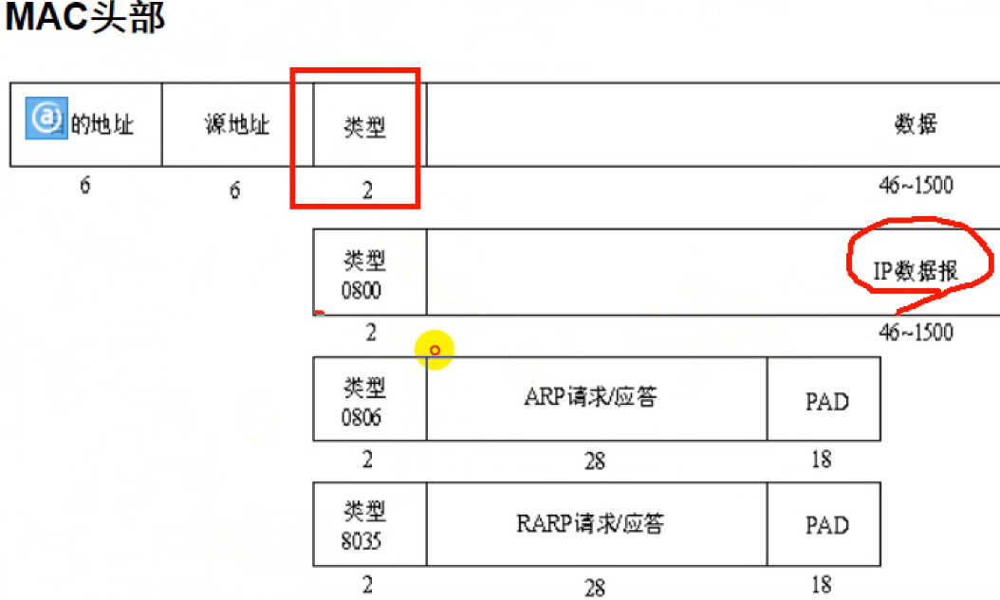

# C语言知识点

## 二级指针

一个指针  保存一个指针的地址 而不是指针所指向的内容的地址

```C
int** point_name;
```

指向一块内存空间的首地址的指针为一级指针

保存该一级指针的地址的指针称为二级指针  依次类推

使用场景

保存一个一级指针a的地址  完全可以通过另外一个一级指针b来完成

但是

当我们要修改a指针所指向的内存空间时 用b无法完成

b 为a指针的地址

*b为该地址中的内容  即a指针所指内存空间的地址

&b 为b的地址


而若使用二级指针c来保存a的地址

c 里面存放指针a的地址

*c代表指针a中存放的值

```c
#include<stdio.h>

int main(void)
{
        int x = 50;
        int* a = &x;
        int* b = &a;
        int** c = &a;

        printf("a point\n");
        printf("a == %p\n", a);
        printf("*a == %d\n", *a);
        printf("*a == %p\n", *a);
        printf("&a == %p\n", &a);

        printf("\nb point\n");
        printf("*b == %p\n", *b);
        printf("*b == %d\n", *b);
        printf("b == %p\n",  b);
        printf("&b == %p\n", &b);

        printf("\nc point\n");
        printf("*c == %p\n", *c);
        printf("&c == %p\n", &c);
        printf("c == %p\n", c);

        printf("\nchange a ad\n");

        int y = 7;
        int z = 8;
        *c = &y;
        printf("a == %p\n", a);
        *b = &z;
        printf("a == %p\n", a);

        return 0;
}


  
  
  

a point
a == 0xffffe70e5324
*a == 50
*a == 0x32
&a == 0xffffe70e5330

b point
*b == 0xe70e5324
*b == -418491612
b == 0xffffe70e5330
&b == 0xffffe70e5338

c point
*c == 0xffffe70e5324
&c == 0xffffe70e5340
c == 0xffffe70e5330

change a ad
a == 0xffffe70e5328
a == 0xffffe70e532c

 发现修改a指针所指向的值通过一级指针或者二级指针都可以修改
  二级指针更高级的一点在于函数传递
  
  
  
  #include <stdio.h>

void updatePointer(int **ptr) {
    int y = 20;
    *ptr = &y;
}

int main() {
    int x = 10;
    int *ptr1 = &x;

    printf("Before update: Value pointed by ptr1: %d\n", *ptr1);

    // 传递 ptr1 的地址，以便在函数中修改 ptr1 的值
    updatePointer(&ptr1);//传入一个地址 用二级指针来接收

    printf("After update: Value pointed by ptr1: %d\n", *ptr1);

    return 0;
}
```

## 联合体和结构体

~~~C++
union UN
{
	char a;
  int b;
} //联合体  a b共用同一块内存空间

struct UN
{
	char a;
  int b;
}//结构体 a b 有各自独有的一块内存空间
~~~


## goto

```c
again:
		语句;
		goto again;
```


## 宏开关


# Linux基础

[Linux系统编程-第02天（vim-gcc-动态库静态库）.pdf](pdf_note\Linux系统编程-第02天（vim-gcc-动态库静态库）.pdf) 

## Linux文件

home 普通用户的家目录

内建命令

bash 解析命令 自带的命令

外部命令

外部软件 给的命令

## Linux命令格式

命令 选项（可以不要） 参数（可以没有）

help + 内建命令

外键命令 + --help

## 帮助文档查看方法

man + 命令/指令

man 页数 命令/指令

第一页是命令

第二页是系统调用

第三页是标准库

例如printf 就是 man 3 printf

## 编写C语言程序

gcc编译器工具链

(1) 生成gcc -E 预处理C文件 将导入的头文件 加载到C文件中

-o 决定预处理后的文件名称

严格关注大小写

（2）生成汇编文件

-S 预处理文件.i -o 指定文件名

（3）生成目标

gcc -c 文件名.s -o 指定目标文件名.o

file + 文件名 可以查看文件类型

LSB 小端模式 

ELF 64-bit LSB relocatable, x86-64, version 1 (SYSV), not stripped 

（4）生成可执行文件

gcc 文件名.o -o hello

执行文件 ./文件名

**一部到位 gcc 文件名.c -o 文件名无后缀 等价于上面四步**

### 静态连接和动态连接

将头文件加入到文件中 属于从源文件到可执行文件的第一步

未来不想给客户看到源代码 只提供这个功能 那么就需要将源代码写成库

链接分为两种：**静态链接**、**动态链接**。

**1）静态链接**

静态链接：由链接器在链接时将库的内容加入到可执行程序中。

优点：

- 对运行环境的依赖性较小，具有较好的兼容性

缺点：

- **生成的程序比较大**，需要更多的系统资源，**在装入内存时会消耗更多的时间**
- **库函数有了更新，必须重新编译应用程序**

**2）动态链接**

动态链接：连接器在链接时仅仅建立与所需库函数的之间的链接关系，在程序运行时才将所需资源调入可执行程序。 

优点：

- 在需要的时候才会调入对应的资源函数
- 简化程序的升级；有着较小的程序体积
- 实现进程之间的资源共享（避免重复拷贝） 

缺点：

- 依赖动态库，不能独立运行
- **动态库依赖版本问题严重**

**3）静态、动态编译对比**

前面我们编写的应用程序大量用到了标准库函数，系统**默认采用动态链接**的方式进行编译程序，若想采用静态编译，加入-static参数。

gcc默认给的可执行文件为a.out


发现静态链接生成的大小要比动态链接 生成的可执行文件大了不止十倍

cp 要复制的文件 生成的文件名

### 一件替换文件中的所有代码

**：%s/被替换的代码/替换后的代码/g（表示全部替换）**

### 静态库和动态库的制作

" " 优先搜索本地的文件

<> 优先搜索标准库

库分为三个部分

前缀 中间 后缀

libxxx.a

（1）将C源文件生成对应的.o文件

（2）用打包工具ar将.o文件打包为.a文件 libxxx.a

> ar -rcs 库函数文件 要打包的.o文件

.o文件时在生成可执行文件前的一部生成的文件 可以通过 gcc -c  源文件.c -o 目标文件名.o生成

**在使用ar工具是时候需要添加参数：rcs**

- r更新
- c创建
- s建立索引

**2）静态库使用**

静态库制作完成之后，需要将.a文件和头文件一起发布给用户。

假设测试文件为main.c，静态库文件为libtest.a头文件为head.h

编译命令：

> deng@itcast:~/test/4static_test$ gcc  test.c -L./ -I./ -ltest -o test

参数说明：

- -L：表示要连接的库所在目录
- -I./:  I(大写i) 表示指定头文件的目录为当前目录
- -l(小写L)：指定链接时需要的库，去掉前缀和后缀

生成的.a文件 是二进制文件 打开看不到信息

### 动态库制作

静态库需要加载入程序中 过于大 

动态库通过链接 在程序需要的时候再加载

动态库制作教程

### 生成目标文件 

**gcc -fPIC -c add.c** 

-c生成目标代码

**-fPIC创建与地址无关的编译程序**

**gcc -shared** 所有的 .o 文件 -o 输出文件名 lib文件名.so 注意后缀为.so

指定库的文件的名字

### 运行方式

把头文件和库发布 以保护核心源代码

gcc test.c -L. -I. -l(小写的L)库名称

但是链接器无法找到库的位置

有两种解决方式

（1）将动态库文件放入到标准库文件中去 /lib（绝对路径）

sudo cp 库文件 /lib

(2)系统动态载入器

在linux系统中编译.c文件生成的文件为.ELF文件格式

对于elf格式的可执行程序，是由ld-linux.so*来完成的，它先后搜索elf文件的 DT_RPATH段 — 环境变量LD_LIBRARY_PATH — /etc/ld.so.cache文件列表 — **/lib/, /usr/lib**目录找到库文件后将其载入内存。

我们可以通过对库文件的一个路径的添加来让程序找到我们的动态库文件

- 临时设置LD_LIBRARY_PATH：

export LD_LIBRARY_PATH=(不能添加空格)$LD_LIBRARY_PATH:库路径

这样只能在程序进行测试的时候使用，因为这里是一个临时变量 从而导致在别的终端 别的服务器上不能运行这个程序

所以我们需要进行永久设置

可以通过对bash配置文件进行追加 绝对路径

vim ~/ .bashrc

source ~/ .bashrc


## 网络常用命令

ping:测试主机与网络 主机与主机之间的网络连通性

ifconfig：配置和显示Linux系统网卡的网络参数

常用于查看IP地址 后使用ssh协议进行连接

route:显示并设置linux中静态路由表 /ru:t/

netstat:net /steat/

> netstat:用来打印Linux中网络系统的状态信息，可让你得知整个Linux系统的网络情况。

kernel(内核)


## centos7防火墙基本使用

systemctl 是centos7特有的 status 在很多命令中都表示查看状态 firewall为防火墙 最后添加的d代表守护进程

> \#防火墙是开启 systemctl start firewalld
>
> #关闭防火墙 systemctl stop firewalld 
>
> #查看防火墙状态 systemctl status firewalld 
>
> #重启防火墙 systemctl restart firewalld


# MakeFile

[Linux系统编程-第03天（makefile-文件IO）.pdf](pdf_note\Linux系统编程-第03天（makefile-文件IO）.pdf) 

## 语法

一条规则：

目标可以为一个动作名称  如clean

目标(生成的东西):依赖文件列表(原材料) 目标必须存在

<Tab> 命令列表  //tab四个空格

```makefile
all:test1
	echo "hello all"

目标:all
依赖test1

可以看做一个if语句 当依赖存在时 执行命令

all:test1
	echo "hello all"

test1:
	echo "hello test1"

依赖可以看做一个函数
```

make -f name.mk

## 命令格式

make命令格式：

make [ -f file ][ options ][ targets ]

make 默认在工作目录中寻找名为GNUmakefile、makefile、Makefile的文件作为输入文件

- -f file ]：

  - make默认在工作目录中寻找名为GNUmakefile、makefile、Makefile的文件作为makefile输入文件

  - -f 可以指定以上名字以外的文件作为makefile输入文件

- option

  - -f 指定除以上名字以外的文件名

  - -v Makefile 版本

  - -w 在处理makefile之前和之后显示工作路径
  - -C dir 读取makefile之前改变工作路径至dir目录
  - -n 只打印要执行的命令但不执行
  - -s 执行但不显示执行的命令

- targets：

  - 指定执行某一target

  - make target -f name.mk 

  - 若使用make命令时没有指定目标，则make工具默认会实现makefile文件内的第一个目标，然后退出


  - 指定了make工具要实现的目标，目标可以是一个或多个（多个目标间用空格隔开）。

    MakeFile中的伪目标

    当与MakeFile同文件夹中有相同的指令

注意Makefile写好后，执行make命令时，默认只执行第一个目标，也就是说默认只识别了第一个目标。

如果第一个目标不存在，就去找依赖，执行对应的命令，第一个目标存在之后，后面的不会去管。

依赖也不存在 则去执行对应的命令


## 变量

类似模版  宏定义

自定义变量

- 定义变量方法
  - 变量名=变量值
- 引用变量
  - $(变量名)
  - ${变量名}
- 变量命名规则
  - makefile的变量名可用数字开头
  - 在开头定义
  - 作用域为全局

系统变量

大写

可对其直接复制

CC = gcc

CPPFLAGS

CFFLAGS

LFLAGS


变量不能单独使用  只能在命令中使用

$@ 表示目标

$^ 表示所有的依赖

$<表示第一个依赖

作用域为当前规则

即 作用域那个规则 $@表示那个目标 以此类推


```makefile
OBJS = add.o sub.o mul.o div.o test.o
TARGET = test

$(TARGET):$(OBJS)
	gcc $^ -o $@

add.o:add.c
	gcc -c $< -o $@ #生成add.o 当目标文件存在后 该条规则结束
	
sub.o:sub.c
	gcc -c $< -o $@#生成sub.o

mul.o:mul.c
	gcc -c $< -o $@#生成mul.o
	
div.o:div.c
	gcc -c $< -o $@#生成div.o
	
test.o:test.c
	gcc -c $< -o $@#生成test.o

clean:
	rm -rf $(OBJS) $(TARGET)
	
```

模式匹配  

所有的.o都依赖对应的.c将所有的.c生成对应的.o

```makefile
OBJS = add.o sub.o mul.o div.o test.o
TARGET = test

%.o:%.c
	gcc -c $< -o $@
	
clean:
	rm -rf $(OBJS) $(TARGET)
```

**MakeFile文件的后缀为.mk文件**

目标：依赖文件列表

<Tab> 命令列表

依赖文件可以没有 命令列表可以没有 但目标一定要有

#### Makefile基本规则三要素：

1）目标：

- 通常是要产生的文件名称，目标可以是可执行文件或其它obj文件，也可是一个动作的名称

- 指令可以作为目标 例如clean指令

- ```makefile
  clean:
      rm -rf $(OBJS) $(TARGET)
  
  ```

删除当前目录下全部的OBJS变量中的文件 和TARGET中的文件

2）依赖文件：

- 用来输入从而产生目标的文件
- 一个目标通常有几个依赖文件（可以没有）

3）命令：

- make执行的动作，一个规则可以含几个命令（可以没有）
- 有多个命令时，每个命令占一行
- **每一句命令开头应该使用TAB按钮**

#### Make命令

make是一个命令工具，它解释Makefile 中的指令（应该说是规则）。 

- 


# 操作系统

用户通过系统调用间接与内核交流的媒介

用户程序调用C语言函数库函数，库函数调用系统调用接口与内核

linux系统

- 深度

- 靶场metasploitable

- kali
- ubuntubudgie

**shell (壳) 程序  让用户与系统进行交互  终端 cmd** 

窗口运行shell程序  但窗口不是shell

Linux下的shell称为bash

操作通过shell解释给内核

脚本语言可以通过shell解释给内核，不需要编译处理

python通过python解释器 解释给内核处理

**只有内核才能直接操作硬件**

## 环境变量

每个进程都有自己的一个环境变量表，表中的每个条目都是 

键=值

形式的环境变量

ubuntu终端下  env   envirment

**查看bash的全局环境变量**

echo $name 环境变量值

**键 通常使用大写**

如 SHELL=/bin/bash 等号左右无空格

USER=orsrrc

添加环境变量

FOOD=liurouduan

FOOD=dafengshou

环境变量可以被改变  


- 环境变量类别
  - 全局环境变量
    - 当前shell和其子进程(子进程可继承)可见
  - 局部(自定义)环境变量
    - 只有当前shell可见

局部环境变量 export 局部环境变量变为全局环境变量

**删除unset 环境变量名**


PATH

记录bash对命令的检索路径   每个路径以:分隔

命令本质为操作系统自带的二进制的可执行程序  执行命令即为到对应的命令去找程序

执行命令时会去检索所有的PATH


whereis 检索文件路径


添加路径到PATH中

./ 当前目录

bash根据PATH环境变量找到可执行程序 若直接输入程序命令  则bash会去PATH中寻找

若提供命令对应的路径 则bash通过用户指定的路径 找到程序

```bash	
PATH=$PATH:.  在当前环境变量下 再添加一个.(相对)  当前路径
环境变量名前$表示环境变量值 
```

由于每个进程都有一个自己的PATH变量

故而当当前窗口关闭时 bash进程被杀死 那么再次打开时 为创建一个新的bash 上次配置的PATH消失

永久更改

在home目录下有.bashrc的脚本文件  每次bash进程启动前都会执行该脚本文件的内容

```bash
source~./.bashrc 

或者修改 .bashrc  在最后加上PATH=$PATH:.

此时 永久生效
```

$PS1 是一个局部变量  用于修改终端命令的值

可将变量放入bashrc中对终端进行修改

## 环境变量表

索引表  每一个进程都有一个环境变量表

具体实现为数组容器中放入指针  指针指向环境变量的内存首地址

指向环境变量表的首地址的指针environ

```C++
#include<stdio.h>

int main(void){
	extern char** environ; //调用其他文件中的全局变量  外部变量声明 关键字
  for(char **pp = environ; *pp; pp++)
  {
    //二级指针  存放指针地址的指针
    printf(“%s\n”, *pp);
  }
  return 0;
}
```

```C++
int main(int argc, char* argv[], char* envp[]//环境变量表)
{
  extern char** environ;
  printf("environ = %p", environ);
  printf("environ = %p\n", envp);
  for (char** pp = envp; *pp; pp++)
  {
    printf("%s\n", *pp);
  }
  return 0;
}
         //通过main函数的第三个参数也可以获取到环境变量表的首地址
```


## 文件

**系统调用就是内核提供给用户的接口**

**用户态 各种操作都有限制**

**内核态 毫无限制的访问各种资源**

**用户态 通过软件中断 到内核态**

错误处理函数

系统调用函数 fopen 打开文件 （“文件路径”， “文件权限（只读r 可读可写wr）”）返回一个指针 指针中存放的地址指向一个结构体

**结构体中有文件描述符**

**文件读写指针位置**

**缓冲区** 内存地址 一个printf函数的缓冲区大概有8k左右

errno 是记录系统的最后一次错误代码,返回值为一个整形的值，可以通过strerror函数将返回值转换为一个字符串

```c
#include <stdio.h>  //fopen
#include <errno.h>  //errno
#include <string.h> //strerror(errno)

int main()
{
    FILE *fp = fopen("xxxx", "r");
    if (NULL == fp)
    {
        printf("%d\n", errno);  //打印错误码
        printf("%s\n", strerror(errno)); //把errno的数字转换成相应的文字
        perror("fopen err");    //打印错误原因的字符串
    }

    return 0;
}
```

perror打印出错代码 作用为strerror(errno) errno == error number

> /usr/include/asm-generic/errno-base.h
>
> /usr/include/asm-generic/errno.h

可以在这两个文件中寻找到错误函数对应的一个绑定


因为计算机内核部分是不能被访问的 不然就会出现段错误

内存访问非法就是段错误


**其中局部全局变量和 全局变量存放的位置相同都在data区**

**0-3G用户可操作区 程序大部分是存放在这些部分**

**内核区 一般的程序无法写入 内核区留下部分接口 给用户区 就是系统调用**

**堆空间中存放动态内存分配** 例如 指针指向数组动态分配 **此时就需要析构函数进行删除 防止内存泄漏**

共享库：存储映射区

栈：存放局部的变量 通过递归可以查看栈的大小 或者通过命令 

只读数据段 ：存储字符段

在磁盘中找到可执行文件后

### 内存的虚拟空间

在进程里平时所说的指针变量，保存的就是虚拟地址。

###  文件描述符


当0 ，1，2 被占用时 打开的文件描述符一定为3 即为空闲的最小的一个文件描述符

对文件描述符进行操作 即为对文件进行操作

#### open 函数

当对open函数的帮助文档进行查看时发现

```c
   int open(const char *pathname, int flags);
   int open(const char *pathname, int flags, mode_t mode);
```

发现在文档中有两个相同的函数定义

但是在C语言中 没有函数的重载 想要实现函数重载怎么办呢 就可以通过  "..."表示参数不确定 从而实现函数重定义

说明open在函数定义时用的就是...表明参数不确定

implicit declaation of function '函数名' 代表 ( 函数的隐式解密 )函数没有头文件

#### 阻塞和非阻塞

程序会不断的读取管道中的内容 但如果管道中没有内容 那么就会造成资源的浪费 所以需要设置阻塞

读常规文件是不会阻塞的，不管读多少字节，read一定会在有限的时间内返回。

从终端设备或网络读则不一定，如果从终端输入的数据没有换行符，调用read读终端设备就会阻塞，如果网络上没有接收到数据包，调用read从网络读就会阻塞，至于会阻塞多长时间也是不确定的，如果一直没有数据到达就一直阻塞在那里。

同样，写常规文件是不会阻塞的，而向终端设备或网络写则不一定。

【注意】阻塞与非阻塞是对于文件而言的，而不是指read、write等的属性。

**例如c/cpp中的输入函数 程序执行到当前命令的时候 会阻塞而等待输入 不往下面的程序执行**

#### stat函数

符号链接（在windows中类似于快捷方式）

Modify: 2022-10-06 05:10:51.922623022 -0400
Change: 2022-10-06 05:10:51.922623022 -0400

Modify 是修改文件属性时间

Change是修改文件内容时间

有的操作修改文件内容会默认修改文件属性

在末行命令模式下

:r !head -10 文件名 代表将文件的前十行 复制到当前文件中

！代表不是强制 只是执行命令四要素

1、编号

2、名称

3、事件

4、默认处理动作

**man 7 signal**查看帮助文档获取

## 信号

### 状态

#### 1、产生

终端上按“Ctrl+c”组合键通常产生中断信号 SIGINT

终端上按“Ctrl+\”键通常产生中断信号 SIGQUIT

终端上按“Ctrl+z”键通常产生中断信号 SIGSTOP 

#### 2、未决状态：没有被处理

#### 3、递达状态：信号被处理了

### 阻塞信号集（信号屏蔽字）

将某些信号加入信号集 对其进行屏蔽 再收到该信号 该信号将再解除屏蔽后处理

类似电话黑名单

### 未决信号集

信号产生后由于某些原因(主要是阻塞)不能抵达在屏蔽解除前，信号一直处于未决状态。

### 信号产生函数

kill函数 给指定进程发送指定信号 不一定是关闭进程或杀死进程

```
int kill(pid_t pid, int sig);
```

```
pid : 取值有 4 种情况 :
        pid > 0:  将信号传送给进程 ID 为pid的进程。
        pid = 0 :  将信号传送给当前进程所在进程组中的所有进程。
        pid = -1 : 将信号传送给系统内所有的进程。
        pid < -1 : 将信号传给指定进程组的所有进程。这个进程组号等于 pid 的绝对值。
    sig : 信号的编号，这里可以填数字编号，也可以填信号的宏定义，可以通过命令 kill - l("l" 为字母)进行相应查看。不推荐直接使用数字，应使用宏名，因为不同操作系统信号编号可能不同，但名称一致。
```

root用户可以发送信号给任意用户 但普通用户只能给自己产生的进程发送信号 不能给root用户或者其他普通用户发送信号 子进程可以对父进程发送信号

raise函数

给自己发送指定信号 类似于 kill(getpid(), sig)

abort函数

```
给自己发送异常终止信号 (6) SIGABRT，并产生core文件，等价于kill(getpid(), SIGABRT);
```

### 不可重入函数

全局函数

不同任务调用这个函数时可能修改其他任务调用这个函数的数据

例如标准输入输出函数 因为标准的输入输出函数 与系统调用的输入输入函数不同的是

调用标准输入输出函数是带有缓冲区的 这样就导致别的函数可以通过缓冲区进行修改或打印不该打印和被获取的值。


满足下列条件的函数多数是不可重入（不安全）的：

- 函数体内使用了静态的数据结构；
- 函数体内调用了malloc() 或者 free() 函数(谨慎使用堆)；
- 函数体内调用了标准 I/O 函数。

## 可重入函数

- 在写函数时候尽量使用局部变量（例如寄存器、栈中的变量）；
- 对于要使用的全局变量要加以保护（如采取关中断、信号量等互斥方法），这样构成的函数就一定是一个可重入的函数。


## 进程

### 进程和程序

程序是一个静态的可执行文件 放在硬盘中

当程序被CPU调用 但没有执行完成时 就是进程 关闭程序 就是杀死进程

进程是cpu分配的最小单位 

单核CPU 不能同时执行多个进程 可以轮流执行不同的进程

可以添加多个处理器 就可以同时执行多个指令

或者一个处理器集成多个核 就可以同时执行多个指令

一个处理器集成多个核的性能 比一台PC集成多个处理器的性能好 但成本也就更高。

一个48核处理器的成本比 4个八核处理器的成本高 对于商用PC 更多的是集成多个处理器。

### 并行与并发

**并行(parallel)：**指在同一时刻，有多条指令在多个处理器上同时执行。


**并发(concurrency)：**指在同一时刻只能有一条指令执行，但多个进程指令被快速的轮换执行，使得在宏观上具有多个进程同时执行的效果，但在微观上并不是同时执行的，只是把时间分成若干段，使多个进程快速交替的执行。 


每一个时刻 只有一条指令在执行

### MMU（Memory Management Unit）内存管理单元

负责将虚拟地址映射为物理地址。在物理地址上内存可能不是连续的 所以需要虚拟地址来映射 让用户觉得是连续的。


### 进程控制块（PCB）

Linux内核的进程控制块是task_struct结构体。

掌握以下部分

- 进程id。系统中每个进程有唯一的id，在C语言中用pid_t类型表示，其实就是一个非负整数。
- 进程的状态，有就绪、运行、挂起、停止等状态。
- 进程切换时需要保存和恢复的一些CPU寄存器。
- 描述虚拟地址空间的信息。
- 描述控制终端的信息。
- 当前工作目录（Current Working Directory）。
- umask掩码。
- 文件描述符表，包含很多指向file结构体的指针。
- 和信号相关的信息。
- 用户id和组id。
- 会话（Session）和进程组。
- 进程可以使用的资源上限（Resource Limit)。

### 进程状态

进程不是死循环 会有一个运行到消亡的状态

**三态模型**

运行态：程序被CPU调度运行

就绪态：程序编译加载工作均已经完成 只等CPU调度

阻塞态：程序请求某种权限、资源时 由于被占用 只能排队等待

五态模型


1.运行态:

程序正在被CPU调度运行

2.就绪态

当程序一切的权限 资源申请调度都完成了 但还未被CPU调度 程序就处于就绪态 

3、僵尸态

程序运行结束后 没有被删除和销毁 

4、等待态

不可中断等待 程序在运行时 由于不接收外来指令和命令 从而不能命令中断和杀死

可中断等待 进程在运行时 可以接收到外来信号 能够被中断和停止

5、停止态

程序运行时 接受到了停止信号 从等待态变为停止态 再次需要调用时 就会变为就绪态 然后可以重新调度运行

#### 查看本机进程

**ps -aux**

USER（用户） PID（进程号） %CPU（占用CPU大小） %MEM（内存） VSZ（虚拟地址）RSS（空闲地址） TTY   （终端 端口号） STAT（状态） START（开始时间）   TIME（运行时间） COMMAND（命令）

通过ps -a 选项查看需要杀死的程序的进程号(PID)

kill + 进程号 进行杀死

#### top 动态显示进程

**bc调用linux程序计算器** quit命令退出

## 进程的创建

#### 创建子进程

在unix和linux系统下可以通过fork（）函数创建子进程

子进程会复制父进程的指令

但创建子进程后 无法确认谁先执行 因为计算机系统的调度算法不同 对于多核计算机来说 讨论这个几乎没有意义

当然子进程与父进程的进程号 进程ID肯定是不相同的

但由于无法确定父进程和子进程谁先执行时


就会出现这种情况

由于bash是所有进程的父进程

所以若调度算法 使得父进程优先执行 那么 就会出现这种情况 输出父进程的hello world后 执行了一次bash 然后再执行子进程的hello world

如果是子进程有限 那么就会出现并行的情况


#### 父进程和子进程

它从父进程处继承了整个进程的地址空间：包括进程上下文（进程执行活动全过程的静态描述）、进程堆栈、打开的文件描述符、信号控制设定、进程优先级、进程组号等。

子进程所独有的只有它的进程号，计时器等（只有小量信息）。因此，使用 fork() 函数的代价是很大的。


所以对与父进程的数据区 子进程不是直接复制 而是**读是共享 写时复制**

**读时共享**

如果子进程不对数据进行修改 而只是读取数据的话 并不会将数据区的数据复制到子进程中 而是父进程和子进程共享这一数据

**写时复制**

若子进程要对数据进行修改 在读取到修改数据命令时 就会复制这个数据到进程本身 然后进行修改

进程退出函数

**exit()** 进程退出函数 

**return 0** 函数退出

_exit()

_EXIT()

这两个函数是直接退出 没有任何的善后处理 包括刷新缓冲区等等操作

#### KILL 杀死进程指令

KILL +【信号】+ 进程号 

KILL -l 查看所有的信号

**kill 杀死一个进程 默认信号为15**  

  1) SIGHUP	 2) SIGINT	 3) SIGQUIT	 4) SIGILL	 5) SIGTRAP
  2) SIGABRT	 7) SIGBUS	 8) SIGFPE	 **9) SIGKILL**	10) SIGUSR1
 3) SIGSEGV	12) SIGUSR2	13) SIGPIPE	14) SIGALRM	**15) SIGTERM**
 4) SIGSTKFLT	17) SIGCHLD	1**8) SIGCONT**	**19) SIGSTOP**	20) SIGTSTP
 5) SIGTTIN	22) SIGTTOU	23) SIGURG	24) SIGXCPU	25) SIGXFSZ
 6) SIGVTALRM	27) SIGPROF	28) SIGWINCH	29) SIGIO	30) SIGPWR
 7) SIGSYS	34) SIGRTMIN	35) SIGRTMIN+1	36) SIGRTMIN+2	37) SIGRTMIN+3
 8) SIGRTMIN+4	39) SIGRTMIN+5	40) SIGRTMIN+6	41) SIGRTMIN+7	42) SIGRTMIN+8
 9) SIGRTMIN+9	44) SIGRTMIN+10	45) SIGRTMIN+11	46) SIGRTMIN+12	47) SIGRTMIN+13
 10) SIGRTMIN+14	49) SIGRTMIN+15	50) SIGRTMAX-14	51) SIGRTMAX-13	52) SIGRTMAX-12
 11) SIGRTMAX-11	54) SIGRTMAX-10	55) SIGRTMAX-9	56) SIGRTMAX-8	57) SIGRTMAX-7
 12) SIGRTMAX-6	59) SIGRTMAX-5	60) SIGRTMAX-4	61) SIGRTMAX-3	62) SIGRTMAX-2
 13) SIGRTMAX-1	64) SIGRTMAX	

**18和19信号分别为 进程继续 和进程挂起**

#### 孤儿进程

与僵尸进程相对的进程是 孤儿进程 **即为父进程已结束 而子进程依旧在运行** 当孤儿进程越来越多 而没有程序进行善后 删除操作时 就会占用系统资源 所以 当出现孤儿进程时 **程序会自动将孤儿进程的父进程设置为 init进程** init进程就是系统内核进程 这样当孤儿进程生命周期结束时 这些孤儿进程就会被回收

sudo init 6/0 可以进行关机开机   

#### 僵尸进程

父进程未结束 子进程结束 但未被父进程清理 这样就会生成僵尸进程 僵尸进程与孤儿进程不同 没有自动回收的机制 所以僵尸进程是很危险的 可以通过ps命令查看系统中的僵尸进程 STAT（状态）一栏中的 Z(zombie)状态就是僵尸进程

#### 进程替换

在程序执行进程时 通过替换进程的数据 堆栈区等 不执行现有进程 而执行新进程


进程调用一种 exec 函数时，该进程完全由新程序替换，而新程序则从其 main 函数开始执行。因为调用 exec  并不创建新进程，所以前后的进程 ID （当然还有父进程号、进程组号、当前工作目录……）并未改变。exec  只是用另一个新程序替换了当前进程的正文、数据、堆和栈段（进程替换）。


## 终端

用户与主机交互的地方就叫做终端

## 进程组

一个或多个进程的集合就叫进程组

进程组的ID可能和进程ID相同

## 会话

多个进程组的集合就叫会话

前台会话只能有一个 并且与终端相关联

当终端断开时 前台进程组中的进程就会被删除

后台进程组可以有多个

并且 脱离终端运行 即关闭终端后 也依然会运行

### 创建会话注意事项

1、**调用进程不能是进程组组长**，该进程变成新会话首进程(session header) 例如父进程创建了一个子进程 父进程就是进程组组长

2、**该调用进程是组长进程，则出错返回**

3、**该进程成为一个新进程组的组长进程**

4、需有root权限(ubuntu不需要)

5、新会话丢弃原有的控制终端，该会话没有控制终端

6、 建立新会话时，先调用fork, 父进程终止，子进程调用setsid

**组长进程的ID和组长ID相同**

## 守护进程

它是一个生存期较长的进程，通常独立于控制终端并且周期性地执行某种任务或等待处理某些发生的事件。一般采用以d结尾的名字。

只有当系统关闭 主机关机时 停止运行

每一个从此终端开始运行的进程都会依附于这个终端，这个终端就称为这些进程的控制终端，当控制终端被关闭时，相应的进程都会自动关闭。

守护进程是个特殊的孤儿进程，这种进程脱离终端，避免进程被任何终端所产生的信息所打断，**其在执行过程中的信息也不在任何终端上显示。**表明关闭了所有的文件描述符 并且所有的标准输出 标准错误输出函数都将信息直接输入到日志文件中。

孤儿进程一般会被一号进程收养 也就是内核

如果在GUI界面主机中使用的话 会被图形界面收养

tail -f动态的查看文件追加内容

​         


## 线程

一个进程可以同时拥有多个线程  至少有一个主线程

每个线程有自己独立的变量 故每个线程有自己独立的一个栈

进程是内存分配的最小单元 线程调度的最小单位

可以看做一个单核的CPU 交替运行任务


时间片+FCFS

线程共享进程中的变量


### 线程号	

通过pthread_self返回pthread_t 类型的当前线程的进程号， 函数总是成功 类似于umask掩码函数

### 创建线程(POSIX线程库)

POSIX标准 提供统一标准函数

创建线程后 执行线程的是内核 需要告诉内核执行哪一个函数 传入参数

#include<pthread.h>

p == POSIX

pthread_create(**pthread_t* tid**, **pthread_attr_t const* attr**, **void\*(\*start_routine)(void*)** //函数指针 线程从哪一函数开始执行(线程过程函数), **void\* arg**//线程的运行函数的参数) //当线程需要多个参数时  可以用结构体(多个不同类型的变量) 或者数组传入地址(多个相同类型的变量)


thread:线程标识符地址
attr:线程属性结构体地址，通常设置为NULL
start_routine:线程函数的入口地址
arg:传给线程函数的参数

返回值:成功返回0 失败返回错误码

### 主线程和子线程

main()是主线程的线程过程函数 main函数结束 意味着主线程结束

主线程结束  进程结束  则子线程全部结束

```C++
#include <stdio.h>
#include <pthread.h>
#include <string.h>
//线程过程函数
void* pthread_fun(void* arg)
{
  printf("%lu线程:我是子线程, 接受到%s\n", pthread_self(), (char* )arg);
  return NULL;
}


int main(void)
{
  printf("%lu线程：我是主线程，我要创建子线程\n", pthread_self() );
	//pthread_self() 返回线程ID %lu 表示无符号长整型
  pthread_t tid;//接收线程的ID
 	int error = pthread_create(&tid, NULL/*线程的属性*/, pthread_fun, "铁锅炖大鹅");
  if(error != 0)
  {
    fprintf(stderr, "pthread_created:%s\n",strerror(error));
    //strerror(错误码)返回错误信息
    return -1;
  }
  printf("%lu线程:我是主线程，我创建了%lu子线程\n", pthread_self(), tid);
  sleep(1);
  return 0;
}
```


**perror 输出最近一次出错的信息**


Compile and link with -pthread

gcc .c -o target -l pthread


接收的参数的地址的内存在子线程运行期间 存储区有效


> 小练习
>
> 创建线程
>
> 该线程负责圆的面积计算 s = pai * r^2 <math>
>
> 半径由主线程创建时 传递给子线程
>
> 线程将面积回传给主线程

```C++
#include <stdio.h>
#inlcude <string.h>
#include <pthread.h>
##include <unstd.h>
#define pai 3.14
double s = 0; //定义全局变量
//内核调用线程过程函数area 而不是main函数 故而在返回时 main函数无法接收area函数的返回值
void* area(void* arg){
  double r = *(double*)arg;
  s = pai * r * r;
  return NULL;
}

int main(void){
  pthread_t tid;
  double r = 10;
  pthread_create(&tid, NULL, area, &r);
  return 0;
} //也可以通过修改arg的值将圆的面积返回main
//在子线程中定义静态变量 表示函数结束时 该变量的内存不回收 但是仍然无法在main函数中访问子线程的变量
```

> 计算两个数字的平均数

```C++
#include <stdio.h>
#inlcude <string.h>
#include <pthread.h>
##include <unstd.h>

void* aver(void* arg){
  double *d = (double*)arg;
  //*d == d[0]
  //*(d+1) == d[1]
  d[2] = (d[0] + d[1]) / 2;
  return NULL;
}

int main(void*)
{
  pthread_t tid;
  double data[3] = {3, 7};
  pthread_create(&tid, NULL, area, &data);
  printf("%d", data[2]);
  return 0;
}

//指针的类型决定了 该指针访问内存时读取几个字节 所有类型的指针的容量都是固定的  唯一的区别是访问内存时所读取的字节数
```

### 汇合线程


将线程返回的指针地址 放入到 retval 二级指针中  接受一级指针的地址 用二级指针

```c++
#include <stdio.h>
#include <stdlib.h>
#include <pthread.h>
#include <unistd.h>
#define PI 3.14

//线程过程函数  计算圆的面积

void* area(void* arg)
{
  double r = *(double*) arg;
  double static s = PI * r * r; //由于s创建的时间比PI 
  //与 r 的时间早 故而不可以用一个未定义的变量给一个已经定义的变量
  double static s;
  s = PI * r * r;
  
  //动态分配 内存回收时间由free来决定
  double* s = (double*)malloc(sizeof(double));
  *s = PI * r * r; //线程间不共享各自的资源 线程间未知对方的缓冲区的地址  因此不能操作对方的缓冲区
  return &s;
}


int main(void)
{
  pthread_t tid;
  double r = 10;
  pthread_create(&tid, NULL, area, &r);
  double* res;//输出线程过程函数的返回值
  pthread_join(tid, (void**) &res); //二级指针是一个形参告诉用户这里需要放入指针的地址
  
  pthread_t tid2;
  double r2 = 20;
  pthread_create(&tid2, NULL, area, &r2);
  double* res2;
  pthread_join(tid, (void**)&res2);
  
  //若有两条线程  而s为static 则两个线程共享一个缓冲区s
  
  return 0;
  
}
```


### 分离线程

主线程不用管理子线程的回收 由内核回收


## 死锁

死锁是指两个或两个以上的进程在执行过程中，由于竞争资源或者由于彼此通信而造成的一种阻塞的现象，若无外力作用，它们都将无法推进下去。此时称系统处于死锁状态或系统产生了死锁，这些永远在互相等待的进程称为死锁进程。 

如图 当线程1和线程2

一个先访问资源1 一个先访问资源2

在并行的状态下

两个线程都会顺利执行 但当走到第二步时 由于加锁的原因资源1 资源2都被占用 导致两个线程都阻塞 无法进行下一步 这样就形成死锁

解决办法之一就是同时访问资源1同时访问资源2 这样当其中一个访问时 资源被占用 另一个线程在第一步就会被阻塞


# 网络

## 网卡

网络适配器 蓝牙也是一种网卡 只是协议不一样 

### MAC地址 6个字节 

标识网卡的ID

每块网卡的ID 是不一样的 但虚拟机可能相同 因为虚拟机需要你的网卡去上网

理论上ID全球唯一

MAC地址是不会变的

### IP地址 

标识主机的ID 这个ID是虚拟的 这个ID会改变

IPV4 32位 4个字节 

IPV6 128位 16个字节

公网使用的IPV6

局域网使用的是IPV4

一个IP将其分为子网ID和主机ID

子网ID和主机ID需要和子网掩码一起来看

192.168.11.23

255.255.255.0

被连续的1覆盖的位就是子网ID

被连续的0覆盖的位就是主机ID

**这里192.168.11.0 就是 网段地址**

23就是主机ID 

**广播地址 192.168.11.255** 如果是这个IP 发送

除去这两个地址不能做主机IP

主机ID分配的范围为：192.168.11.1——>192.168.11.254 2^8 - 2 = 254 最后一位 8个1 

192.168.1.23/24(255.255.255.0) 代表24个1

也就是说 前三位为子网ID 最后一位为主机ID 23

那么它的网段地址为 192.168.1.0

它的广播地址为192.168.1.255

**192.168.1.2/16(255.255.0.0)**

它的网段地址为192.168.0.0

广播地址为 192.168.255.255

能分配的IP地址范围为

两个八位 2^16 - 2个

ens33网卡名称

inet ip地址 netmask 子网掩码 broadcast 广播地址 mtu代表一次最大接受的数据包的长度


ping 命令 用来检测两台主机的网络联通性

A -->ping -->B

B-->ping-->A

lo本地回环地址 127.0.0.1 -- 127.255.254 都属于回环IP

ping lo网卡 测试本地网络

windows设置IP 在网络的适配器中点击IPV4服务 进行设置

Linux下设置IP可以在ifconfig 命令后加 网卡名称 ens33

### 桥接和net

### 桥接 

让物理机虚拟出一块网卡 这块网卡有自己专属的IP地址 即可以通过路由查询 但这块网卡在局域网内只能访问物理机的网卡 而无法访问 局域网内的别的主机 。

可以通过物理机来访问外部网络

### 端口

端口是用于区分不同的应用程序的缓冲区 当别的主机发来的消息包时 由于每个应用程序的端口不同 使得主机能够将这个消息包发给对应的应用程序。

## OSI七层模型

第零层

在物理层的下面的一层 这一层指代的是物理设备 例如网卡之类的

物理层

双绞线接口类型，光纤的传输速率等等

数据链路层 mac负责收发数据

网络层 ip给两台主句提供路径选择 区分是否是递送给本机的

传输层：port区分数据递送到哪一个应用程序

会话层 建立会话

表示层 解码

应用层


开发中使用


链路层 设备到设备 MAC 到 MAC 

网络层 ICMP IP IGMP

传输层 TCP UDP

应用层 FTP Telnet TFP NFS ...... 很多


收数据 从下往上搜

发数据 从上往下搜


## 协议

规定了数据传输的方式和格式

应用层协议:

FTP: 文件传输协议

HTTP: 超文本传输协议

NFS: 网络文件系统

传输层协议:

TCP:  传输控制协议

UDP:用户数据报协议

网络层:

IP:英特网互联协议

ICMP: 英特网控制报文协议 ping

IGMP: 英特网组管理协议

链路层协议:

ARP: 地址解析协议 通过ip找mac地址

RARP: 反向地址解析协议 通过mac找ip

### arp协议

#### arp地址解析协议

ip地址转换为 mac地址

对于一个路由器而言

一个LAN口可以连接 局域网内的一台主机

局域网内的主机通过UDP协议进行通信

这样就需要别的 主机的 IP 和 MAC 地址

如果没有怎么办呢

例如 A想跟B通信 但没有B的MAC地址 那么就需要在局域网内发送一个ARP广播 

向路由器发送一个ARP请求 然后每个通过LAN口连接的主机都会 收到一个ARP请求

然后 只有B会应答

其他主机就直接将这个请求的包丢掉

当局域网内的主机想要访问外网主机的时候

这个时候肯定就不能获取外网主机的MAC地址 

这个时候 局域网内的主机会将数据包发送给路由器的网关 

网关负责向外发送 此时数据包的MAC地址就填入网关的MAC地址

网关的主机IP地址一般为1和254 最大或者最小

##### ARP请求报文组包

ARP请求报文 由14个字节的mac头 和 28字节的arp报文组成

其中mac头尾 以太网首部 这是每个包都必须要的 其内容尾 目的主机的MAC地址

源MAC地址

目的主机的MAC地址 

当需要在局域网内发送广播时 单纯添加某一主机的MAC地址时 只有该主机会收到ARP请求包

故而 MAC地址的包应该为ff:ff:ff:ff:ff::ff 当MAC地址为该地址时 局域网内的主机会无条件接收


##### 传输层 TCP与UDP

一般来说 在局域网中使用最多的是UDP 当需要夸网关传输时 使用的是TCP 

因为UDP传输效率高 但不重传 不安全

TCP比较安全 

UDP:用户数据报协议

报头中有八个字节 类似包裹的纸壳

客户机与服务器的连接

- 建立虚电路
- 交换数据
- 终止连接

特点

- 可靠连接
  - 每次发送一个数据包都需要确认
  - 超时重传
- 有序性
- 全双工

三次握手|三路握手

- 发一个SYN(同步)数据包 告知对方自己将在连接中发送数据的初始序列号
- TCP包的头部有部分保留的字节  即某一位为1 可看SYN置一
- 服务器的TCP协议栈向客户机发送一个数据包


UDP报头有八个字节

A给B发送数据 源端口号 为A

B为目的端口号

数据为另算的东西 类似包裹的内容

UDP16位校验和

两个字节两个字节的叠加 会生成一串数字 发出数据包时会将这串数字一起发送

当接收方接收数据的时候 会将接收到的数据也两个字节两个字节的叠加 生成一个校验和 两个校验和一比较就可以看出数据包是否丢失


### TCP报头


#### 头部长度即为首部长度

它为四位 代表数据最大值为15 但TCP报头总共有20个字节 那么20/4 = 5 说明 头部长度为5 

连续发四个这样的包 然后接收方通过序列号 确认号等组合起来

窗口尺寸代表 接收方的缓冲区大小 当超过这个大小时 发送的包就回丢失

紧急指针一般为0 当为1时就回立即发送数据

### IP报头


版本为IPV4 或者是 IPV6

当一个数据包很大的时候 就需要将一个包分开多次传输 片偏移就是用于组包的

TTL 每经过一个路由器就减一 默认值为64或128


说明经过了13个路由器才到达百度的路由器

作用：

当对一个IP地址发送数据包的时候 如果接收方的网络断开

那么这个数据包就回在路由器与路由器之间乱走 如果不删除这个数据包 当后面的数据来的时候就回形成阻塞

所以给数据包设置TTL 每当数据包遇到路由器时 TTL就减一 当TTL的值为零时 路由器就不再转发 直接将数据包给丢掉

协议类型：

通过协议类型可以知道向上发送数据包的时候时发给TCP还是UDP 每一个协议类型都有对应的数字 例如UDP协议为17

UDP 默认8个字节 TCP IP 都默认为20个字节


## 网络同通信协议过程

组包的过程由上往下 即 应用层 → 传输层 → 网络层 → 链路层


从应用层开始 主机A的IP为 192.168.1.1/24 通过应用飞秋传输消息给主机B IP 192.168.1.2/24 

其中 为物理地址

从物理层 发出消息 并且通过应用的协议 到达传输层

传输层填入8个字节的UDP 然后填入源地址端口src和目的地址dst端口

然后传入网络层

加入IP报头

输入源IP地址和目的IP地址

到达链路层加入mac头

14个字节



然后往主机B的链路层传输  判断主机B的MAC地址 与MAC头中的MAC地址是否一致 如果一致那么就传输到链路层中然后通过协议往上解包


然后被解开包 就被丢弃 类似 收到包裹以后 将包裹的外包装一次撕开

每一层被解开的包如果找不到对应的ip那么就回直接将包给丢掉


## 网络设计模式

B/S browser/server 浏览器和服务器

C/S cilent/server 客户端与服务器

### C/S cilent/server 客户端与服务器

**优点**：所有的计算都在本地进行计算 性能比较好

如果多人同时在线游玩一个游戏 都让服务器进行计算的话 服务器的计算量会非常的大

所以 在本地计算完成后 发送给服务器 可以有效减轻服务器的负荷

**缺点**：

客户端容易篡改数据 外挂 并且开发周期较长

### B/S browser/server 浏览器和服务器

优点：客户端安全 开发周期短

缺点：性能低 不能用于大型游戏

在网络协议上 由于是浏览器 所以协议必须是http/https 而客户端可以有自己的协议


# API

## Socket()

#include <sys/socket.h>

int socket(int domain, int type, int protocol);

功能：创建套接字

参数 domain:通信域 协议族

- PF_LOCAL/PF_UNIX 本地套接字  进程间通信
- PF_INET IPV4通信
- PF_INET6 IPV6通信
- PF_PACKET 底层包的网络通信

**所有的PF\*  都可以更换为AF ***

type 套接字类型

- SOCK_STREAM TCP协议  流式套接字
- SOCK_DGREAM UDB协议  数据报套接字
- SOCK_RAW 创建在工作在传输层以下的套接字

**对于使用TCP 和 UDP的套接字   那么在参数三protocol 传入0即可**

当传入套接字在传输层以下  **那么需要用户指定每一层的协议CNVXZ,./**

### 工作在物,./理层的套接字的应用

由于物理层需要接收所有数据包 则可以用于抓包

PF_PACKET 底层包的网络通信

SOCK_RAW 创建在工作在传输层以下的套接字

## Bind()

**#include** **<sys/socket.h>**

 int bind(int socket, const struct sockaddr *address, socklen_t address_len);

**DESCRIPTION**

 **bind**() assigns a name to an unnamed socket. When a socket is created with

 socket(2) it exists in a name space (address family) but has no name assigned.

 **bind**() requests that address be assigned to the socket.

**NOTES**

 Binding a name in the UNIX domain creates a socket in the file system that must be

 **deleted by the caller when it is no longer needed (using unlink(2)).**

 The rules used in name binding vary between communication domains. Consult the manual entries in section 4 for detailed information.

**RETURN** **VALUES**

 **Upon successful completion, a value of 0 is returned.** Otherwise, **a value of -1 is**  **returned** and the global integer variable errno is set to indicate the error.


## 主机字节序与网络字节序的转换

**小端  主机字节序  大端  网络字节序**

网络协议栈以大端方式(方便人类阅读)处理数据  但数据在计算机中存储方式为小端方式

故而  在传递数据时  需要将数据有小端方式改为大端方式后传输

       #include <arpa/inet.h>
    
       uint32_t htonl(uint32_t hostlong);
    
       uint16_t htons(uint16_t hostshort);
    
       uint32_t ntohl(uint32_t netlong);
    
       uint16_t ntohs(uint16_t netshort);

>The htonl() function converts the unsigned integer hostlong from ***host byte order** to **network byte** order.
>
>The  htons() function converts the unsigned short integer hostshort from **host byte order** to **network byte**
> **order**.
>
>The ntohl() function converts the unsigned integer netlong from **network byte order** to **host byte order**.
>
>The ntohs() function converts the unsigned short integer netshort from **network byte order** to  **host  byte**
> **order**.
>
>integer 整型   host byte order 主机字节序 network byte order 网络字节序

**ip地址的转换**

int_addr_t inet_addr(char const* ip);

**点分十进制字符串地址 转换为网络字节序形式整数地址**

int inet_aton(char const* ip, struct in_addr* nip);

char* inet_ntoa(struct in_addr nip);


## wrap

### wrap.h

```c++
#ifndef __WRAP_H_
#define __WRAP_H_
#include <stdlib.h>
#include <stdio.h>
#include <unistd.h>
#include <errno.h>
#include <string.h>
#include <sys/socket.h>
#include <arpa/inet.h>
#include <strings.h>

void perr_exit(const char *s);
int Accept(int fd, struct sockaddr *sa, socklen_t *salenptr);
int Bind(int fd, const struct sockaddr *sa, socklen_t salen);
int Connect(int fd, const struct sockaddr *sa, socklen_t salen);
int Listen(int fd, int backlog);
int Socket(int family, int type, int protocol);
ssize_t Read(int fd, void *ptr, size_t nbytes);
ssize_t Write(int fd, const void *ptr, size_t nbytes);
int Close(int fd);
ssize_t Readn(int fd, void *vptr, size_t n);
ssize_t Writen(int fd, const void *vptr, size_t n);
ssize_t my_read(int fd, char *ptr);
ssize_t Readline(int fd, void *vptr, size_t maxlen);
int tcp4bind(short port,const char *IP);
#endif
```

### wrap.c

```c++
// #include <stdlib.h>
#include <stdio.h>
#include <unistd.h>
#include <errno.h>
#include <string.h>
#include <sys/socket.h>
#include <arpa/inet.h>
#include <strings.h>

void perr_exit(const char *s)
{
	perror(s);
	exit(-1);
}

int Accept(int fd, struct sockaddr *sa, socklen_t *salenptr)
{
	int n;

again:
	if ((n = accept(fd, sa, salenptr)) < 0) {
		if ((errno == ECONNABORTED) || (errno == EINTR))//如果是被信号中断和软件层次中断,不能退出
			goto again;
		else
			perr_exit("accept error");
	}
	return n;
}

int Bind(int fd, const struct sockaddr *sa, socklen_t salen)
{
    int n;

	if ((n = bind(fd, sa, salen)) < 0)
		perr_exit("bind error");

    return n;
}

int Connect(int fd, const struct sockaddr *sa, socklen_t salen)
{
    int n;

	if ((n = connect(fd, sa, salen)) < 0)
		perr_exit("connect error");

    return n;
}

int Listen(int fd, int backlog)
{
    int n;

	if ((n = listen(fd, backlog)) < 0)
		perr_exit("listen error");

    return n;
}

int Socket(int family, int type, int protocol)
{
	int n;

	if ((n = socket(family, type, protocol)) < 0)
		perr_exit("socket error");

	return n;
}

ssize_t Read(int fd, void *ptr, size_t nbytes)
{
	ssize_t n;

again:
	if ( (n = read(fd, ptr, nbytes)) == -1) {
		if (errno == EINTR)//如果是被信号中断,不应该退出
			goto again;
		else
			return -1;
	}
	return n;
}

ssize_t Write(int fd, const void *ptr, size_t nbytes)
{
	ssize_t n;

again:
	if ( (n = write(fd, ptr, nbytes)) == -1) {
		if (errno == EINTR)
			goto again;
		else
			return -1;
	}
	return n;
}

int Close(int fd)
{
    int n;
	if ((n = close(fd)) == -1)
		perr_exit("close error");

    return n;
}

/*参三: 应该读取固定的字节数数据*/
ssize_t Readn(int fd, void *vptr, size_t n)
{
	size_t  nleft;              //usigned int 剩余未读取的字节数
	ssize_t nread;              //int 实际读到的字节数
	char   *ptr;

	ptr = vptr;
	nleft = n;

	while (nleft > 0) {
		if ((nread = read(fd, ptr, nleft)) < 0) {
			if (errno == EINTR)
				nread = 0;
			else
				return -1;
		} else if (nread == 0)
			break;

		nleft -= nread;
		ptr += nread;
	}
	return n - nleft;
}
/*:固定的字节数数据*/
ssize_t Writen(int fd, const void *vptr, size_t n)
{
	size_t nleft;
	ssize_t nwritten;
	const char *ptr;

	ptr = vptr;
	nleft = n;
	while (nleft > 0) {
		if ( (nwritten = write(fd, ptr, nleft)) <= 0) {
			if (nwritten < 0 && errno == EINTR)
				nwritten = 0;
			else
				return -1;
		}

		nleft -= nwritten;
		ptr += nwritten;
	}
	return n;
}

static ssize_t my_read(int fd, char *ptr)
{
	static int read_cnt;
	static char *read_ptr;
	static char read_buf[100];

	if (read_cnt <= 0) {
again:
		if ( (read_cnt = read(fd, read_buf, sizeof(read_buf))) < 0) {
			if (errno == EINTR)
				goto again;
			return -1;
		} else if (read_cnt == 0)
			return 0;
		read_ptr = read_buf;
	}
	read_cnt--;
	*ptr = *read_ptr++;

	return 1;
}

ssize_t Readline(int fd, void *vptr, size_t maxlen)
{
	ssize_t n, rc;
	char    c, *ptr;

	ptr = vptr;
	for (n = 1; n < maxlen; n++) {
		if ( (rc = my_read(fd, &c)) == 1) {
			*ptr++ = c;
			if (c  == '\n')
				break;
		} else if (rc == 0) {
			*ptr = 0;
			return n - 1;
		} else
			return -1;
	}
	*ptr  = 0;

	return n;
}

int tcp4bind(short port,const char *IP)
{
    struct sockaddr_in serv_addr;
    int lfd = Socket(AF_INET,SOCK_STREAM,0);
    bzero(&serv_addr,sizeof(serv_addr));
    if(IP == NULL){
        //如果这样使用 0.0.0.0,任意ip将可以连接
        serv_addr.sin_addr.s_addr = INADDR_ANY;
    }else{
        if(inet_pton(AF_INET,IP,&serv_addr.sin_addr.s_addr) <= 0){
            perror(IP);//转换失败
            exit(1);
        }
    }
    serv_addr.sin_family = AF_INET;
    serv_addr.sin_port   = htons(port);
    int opt = 1;
	setsockopt(lfd, SOL_SOCKET, SO_REUSEADDR, &opt, sizeof(opt));

    Bind(lfd,(struct sockaddr *)&serv_addr,sizeof(serv_addr));
    return lfd;
}
```


## Select()

> select()  and  pselect() allow a program to monitor multiple file descriptors, waiting until one or more
>        of the file descriptors become "ready" for some class of I/O operation (e.g., input possible).   A  file
>        descriptor  is  considered  ready  if  it  is possible to perform the corresponding I/O operation (e.g.,
>        read(2)) without blocking.

/* According to POSIX.1-2001 */
       #include <sys/select.h>

/* According to earlier standards */
   #include <sys/time.h>
   #include <sys/types.h>
   #include <unistd.h>

 int select(int nfds, fd_set *readfds, fd_set *writefds,
              fd_set *exceptfds, struct timeval *timeout);

- 参数

  - nfds 最大文件描述符 + 1 

  - fd_set 文件描述符集合

  - readfds 需要监听的读的文件描述符存放集合

  - writefds 需要监听的写的文件描述符存放集合

  - exceptfds 需要监听的异常的文件描述符存放集合

    > - Three independent sets of file descriptors are watched.  Those listed in readfds will be watched to  see
    >   if characters become available for reading (more precisely, to see if a read will not block; in particular, a file descriptor is also ready on end-of-file), those in writefds will be  watched  to  see  if  a
    >   write will not block, and those in exceptfds will be watched for exceptions.  On exit, the sets are modified in place to indicate which file descriptors actually changed  status.   Each  of  the  three  file
    >   descriptor  sets may be specified as NULL if no file descriptors are to be watched for the corresponding
    >   class of events.

  - timeout 一次监听的时间 NULL 持续监听

    > **The timeout argument specifies the minimum interval that  select()  should  block  waiting  for  a  file**
    > **descriptor to become ready.**  (This interval will be rounded up to the system clock granularity, and kernel scheduling delays mean that the blocking interval may overrun by a small amount.)  If both fields of the  timeval  structure  are zero, then select() returns immediately.  (This is useful for polling.)  If
    > timeout is NULL (no timeout), select() can block indefinitely.

    - The timeout
             The time structures involved are defined in <sys/time.h> and look like

                 struct timeval {
                     long    tv_sec;         /* seconds */
                     long    tv_usec;        /* microseconds */
                 };
              
             and
              
                 struct timespec {
                     long    tv_sec;         /* seconds */
                     long    tv_nsec;        /* nanoseconds */
                 };

- 返回值

  - On success, select() and pselect() **return the number of file descriptors contained in the three returned**
    **descriptor  sets  (that is, the total number of bits that are set in readfds, writefds, exceptfds) which**
    **may be zero if the timeout expires before anything interesting happens.** 
  - **On error, -1 is  returned**,  and
    errno  is  set  appropriately;  the  sets and timeout become undefined, so do not rely on their contents
    after an error.

一次监听过程中 返回容器内存在变化的描述符的数量 若整个过程中没有描述符发生改变则返回0


>监听多个文件描述符的属性变化(读，写，异常)  
>
>void FD_CLR(int fd, fd_set *set);
>int  FD_ISSET(int fd, fd_set *set);
>void FD_SET(int fd, fd_set *set);
>void FD_ZERO(fd_set *set);

### 监听原理

![Image [2]](C++.assets/Image [2].png)

> 应用层调用系统调用 让内核监听文件描述符 应用层每次传入一个位图表 表示监听哪几个文件描述符 每个描述符在监听的时间内变化则内核修改其在位图上的对应位置 监听结束后返回给应用 若监听lfd时 该描述符变化 则表示产生了新的描述符 则在位图表中将对应位置 置为1表示已分配 然后传递给内核 内核在下次监听时会根据位图表监听对应的文件描述符


```c++
#include <stdio.h>
#include <sys/select.h>
#include <sys/types.h>
#include <unistd.h>
#include <sys/time.h>
#include "wrap.h"
#include <sys/time.h>
#define PORT 8888

int main(int argc, char* argv[])
{
  //创建套接字 绑定
  int lfd = tcp4bind(PORT, NULL);
  //监听
  Listem(lfd, 128);
  int maxfd = lfd; //最大的文件描述符
  fd_set oldset, rset;
  FD_ZERO(&oldset);
  FD_ZERO(&rset);
  //将lfd添加到oldset集合中
  FD_SET(lfd, &oldset);

  //while
  while(1)
  {
    //select 监听
    rset = oldset; // 将oldset赋值给需要监听的集合rset
    int n = select(maxfd + 1, &rset, NULL, NULL, NULL);
    if(n < 0)
    {
      perror("");
      break;
    }
    else if(n == 0)
    {
      continue; //无变化
    }
    else
    {
      //lfd 变化
      if(FD_ISSET(ldf, &rset))
      {
        struct sockaddr_in cliaddr;
        socklen_t len = sizeof(cliaddr);
        char ip[16] = "";
        //提取新的连接
        int cfd = Accept(lfd, (struct sockaddr*)&cliaddr, &len);
        printf("new client ip = %s port = %d\n", 
               inet_ntop(AF_INET, &cliaddr.sin_addr.s_addr,ip,16),
               ntohs(cliaddr.sin_port) );
        //将cfd添加至oldset集合中， 用以下一次监听
        FD_SET(cfd, oldset);
        //更新maxfd
        maxfd = cfd > maxfd ? cfd : maxfd;
        //如果只有lfd变化 continue
        if(--n == 0)
        {
          continue;
        }

        //cfd connetfd
        for(int i = lfd + 1; i <= maxfd; i++)
        {
          //如果i文件描述符在rset集合中
          if(FD_ISSET(i, &rset))
          {
            char buf[1500] = ""; //以太网的最大传输单元为1500B
            int ret = Read(i, buf, sizeof(buf));
            if(ret < 0) //出错将cfd关闭 从oldset中删除cfd
            {
              perror("");
              close(i);
              FD_CLR(i, &oldset);
              continue;
            }
            else if(ret == 0)
            {
              close(i);
              FD_CLR(i, &oldset);
              printf("客户端关闭\n");
					 }
            else
            {
             printf("%s\n", buf);
             write(i, buf, ret);
					}
          }//if
          
          
        }//for
        
      }
    }
  }
}
```


# TCP

## 状态转换图


主动方 客户端

被动方 服务器 

主动方主动发起TCP连接请求  被动方运行开始保持监听状态


## TCP编程模型

### 头文件

> <string.h>
>
> <ctype.h> 
>
> <sys/socket.h>
>
> <sys/types.h>
>
> <arpa/inet.h>


**toupper函数**

```
int toupper ( int c ); //转换为ASCII
```

> toupper Convert lowercase letter to uppercase
>
> Convert lowercase letter to uppercase  小写转为大写
>
> Converts *c* to its uppercase equivalent if *c* is a lowercase letter and has an uppercase equivalent. If no such conversion is possible, the value returned is *c* unchanged.


**客户端和服务器端一对一通信**

```C++
//服务器端
//创建套接字
int sockfd = socket(AF_INET, SOCK_STREAM, 0); //返回套接字描述符  
//默认创建主动socket 无法接受
if (sockfd == -1) //规定sockfd为-1 表示创建失败
{
  perror("socket");
  return -1;
}
//准备地址结构 包括 地址族 ip地址  端口号
struct sockaddr_int ser;
ser.sin_family = AF_INET; //基于IPV4的同学
ser.sin_port = htons(8888); //字节序转换
ser.sin_addr.s_addr = inet_addr("192.168.222.128");//将字符串转换为整数
//若端口号被占用  则绑定地址时会报错
ser.sin_addr.s_addr = INADDR_ANY //接收任意IP地址数据
  //绑定地址  将ip地址与socket绑定
  bind(int sockfd, struct sockaddr const* addr, socklen_t addrlen);
//sockfd 套接字
//sockaddr 强转为泛化的结构体
//addrlen 地址的长度sizeof(ser)
//失败时 bind返回-1

//启动侦听
#include<sys/socket.h>
int listen(int sockfd, int backlog); /*指定接受窗口/接收缓冲区*/  ）;
if(listen(sockfd, 1024) == -1)//侦听套接字(该套接字负责接收所有的数据)
{
  perror("listen");
  return -1;
}
//等待连接 //进程阻塞 被动接收 接收连接请求 每一个accept为一个进程  多个进程发送连接请求时需要创建多个accept
int accept(int sockfd, struct sockaddr* addr, socklen_t* addrlen);
/*
			 sockfd 侦听套接字描述符
        addr 输出连接请求发送方的地址信息
        addrlen 输出连接请求发起方的地址信息字节数
        失败返回-1
        返回可用于后续通信套接字的fd
*/

struct sockaddr_in cli;
socklen_t len = sizeof(cli);
int conn = accept(sockfd， (struct sockaddr*)&cli, &len); //通信套接字
if(conn == -1)
{
  perror("accept");
  return -1;
}
printf("服务器接收到%s>%hu的客户端\n", inet_nota(cli.sin_addr), ntohs(cli.sin_port) );

//数据处理
bool isFlag = true;
while(isFlag)
{
  char buf[128] = {};
  ssize_t size =  read(conn,buf, sizeof(buf)-1/*减去串结束符\0*/)
    if(size == -1)
    {
      perror("read");
      return -1;
    }

  else if (size == 0)
  {
    printf("服务器:客户端退出\n")
      isFlag = false;
    break;
  }
  for(int i = 0; i < strlen(buf); i++)
  {
    toupper(buf[i]);
  }
  if (write(conn, buf, strlen(buf)) == -1)
  {
    perror("write");
    return -1;
  }
}    

//关闭套接字
close(conn);
close(sockfd);


//客户机端
//创建套接字
	int sockfd = socket(AF_INET, SOCK_STREAM, 0);
	if(socket == -1)//创建失败
  {
   	perror("socket");
    return -1;
  }
	
//准备地址结构
	struct sockaddr_in ser;
	ser.sin_family = AF_INET;
	ser.sin_port = htons(8888); 
	ser.sin_addr.s_addr = inet_addr("服务器IP地址  点分十进制");
//请求连接
	if( connect(sockfd, (struct sockaddr*)&ser, sizeof(ser)) == -1)
  {
    perror("connect");
    return -1;
  }
//数据处理
	for(;;)
  {
    //通过键盘获取小写消息
    char buf[128] = {};
    fgets(buf, sizeof(buf), stdin);
    //发送给服务器  服务器返回大写消息
    //数据！退出循环
    
    if(strcmp(buf, "!\n"))
    {
      break;
		}
    send()
    #include <sys/socket.h>
    sisize_t send(int sockfd, void const* buf, size_t count, int flags);
		//客户端接收服务器回传的数据
    //flag  MSG_DONTWAIT  以非阻塞方式接受数据
    //MSG_OOB 接收带外数据
    //MSG_DONTROUTE  不查路由表 直接在本地网络中寻找目的主机
    //返回值 成功返回实际发送的字节数 失败返回-1
  	send(aockfd, buf, strlen(buf), 0 == -1)
		if ( send(sockfd, buf, strlen(buf), 0) == -1)
    {
      perror("send");
      return -1;
    }
    ssize_t size = recv(sockfg, buf, sizeof(buf)-1, 0);
    if(size == -1)
    {
      perror("rece");
      return -1;
    }
   	
    // 关闭套接字
    printf("客户端:关闭套接字");
    close(sockfd)
  }
	
```


**多个客户端和一个服务器端通信**

> 服务器进程负责接收socket  
>
> 对数据的处理交给子进程进行  子进程负责发送处理完成的数据
>
> 子进程和父进程为继承关系 故而父进程接收和创建的socket 子进程均有一个副本
>
> 子进程仅使用通信套接字  父进程仅使用监听套接字
>
> 当客户端结束链接后
>
> 在信号中对子进程内存进行回收

```C++
  //服务器端
	//信号处理函数 负责回收
	void sigfun(int signum)
  {
		for(;;)
    {
      pid_t pid = waitpid(-1, NULL, WNOHANG); //非阻塞方式
      if(pid == -1)
      {
        if(errno == ECHILD)
        {
          printf("服务器:没有子进程");
          break;
        }
        else
        {
          perror("waitpid");
          return -1;
				}
      }
      else if (pid == 0)
      {
        printf("子进程在运行中");
        break;
      }
      else if (pid > 0)
      {
        printf("服务器: 回收了%d进程的僵尸", pid)
      }
    }
  }
	

  //对17号信号进行捕获处理
	if(signal(SIGCHLD, sigfun) == SIG_ERR)
  {
    perror("signal");
    return -1;
  }
  //创建套接字
  int sockfd = socket(AF_INET, SOCK_STREAM, 0); //返回套接字描述符  
  //默认创建主动socket 无法接受
  if (sockfd == -1) //规定sockfd为-1 表示创建失败
  {
    perror("socket");
    return -1;
  }
  //准备地址结构 包括 地址族 ip地址  端口号
  struct sockaddr_int ser;
  ser.sin_family = AF_INET; //基于IPV4的同学
  ser.sin_port = htons(8888); //字节序转换
  ser.sin_addr.s_addr = inet_addr("192.168.222.128");//将字符串转换为整数
  //若端口号被占用  则绑定地址时会报错
  ser.sin_addr.s_addr = INADDR_ANY //接收任意IP地址数据
    //绑定地址  将ip地址与socket绑定
    bind(int sockfd, struct sockaddr const* addr, socklen_t addrlen);
  //sockfd 套接字
  //sockaddr 强转为泛化的结构体
  //addrlen 地址的长度sizeof(ser)
  //失败时 bind返回-1


  //启动侦听
  #include<sys/socket.h>
  int listen(int sockfd, int backlog); /*指定接受窗口/接收缓冲区*/  ）;
  if(listen(sockfd, 1024) == -1)//侦听套接字(该套接字负责接收所有的数据)
  {
    perror("listen");
    return -1;
  }
  //等待连接 //进程阻塞 被动接收 接收连接请求 每一个accept为一个进程  多个进程发送连接请求时需要创建多个accept
  int accept(int sockfd, struct sockaddr* addr, socklen_t* addrlen);
  /*
           sockfd 侦听套接字描述符
            addr 输出连接请求发送方的地址信息
            addrlen 输出连接请求发起方的地址信息字节数
            失败返回-1
            返回可用于后续通信套接字的fd
    */

  struct sockaddr_in cli;
  socklen_t len = sizeof(cli);
  int conn = accept(sockfd， (struct sockaddr*)&cli, &len); //通信套接字
  if(conn == -1)
  {
    perror("accept");
    return -1;
  }
  printf("服务器接收到%s>%hu的客户端\n", inet_nota(cli.sin_addr), ntohs(cli.sin_port) );

  pid_t pid = fork(); //创建子进程
  if (pid == -1)
  {
    perror("fork");
    return -1;
  }
  if (pid == 0)
  {
    close(sockfd);
    for(;;)
    {
      //数据处理
      bool isFlag = true;
      while(isFlag)
      {
        char buf[128] = {};
        ssize_t size =  read(conn,buf, sizeof(buf)-1/*减去串结束符\0*/)
          if(size == -1)
          {
            perror("read");
            return -1;
          }

        else if (size == 0)
        {
          printf("服务器:客户端退出\n")
            isFlag = false;
          break;
        }

        for(int i = 0; i < strlen(buf); i++)
        {
          toupper(buf[i]);
        }
        if (write(conn, buf, strlen(buf)) == -1)
        {
          perror("write");
          return -1;
        }
      }    
      //子进程关闭通信套接字
      close(conn);
      return 0;
    }
    //父进程关闭套接字 等待下一个连接请求
    close(conn);
   }
   close(sockfd);
   return 0;
  }
```

# UDP

## UDP编程模型

> UDP不面向连接 一个套接字与多个客户端通信 不需要先建立三次握手连接
>
> 不保证数据传输的可靠性和有序性
>
> 不提供流量控制
>
> 应用场景 对安全性要求不高  对传输速率要求高

#include<sys/socket.h>

ssize_t recvfrom(int sockfd, void* buf, size_t count, int flags, struct sockaddr* src_addr, socklen_t* addrlen)

- src_addr 输出源主机的地址信息  从哪里发来的请求 按照原有的地址发回去
- addrlen 输入和输出源主机的地址信息的字节数
- 成功返回实际接收的字节数  失败返回-1

```C++
//服务器端
#include<stdio.h>
#include<string.h>
#include<ctype.h>
#include<unistd.h>
#include<sys/socket.h>
#include<sys/types.h>
#include<arpa/inet.h>

int main(void)
{
  //创建套接字
  printf("服务器创建套接字\n");
  int socketfd = socket(AF_INET, SOCK_DGRA, 0);
  if(socketfd == -1)
  {
    perror("socket");
    return -1;
  }
  //准备地址结构
  printf("服务器:组织地址结构\n");
  struct sockaddr_in ser;
  ser.sin_family = AF_INET;
  ser.sin_port = htons(999);
  //绑定地址
  if(bind(sockfd, (struct sockaddr*)&ser, sizeof(ser)) == -1)
  {
    perror("bind");
    return -1;
  }
  //数据处理
  for(;;)
  {
    char buf[128] = {};
    struct sockaddr_in cli;
    socklen_t len = sizeof(cli);
    ssize_t size = recvfrom(sockfd, buf, sizeof(buf) - 1, 0, (struct sockaddr*)&cli, &len);
    if(size == -1)
    {
      perror("recvfrom");
      return -1;
    }
    //'\0'的ASCII码为0 此时为假
    for(int i = 0; buf[i]; i++)
    {
      buf[i] = toupper(buf[i]);
    }
    //发送数据
    if(sendto(sockfd, buf, strlen(buf), 0, (struct sockaddr*)&cli, sizeof(cli)) == -1)
    {
      perror("sendto");
      return -1;
    }

  }
  //关闭套接字
  
  printf("服务器:关闭套接字\n");
  close(sockfd);
}


//客户端
//创建套接字
int main(void)
{
	printf("客户端:创建套接字\n");
  int sockfd = socket(AF_INET, SOCK_DGRAM, 0);
  if(sockfd == -1)
  {
    perror("socket");
    return -1;
  }  
//准备地址结构
  struct sockaddr_in ser;
  ser.sin_family = AF_INET;
  ser.sin_port = htons(9999);
  ser.sin_addr.s_addr = inet_addr("192.168.222.128");
 	return 0;
	//数据处理
  printf("客户端:业务处理\n");
  for(;;)
  {
    char buf[128] = {};
    fgets(buf, sizeof(buf), stdin);
    if(strcmp(buf, "!\n") == 0)
    {
      break;
    }
    if(sendto(sockfd, buf, strlen(buf), 0, (struct sockaddr*)&ser, sizeof(ser)) == -1)
    {
      perror("sendto");
      return -1;
    }
    //接收数据
    if(recv(sockfd, buf, sizeof(buf)-1, 0) == -1)
    {
      perror("recv");
      return -1;
    }
    printf("-->%s", buf);
  }
	
	
//关闭套接字
  printf("客户端:关闭套接字");
  close(sockfd);
  return 0;
}

```


# 域名解析

域名到IP地址的转换过程  由DNS服务器完成

> #include<netdb.h>
>
> struct hostent* gethostbyname(char const* host_name);
>
> 通过域名 获取主机信息
>
> - host_name 主机域名
> - 返回值 成功返回主机信息的结构体指针  失败返回NULL
> - char *h_name //主机官方名
> - char **h_aliases 主机别名表  官方名只有一个  主机别名表即 别名有多个
> - int h_length; //地址长度
> - char **h_addr_list //IP地址表

```C++
#include <stdio.h>
#include <netdb.h>
#include <arpa/inet.h>

int main(int argc, char* argv[])
{
  struct hostent* host = gethostbyname(argv[1]);
  if(host == NULL)
  {
    perror("gethostbyname");
    return -1;
  }
  printf("主机官方名:\n");
  printf("%S\n", host->h_name);
  printf("主机别名表\n");
  for(char** pp = host->h_aliases; *pp; pp++)
  {
    printf("%s\n", *pp);
  }
  printf("IP地址表:\n");
  for(struct in_addr** pp1 = (struct in_addr**)host->h_addr_list; *pp1; pp1++)
  {
		printf("%s\n", inet_ntoa(*pp1));
  }
  return 0;
}
//运行 通过执行时传入域名地址  ./dns www.baidu.com
```


# HTTP协议

应用层协议

客户端和服务器端请求和应答的标准

客户端 服务器通过协议标准发送 应答数据

## 请求头


**URL**:uniform resource locator 统一资源定位系统


若客户端发送请求头时 未指出获取的文件路径 那么浏览器在发送请求时URI部分为/

服务器接收到/后 返回该服务器的首页文件


> accept 主类型加子类型   
>
> 每一种拓展名的文件都由一个主类型加上子类型构成 邮箱拓展类型
>
> 如 .html 由 txt/html
>
>    .png 由image/pneg
>
>    .gif 由image/gif
>
> connection
>
> - close 只有一次
> - keep-alive 长久连接

结束\r\n  请求的末尾\r\n \r\n


## 响应头


状态码 200 OK  404 NOT FOUND  400 协议格式错误  

字段名:空格+内容


```C++
#include <stdio.h>
#include <string.h>
#include <unistd.h>
#include <sys/socket.h>
#include <sys/types.h>
#include <arpa/inet.h>

int main(int argc, char* argv[]) //命令行参数 输入百度域名地址 百度服务器IP地址  URL
{
  char* name = argv[1];
  char* ip = argv[2];
  char* path = argv < 4 ? "" : argv[3];
  
  //创建套接字 tcp socket
  int sockfd = socket(AF_INET, SOCK_STREAM, 0);
  if (sockfd == -1)
  {
    perror("socket");
    return -1;
  }
  //组织服务器地址结构 struct sockaddr_in ser ; AF_INET 80 ser.ip = ip
  //代表一个通信的主体 (端口号 IP地址)
  struct sockaddr_in ser;
  ser.sin_family = AF_INET;
  ser.sin_port = htons(80); //http协议所使用80端口
  ser.sin_addr = inet_addr(ip);
  
  //向服务器发起连接  connect
  if(connect(sockfd, (struct sockaddr*)&ser, sizeof(ser)) == -1)
  {
    perror("connect");
    return -1;
	}
  
  //组织http请求  buf = "GET path HTTP/1.1\r\n HOST: name\r\n Accept: */*\r\n"
  char buf[1024] = {};
  sprintf(buf, "GET /%s HTTP/1.1\r\n 
          "HOST: %s\r\n" 
          "Accept: */*\r\n"
         	"User-agent: Mozilla/5.0\r\n"
          "Connection: Close\r\n"
         	"Referer: %s\r\n(对本行结束的表示符)\r\n(对请求头结束的表示符)",pathm name,name); //输出一个串到指定的存储区中
  //发送给服务器   send
  if(send(sockfd, buf, strlen(buf), 0) == -1 )
  {
    perror("send");
    return -1;
  }
  //接收服务器的响应 大小不确定 动态分配 循环接
  for(;;)
  {
    char respond[1024] = {};
    ssize_t size = recv(sockfd, respond, sizeof(respond)-1, 0);
  	if(size == -1)
    {
      perror("recv");
      return -1;
    }
    if(size == 0) //为收到数据时 停止接收
    {
      break;
    }
  	printf("%s", respond);
  }
  printf("\n");
  close(sockfd);
  return 0;
}
```

输出重定向 ./http www.baidu.com 220.181.38.150 >http/html

\r\n  == ^M


# 密码学

## OPENSSL加密的方式

https 中的s 用的就是openssl

C语言编写的一个开源的密码库

是一个安全套接字层密码库

没有官方帮助文档

ssl是安全套接字层协议

需要在网络通信时使用

TLS 传输层套接字协议

### protobuf 用于数据序列化 （谷歌）

跨平台传输的时候 一般都会将数据按照某种规定 组织排列起来  

保证 在一个平台到另一个平台的时候能够完完全全的解析出来

在不同系统中 不同数据类型的字节位数可能不同 例如在32位系统中 int占4个字节 到64位系统可能占8个字

**字节对齐**

`struct A`

`{`

`int a; //4`

`char b; //1`

`int c; //4`

`};`

在传输的时候，不同硬件平台不一定支持任何内存地址的存取。一般是以双字节 四字节为单位进行存取

所以在上面的结构体中 char 数据类型虽然只占一个字节 但是由于字节对齐 会给char 补足为4个字节

这样 将总字节为12的结构体进行序列化

所以如果多加一个char类型的变量

总值也是12字节

`struct A`
`{`
    `int a;	// 4`
    `char b;	// 1`
    `char cc;`
    `int c;	// 4`
`};`

- 序列化 -> 编码

  - 将原始数据按照某种格式进行封装 -> 特殊的字符串
  - 将特殊字符串发送给对方

- 反序列化 -> 解码

  - 接收到序列化的特殊字符串 -> 解析	-> 原始数据
  - 安装业务需求处理原始数据

  

  ## 套接字通信

  - **tcp**

  - **线程池**

    服务器端使用

    在服务器端 线程使用完以后 就回直接销毁 回收 

    线程池就是将使用完的线程 回收后重新使用加载

  - **连接池**

    客户端使用

    多线程的使用

  ## 共享内存-> share memory

  **进程间通信的一种方式**

  - **效率最高**
    - **因为进程间通信的方式大多都需要使用到**fd 而共享内存不需要访问磁盘文件
      - **管道**
        - 匿名管道->不需要读磁盘 但是进攻有血缘关系的进程，进行进程间通信-
        - 有名管道->需要磁盘文件

**tortoiseGit 进行项目版本管理工具 管理源代码**

## 加密三要素

- 明文/密文
  - 明文->原始数据
  - 密文->加密之后的数据

- 秘钥

  - 定长的字符串
  - 自己生成 只适用于对称加密
  - 非对称加密->有对应的生成函数API 可以直接调用API
  - 在加密和解密的时候都会参加对应的行为

- 算法

  - 加密算法
    - 加密算法 + 明文 + 秘钥 = 密文

  - 解密算法
    - 解密算法 + 密文 + 秘钥 = 明文


  - 举例

    ```
    明文：123
    秘钥：111
    加密算法：明文 + 秘钥
    加密：123 + 111 = 密文 == 234
    密文：234
    解密算法：密文 - 秘钥 
    解密：234 -111 = 明文 ==123
    ```

### 常用的加密方式

  - 对称加密

    - 秘钥比较短
    - 秘钥只有一个
      - 加密和解密用的秘钥是相同的
    - 加密强度相对较低(相对于非对称加密) 因为秘钥比较短
    - 秘钥分发困难 秘钥必须要保密 所以在分发的时候不能泄露
      - 秘钥不能直接在网络环境中进行发送
        - 例如 A -> B发送消息 被C拦截 此时A 生成一个秘钥后 将秘钥和消息一起发送给B C还是能够拦截 并且可以将消息丢弃后 通过秘钥重新加密一个消息发送给B 形成重放攻击

  - 非对称加密

    - 秘钥比较长 所以相对的计算量比较高 

    - 效率比较低 但加密强度高

    - 加解密使用的秘钥对有两个，所有的非对称加密算法都有生成密钥对的函数

      - 这两个秘钥对保存到不同的文件中，一个文件是公钥(比较小)，一个文件是私钥（比较大）
      - `通过私钥可以把公钥给推出来`
      - 公钥 ->可以公开的
      - 私钥 ->不能公开 需要妥善保存

    - 加解密使用的秘钥不同

      - 如果使用公钥加密，`必须`使用私钥解密
      - 如果使用私钥加密，`必须`公钥解密

    - 秘钥可以直接分发 -> 分发的公钥

      - 举例

        ```发送方生成秘钥对
        A与B通信， 如果在A端生成密钥对 然后将公钥和消息包发送给B C拦截到消息包和公钥后 由于消息包是私钥加密的 所以呢根据私钥加密公钥解密的原则 那么C就可以根据公钥进行解密 获取到A的消息内容 但无法通过私钥加密后 进行重放攻击
        ```

        ```接收方生成密钥对
        A与B通信， 在B端生成秘钥对， 然后将公钥发送给A A根据B发送的公钥进行加密 然后发送一个A的公钥给B B根据自己的私钥解密 这样C获取到公钥和公钥加密的数据包 那么就无法知道数据包的内容 但可以发送一个加密的数据包给接收方
        这样做得坏处是 两端都会各自生成秘钥和公钥 大大降低效率 所以做法为将公钥分发出去 私钥各自保留
        ```

        

定长的字符串

是对于算法来说的

## 对称加密

### 算法

- DES/3DES
  - DES 到现阶段已被破解 不安全 但在未被破解前 使用的最广泛的对称加密
  - 秘钥长度 8bytes
  - 对数据进行分段， 每8个字节为一组 每个组通过公钥进行加密后 变为密文的一组 将多个密文段组合在一起就是一个完整的密文
    - 得到的密文和明文长度相同
    - 当有一组不够8个字节的时候 那一组会被填充为8个字节 解密的时候 把填充的数据删除
- 3DES -> 3重des
  - 安全的, 效率比较低
  - 对数据分段加密, 每组8字节
  - 得到的密文和明文长度是相同的  == 8字节
  - 秘钥长度24字节, 在算法内部会被平均分成3份, == 每份8字节
    - 看成是3个秘钥
    - 每个8字节
  - 加密处理逻辑:
    - 加密: 	-> 秘钥1  * 加密算法
    - 解密     -> 秘钥2   * 解密算法 
    - 加密     -> 秘钥3   * 加密算法
  - 三组秘钥都不同, 加密的等级是最高的
  - 这么设置可以兼容DES 因为当三个秘钥为相同的时候 前两次加密无效 直到第三次加密才是真正的加密

### 怎么填充的呢？

- 每组八个字节 假设需要发送的秘钥长度为17个字节 那么最后一组就需要填充7个数据包 形成8个字节的数据段 填充包中的数据为几呢？
  - 一般来说为填充的字节数 例如需要填充七个 那么就填充七个7 那么当读取的时候 看到最后一个数据段的最后一个数据为7就截取后七个数据包 然后保留对应剩下的为有效数据包
  - 当秘钥长度刚好够8整除的时候
    - 例如 秘钥长度为16 刚好够两组 那么此时还是会读取最后一个数据包的数据 怎么办呢？
      - 填充一组数据包 每个数据包的数据为8 这样读取到8的时候 截取八个字节 最后剩下的就是正确的数据段

### AES

- 目前最安全, 效率最高的公开的对称加密算法
- 秘钥长度: 16字节, 24字节, 32字节
  - 秘钥越长加密的数据越安全, 效率越低
  - 16 + 8 = 24 16 + 16 = 32
- `分组加密, 每组长度 16 字节`
- 每组的密文和明文的长度相同  == 16byte


## 非对称加密

### 算法

- RSA（**数字签名和密钥交换**）
  - 公钥私钥 是两个非常大的数字 生成的是字符串 由于没有合适的数据类型进行存储
- ECC **效率最高** （椭圆曲线加密算法）
  - 椭圆曲线和一条直线的交点
- Diffie-Hellman(DH 密钥交换)
- El Gamal (数字签名)
- DSA （数字签名）

### 密钥交换过程

```
通信的双方为:客户端C，服务器端S

为什么要交换？
非对称加密 密钥分发方便 但是生成秘钥的效率低 所以使用对称加密
使用对称加密 
秘钥分发困难
使用非对称加密进行秘钥分发
分发是对称加密的秘钥 本质就是一个字符串

秘钥交换过程
在服务器端生成一个非对称加密的秘钥对:公钥 私钥
服务器将公钥发送给客户端 客户端有了公钥
在客户端生成一个随机字符串
	对称加密所需要的秘钥
在客户端使用公钥对生成的对称加密的秘钥进行加密 生成密文
	公钥加密 私钥解密 私钥只有服务器端才有私钥
将密文发送给服务器 
服务器使用私钥解密生成对称加密的秘钥
双方使用同一个秘钥进行通信
```


### HASH算法（单项散列函数）

```
特点：
不管原始数据有多长
通过HASH算法进行运算
得到的结果的长度是固定的
	是一个二进制的字符串
只要是原始数据不同
得到的结果就不一样
	原始数据之间只有一个字符之差 得到的结果也是完全不同的
	散列值相似，原始数据之间差距也很多
有很强的抗碰撞性
	通过不断的造数据
	原始数据不同，但是通过同样的哈希算法进行计算能得到相同的结果
	结论
		数据不同得到的结果就不同
	应用场景：
		数据校验
         看哈希值是否相同 因为哈希值几乎唯一
		例如下载的软件等 软件官方会提供MD5 用于确定下载的文件与官方提供的文件是否相同
		如果对文件进行哈希运算 如果与提供的散列值不同 说明文件遭受修改
		登陆验证
			对用户的密码进行保护
			设置密码时 系统保护的不是密码本身，而是保护密码生成的散列值，当第二次登陆的时候，输入密码，对其进行运算的时候，与原先结果一致，说明密码正确，这样就有效防止，系统管理员能够看得到普通用户的密码
			对于网站论坛 手机支付应用等，数据库中存储的也是其经过算法后保存的加密序列。每次登陆时通过计算后比对，验证密码是否正确
			网盘秒传
			对于网盘秒传，不论多少带宽都能秒传上去，是系统对文件的散列值进行运算，与数据库中的文件散列值进行比对，如果数据库中有这个散列值，说明服务器有这个文件，那么就不需要再传一次到网盘中，这样就实现了秒传功能，但当数据库中没有这个功能时，则功能失效。
			结果不可逆
			得到的结果不能推导出原始数据
			因为结果是很短的一个字符串
			并不知道原始数据有多大
			如果能还原 时代将会翻天覆地，硬盘等只需要几K的字符 就能还原1G 或者1T的大小的值
```

哈希运算的结果

- 散列值
- 指纹
- 摘要
  - 对数据进行哈希运算得到的结果 称之为摘要


openssl 提供函数API

MD4/MD5

- 散列值长度：16字节
  - 模拟碰撞 得到的散列值相同
  - 抗碰撞性已被破解
  - 不安全
  - 通过不同的数据 通过模拟碰撞 使得有相同的散列值

SHA-1

- 散列值长度：20字节
- 抗性碰撞已被破解

SHA-2 一系列的算法

- sha 224
  - 散列值长度 224bit / 8 = 28 byte
- sha 256
  - 256bit / 8 = 32 byte
- sha 384
  - 384 bit / 8 = 48 byte
- sha 512
  - 512 bit / 8 = 64 bit
- 安全的算法 但效率低 散列值很长 

SHA3-224/SHA3-256/SHA3-384/SHA3-512

最后的编码为bit位 底层的hash算法不一样


HASH算法不能称为加密算法 因为加密后 不能还原

如果不需要还原 则可以使用HASH


### 消息验证码->HMAC

作用

- 并没有加密的功能

- 在通信的时候，只是**校验通信的时候是否被篡改**（被篡改）

使用

- 消息验证码 也是一个散列值

- （原始数据+秘钥）*哈希函数 = 消息认证码
  - 最关键的数据：秘钥 
  - 国产 SM加密系列

- 校验过程
  - 数据发送方A 数据接收方B
  - 在A或B端生成一个秘钥：X 将秘钥进行分发->A和B端都有秘钥X
  - 在A端进行散列值运算：（原始数据 + ）*哈希函数 = 得到散列值
  - 在A端：将原始数据和散列值同时发送给B

  - 在B端 AB端使用的哈希算法是相同的
    - 接收数据
    - 校验：（接收的原始数据 + x ） * 哈希函数（相同的算法）= 散列值 New
    - 比较散列值 散列值 New 和 接收的散列值 是不是相同
      - 相同: 没有篡改
      - 不同: 被篡改

- 缺点

  - 秘钥分发困难 由于AB端的秘钥相同通过网络分发
  - 不能够校验出消息的所有者 当秘钥泄漏时 第三方知道后 可以通过 秘钥 + 数据 *哈希算法 发送给接收方

### 数字签名

> 作用：
>
> - 校验数据有没有被篡改(完整性)
> - 鉴别数据的所有者
> - 不对数据进行加密
>
> 数字签名的过程：私钥加密 公钥解密 
>
> - 生成一个非对称加密的密钥对，分发公钥
> - 使用哈希函数对原始数据进行哈希运算->散列值 由于直接对原始数据进行非对称加密 则算法效率很低
> - 使用私钥对数据进行加密->密文 只有公钥能解 用的是对方的公钥 
> - 对散列值进行加密 ->密文 
> - 将原始数据和密文一起发送给接收者
>
> 校验签名的过程：
>
> - 接收签名一方分发的公钥
>
> - 接收签名者发送的数据：接收的原始数据+签名
>
> - 对数据进行判断： 
>
>   - 对接收的原始数据进行哈希运算->取得散列值New 哈希算法和签名时所用算法相同
>
>   - 使用得到的公钥和签名(密文)解密->得到了散列值 old
>
>   - 比对 两个散列值是否相同 new 与 old 
>
>     - 相同：数据所有者确实是A 并且数据没有被篡改
>     - 不相同:数据所有者不是A 或者数据被篡改了
>
> 


在古典密码体制中，倒序容码属于置换密码

完整的密码体制包括 明文空间 密文空间 秘钥空间

在DES算法中 输入密文K（64）位，去除校验位 得到64位秘钥

因为在DES算法中 密文长度与明文长度相同 且每八位一组 64位刚好除尽 所以会添加八位校验位也就是72位 72位减去八位得64位


# WEB服务器项目

## CPPweb项目开发流程

1.需求分析

- 做什么东西 实现什么功能  达到什么效果 解决什么问题
- 需求分析文档  （业务 产品经理）

2.概要设计

- 采用什么框架  技术 结构 技术选型 语言 平台
- 技术大牛  技术水平高 高级程序员 架构师

3.制定计划

- 评估投入和产出 编写研发计划

4.详细设计

- 设计类 功能模块的细节 文件 库 函数 数据类型

5.编写代码

- 根据详细设计 给出代码实现

6.系统测试

- 黑盒 白盒 灰盒

7.发布产品

8.项目总结

### 需求分析

基于HTTP协议的WEB服务器，提供静态页面的下载

- 服务器和浏览器进行通信 传输层使用tcp  应用层 http 
- 浏览器向服务器发送http请求 服务器对http请求进行解析 服务器接收请求后 对请求内容进行解析
- 明确浏览器目的 服务器需要从请求中提取关键数据 
- 判断对方所请求的文件是否存在 并确定类型 构造响应(响应头 响应体) 并回传给浏览器
- 有 就回传  没有就404 支持并发访问(多线程访问)

### 概要设计

http模块 

- 对http请求进行解析  
  - 将关键信息提取 进行判断
- 对http响应进行构造

资源模块 

- 判断文件是否存在 
- 判断文件的类型

通信模块 

- 创建套接字 
- 组织地址结构 
- 绑定 
- 监听 
- 接收连接请求(与客户端建立tcp连接)
- 接受http响应
- 接收http请求

信号模块

- 忽略大部分信号
- ctrl c  2号 15号信号

线程模块

- 负责和客户端通信

服务器模块

- 接收连接请求  创建线程

主模块

- main() 调用服务器模块


从基础模块编写 大多数


主模块 启动 服务器模块 服务器模块主要负责请求开线程

线程模块借助通信模块 接受客户端发送的http请求

线程模块借助http模块 对http请求进行解析

线程模块借助资源模块 对文件进行判断

线程模块借助http模块 构造响应

线程模块借助通信模块 发送响应

### 详细设计

| 模块名     |      头文件      |   源文件   |           作用            |
| ---------- | :--------------: | :--------: | :-----------------------: |
| http模块   |      http.h      |   http.c   |         解析 构造         |
| 通信模块   |     socket.h     |  socket.c  |        创建套接字         |
| 资源模块   | resouce.h mime.h | resource.c | 文件传输 判断文件是否存在 |
| 信号模块   |    signals.h     | signals.c  |       忽略部分信号        |
| 线程模块   |     client.h     |  server.c  |       线程过程函数        |
| 服务器模块 |     server.h     |  server.c  |         创建线程          |
| 主模块     |        -         |   main.c   |      调用服务器模块       |

#### http

http.h

```c++
#ifndef __HTTP_H
#define __HTTP_H

#include <limits.h> //PATH_MAX
#include <sys/types.h>

//存储 解析后的数据
typedef struct httpRequest{
  char method[32];//请求方法 GET？POST？ DELETE？
  char path[PATH_MAX + 1]; //资源路径 PATH_MAX 宏 系统中对一个路径所允许表示的最大程度
	char protocol[32]; //协议版本
  char connetction[32]; //连接状态
}HTTP_REQUEST；

//http请求的解析
int parserRequest(const char* req, HTTP_REQUEST* hreq); //提取出的解析结果放入hreq
//返回解析成功或者失败

//构造响应头时需要的数据
typedef struct httpRespond{
  char protocol[32];//协议版本
  int status;//状态码
  char describe[128];//状态描述
  char type[64]; //类型
  off_t length;  //off_t表示文件长度
  char connection[32]; //连接状态
}HTTP_RESPOND;

//http响应的构造
int constructHead(const HTTP_RESPOND* hres, char* head);


#endif //__HTTP_H
```

http.c


```c++
#include "http.c"
#include <sys/syscall.h> //返回线程ID
#include <stdio.h>
#include <string.h>
#include <time.h>

#define __USE_GNU //定义该宏后 才能使用strcasestr函数


//解析http请求
int parserRequest(const char*req, HTTP_REQUEST* hreq)
{
  //strtok
  //split
  //sscanf
  sscanf(req, "%s%s%s", hreq->method, hreq->path, hreq->protocol);
  //一段字符串中是否有某一小字符串 成功返回首字母的地址
  strstr(req, "connection");
  char* connection = strcasestr(req, "connection"); // 对connection大小写不敏感
 	if(connection)
  {
    sscanf(connection, "%*s%s", hreq->connection); //%*s忽略该串 读但是不存
  }
  printf("%d. %ld > [%s][%s][%s][%s]\n",
         getpid(),
         syscall(SYS_gettid),
         hreq->method, 
         hreq->path,
         hreq->protocol,
         hreq->connection);
  //判断请求方法
if(strcasecmp(hreq->method, "get")) //比较串中有没有一个子串 且大小写不敏感
{
  printf("%d.%ld > 无效的方法\n", getpid(), syscall(SYS_gettid));
  return -1;
}
  //判断协议版本 该协议版本既不是1.0 也不是1.1 error
  if(strcasecmp(hreq->protocol, ""http/1.0) && strcasestr(hreq->protocol, "http/1.1")){
    printf("%d.%ld > 无效协议\n", geipid(), syscall(SYS_gettid));
    return -1;
  }
  
  return 0;
}


//构造http响应

int constructHead(const HTTP_RESPOND* hres, char* head){
  char dateTime[32];
  time_t now = time(NULL);
  strftime(dataTIme, sizeof(dateTime), "%a %d %b %Y %T",gmtime(&now));
  sprintf(head, "%s %d %s\r\n"
         	"Server: LaozhangyoudianmenServer1.0\r\n"
         	"Date: %s\r\n"
          "Content-Type: %s\r\n"
          "Content-Length: %ld\r\n"
          "Connection: %s\r\n\r\n", hres->protocol,
          hres->status,
          hres->describe,
          dataTime,
          hres->type, 
          hres->length, 
          hres->connection);
  return 0;
}
//没有头文件  gcc -c file.c 验证是否有语法错误
```

#### socket

socket.h

```c++
#ifndef __SOCKET_H_
#define __SOCKET_H_
//初始化套接字

int initSocket(short port);
//接收客户端的连接请求
int acceptClient(void);
//接收http请求
char* recvRequest(int conn); //动态分配将http解析后放入存储区返回存储区地址
//发送http响应头
int sendHead(int conn, const char* head);
//发送http响应体
int sendBody(int conn, const char* path);
//关闭套接字
void deinitSocket(void);


#endif //__SOCKET_H_
```

socket.c

```C++
//通信模块实现
#include "socket.h"
#include <unistd.h>
#include <fcntl.h> //open
#include <sys/socket.h>
#include <sys/syscall.h>
#include <sys/types.h>
#include <arpa/inet.h>
#include <stdio.h>
#include <stdlib.h>
#include <string.h>

static int s_sock = -1; //侦听套接字 static 表示该全局变量  只能在本地源文件执行
//该项目是由多个源文件组成的一个可执行文件  一个.c的源文件想要使用别的源文件的全局变量只需要做一个外部声明erxtern
//表明该变量是在外部文件中声明的 该源文件只是做一个引用

int initSocket(short port)
{
  printf("%d.%ld > 创建套接字\n", getpid(), syscall(SYS_gettid));
  s_sock = socket(AF_INET, SOCK_STREAM, 0);
	if(s_sock == -1)
  {
    perror("socket");
    return -1;
  }
  
  printf("%d.%ld > 设置套接字\n", getpid(), ysycall(SYS_gettid));
  //服务器程序结束后 立马重启 bind函数有可能会报错(底层的套接字或者端口还没有释放，则绑定时出错)
  //导致服务器程序重启失败
  //所以需要对端口进行设置 允许端口可以绑定多个套接字 端口复用
	if(setsockopt(s_sock, SOL_SOCKET, SO_REUSEADDR, &on, sizeof(on)) == -1)
  {
    perrror("setsockopt");
    return -1;
  }
  printf("%d.%ld > 组织地址结构\n", getpid(), syscall(SYS_gettid));
  struct sockaddr_in ser;
  ser.sin_family = AF_INET;
  ser.sin_prot = htons(port);
  ser.sin_addr.s_addr = INADDR_ANY;
  printf("%d.%ld > 绑定地址结构\n", getpid(), syscall(SYS_gettid));
  if(bind(s_sock, (struct sockaddr*)&ser, sizeof(ser)) == -1)
  {
    perror("bind");
    return -1;
  }
  printf("%d.%ld > 启动侦听\n", getpid(), syscall(SYS_gettid));
  if(listen(s_sock, 1024) == -1)
  {
    perror("listen");
    return -1;
  }
  return 0;
}


//接收客户端的连接请求
int acceptClient(void)
{
  printf("%d.%ld > 等待客户机的连接\n", getpid(), syscall(SYS_gettid));
  struct sockaddr_int cli; //用来输出客户端的地址结构
  socklen_t len = sizeof(cli); //用来输出地址结构的大小
  int accept(s_sock, (struct sockaddr*)&cli, &len);
  if(conn == -1)
  {
    perror("accept");
  	return -1;
  }
  printf("%d.%ld > 接收到客户端%s:%hu的连接\n", getpid(), syscall(SYS_gettid),
        	inet_ntoa(cli.sin_sddr),
          ntohs(cli.sin_port)
        );
  return conn;
}


//接收http请求
char* recRequest(int conn)
{ //由于未知请求的大小  所以容器采用vector的思路 但是每次扩大的大小为初始申请的缓冲区大小
  //可抽象看做一个c语言实现vector容器 realloc
  char* req = NULL; //记录动态分配存储区的首地址
  ssize_t len = 0; //记录已经接收的总字节数
  for(;;)
  {
    char buf[1024] = {};
    ssize_t size = recv(conn, buf, sizeof(buf) - 1, 0);
    if(size == -1)
    {
      perror("recv");
      free(req);
      return NULL;
    }
    if(size == 0) //recv关闭套接字 但数据可能未接收完
    {
      printf("%d.%ld > 客户端关闭连接\n", getpid(), syscall(SYS_gettid));
      free(req);
      return NULL;
    }//应该判断接收数据有没有连续的\r\n\r\n
    
    req = realloc(req, len + size + 1); //扩大存储区
    memcpy(req + len, buf, size + 1)//内存拷贝
    len = len + size; //总长
    
    //如果请求中有\r\n\r\n代表接收完成
    if(strstr(req, "\r\n\r\n"))
    {
      break;
    }
  }
  return req;
}


//发送http响应头
int sendHead(int conn, const char* head)
{
  if(send(conn, head, strlen(head), 0)  == -1)
  {
    perror("send");
    return -1;
  }
  return 0;
}

//发送http响应体
int sendBody(int conn, const char* path)
{
  //打开文件
  int fd = open(path, O_RDONLY);
  if(fd == -1)
  {
    perror("open");
    return -1;
  }
  //循环读取并发送
  char buf[1024];
  ssize_t len;
  while((len = read(fd, buf, sizeof(buf))) > 0)
  {
    if(send(conn, buf, len, 0) == -1)
    {
      perror("send");
      return -1;
    }
  }
  //循环结束, len>0 正常读完文件 len>1读取出错
  if(len == -1)
  {
    perror("read");
    return -1;
  }
  close(fd);
  return 0;
}

//关闭套接字
void deinitSocket(void)
{
	close(s_sock);
  
}

```

> setsockopt()
>
> getsockopt()


> 在接收数据的时候 由于使用同一块缓冲区  可能会出现上述情况  上一次读取的数据长度大于本次读取长度  导致缓冲区中上一次读取的数据还存在于缓冲区中 但是在本次读取文件的过程中有一个文件结束符 \0 send函数发送过程中的大小为本次读取数据大小 即发送的数据仅为本次读取的数据
>
> 在处理时也可以多次初始化缓冲区 将buf放入循环中 但效率比只初始化一次差

#### resource

resource.h

```c++
//资源模块头文件

#ifndef __RESOURCE_H_
#define __RESOURCE_H_
//判断文件是否存在 搜索资源
int searchResouce(const char* path);

//识别类型
int identifyType(const char* path, char* type);

#endif//__RESOURCE_H_
```

> www.baidu.com:8888/c/c.html? url 完整路径
>
> /c/c.html uri 资源路径


文件类型判断

```c++
#ifndef _MIME_H
#define _MIME_H

static struct {
	char suffix[256];
	char type[256];
}	s_mime[] = {
	{"."       , "application/x-"                         },
	{".*"      , "application/octet-stream"               },
	{".001"    , "application/x-001"                      },
	{".301"    , "application/x-301"                      },
	{".323"    , "text/h323"                              },
	{".906"    , "application/x-906"                      },
	{".907"    , "drawing/907"                            },
	{".acp"    , "audio/x-mei-aac"                        },
	{".ai"     , "application/postscript"                 },
	{".aif"    , "audio/aiff"                             },
	{".aifc"   , "audio/aiff"                             },
	{".aiff"   , "audio/aiff"                             },
	{".a11"    , "application/x-a11"                      },
	{".anv"    , "application/x-anv"                      },
	{".apk"    , "application/vnd.android.package-archive"},
	{".asa"    , "text/asa"                               },
	{".asf"    , "video/x-ms-asf"                         },
	{".asp"    , "text/asp"                               },
	{".asx"    , "video/x-ms-asf"                         },
	{".au"     , "audio/basic"                            },
	{".avi"    , "video/avi"                              },
	{".awf"    , "application/vnd.adobe.workflow"         },
	{".biz"    , "text/xml"                               },
	{".bmp"    , "application/x-bmp"                      },
	{".bot"    , "application/x-bot"                      },
	{".c4t"    , "application/x-c4t"                      },
	{".c90"    , "application/x-c90"                      },
	{".cal"    , "application/x-cals"                     },
	{".cat"    , "application/vnd.ms-pki.seccat"          },
	{".cdf"    , "application/x-netcdf"                   },
	{".cdr"    , "application/x-cdr"                      },
	{".cel"    , "application/x-cel"                      },
	{".cer"    , "application/x-x509-ca-cert"             },
	{".cg4"    , "application/x-g4"                       },
	{".cgm"    , "application/x-cgm"                      },
	{".cit"    , "application/x-cit"                      },
	{".class"  , "java/*"                                 },
	{".cml"    , "text/xml"                               },
	{".cmp"    , "application/x-cmp"                      },
	{".cmx"    , "application/x-cmx"                      },
	{".cot"    , "application/x-cot"                      },
	{".crl"    , "application/pkix-crl"                   },
	{".crt"    , "application/x-x509-ca-cert"             },
	{".csi"    , "application/x-csi"                      },
	{".css"    , "text/css"                               },
	{".cut"    , "application/x-cut"                      },
	{".dbf"    , "application/x-dbf"                      },
	{".dbm"    , "application/x-dbm"                      },
	{".dbx"    , "application/x-dbx"                      },
	{".dcd"    , "text/xml"                               },
	{".dcx"    , "application/x-dcx"                      },
	{".der"    , "application/x-x509-ca-cert"             },
	{".dgn"    , "application/x-dgn"                      },
	{".dib"    , "application/x-dib"                      },
	{".dll"    , "application/x-msdownload"               },
	{".doc"    , "application/msword"                     },
	{".dot"    , "application/msword"                     },
	{".drw"    , "application/x-drw"                      },
	{".dtd"    , "text/xml"                               },
	{".dwf"    , "application/x-dwf"                      },
	{".dwg"    , "application/x-dwg"                      },
	{".dxb"    , "application/x-dxb"                      },
	{".dxf"    , "application/x-dxf"                      },
	{".edn"    , "application/vnd.adobe.edn"              },
	{".emf"    , "application/x-emf"                      },
	{".eml"    , "message/rfc822"                         },
	{".ent"    , "text/xml"                               },
	{".epi"    , "application/x-epi"                      },
	{".eps"    , "application/x-ps"                       },
	{".eps"    , "application/postscript"                 },
	{".etd"    , "application/x-ebx"                      },
	{".exe"    , "application/x-msdownload"               },
	{".fax"    , "image/fax"                              },
	{".fdf"    , "application/vnd.fdf"                    },
	{".fif"    , "application/fractals"                   },
	{".fo"     , "text/xml"                               },
	{".frm"    , "application/x-frm"                      },
	{".g4"     , "application/x-g4"                       },
	{".gbr"    , "application/x-gbr"                      },
	{".gif"    , "image/gif"                              },
	{".gl2"    , "application/x-gl2"                      },
	{".gp4"    , "application/x-gp4"                      },
	{".hgl"    , "application/x-hgl"                      },
	{".hmr"    , "application/x-hmr"                      },
	{".hpg"    , "application/x-hpgl"                     },
	{".hpl"    , "application/x-hpl"                      },
	{".hqx"    , "application/mac-binhex40"               },
	{".hrf"    , "application/x-hrf"                      },
	{".hta"    , "application/hta"                        },
	{".htc"    , "text/x-component"                       },
	{".htm"    , "text/html"                              },
	{".html"   , "text/html"                              },
	{".htt"    , "text/webviewhtml"                       },
	{".htx"    , "text/html"                              },
	{".icb"    , "application/x-icb"                      },
	{".ico"    , "image/x-icon"                           },
	{".iff"    , "application/x-iff"                      },
	{".ig4"    , "application/x-g4"                       },
	{".igs"    , "application/x-igs"                      },
	{".iii"    , "application/x-iphone"                   },
	{".img"    , "application/x-img"                      },
	{".ins"    , "application/x-internet-signup"          },
	{".ipa"    , "application/vnd.iphone"                 },
	{".isp"    , "application/x-internet-signup"          },
	{".IVF"    , "video/x-ivf"                            },
	{".java"   , "java/*"                                 },
	{".jfif"   , "image/jpeg"                             },
	{".jpe"    , "image/jpeg"                             },
	{".jpeg"   , "image/jpeg"                             },
	{".jpg"    , "image/jpeg"                             },
	{".js"     , "application/x-javascript"               },
	{".jsp"    , "text/html"                              },
	{".la1"    , "audio/x-liquid-file"                    },
	{".lar"    , "application/x-laplayer-reg"             },
	{".latex"  , "application/x-latex"                    },
	{".lavs"   , "audio/x-liquid-secure"                  },
	{".lbm"    , "application/x-lbm"                      },
	{".lmsff"  , "audio/x-la-lms"                         },
	{".ls"     , "application/x-javascript"               },
	{".ltr"    , "application/x-ltr"                      },
	{".m1v"    , "video/x-mpeg"                           },
	{".m2v"    , "video/x-mpeg"                           },
	{".m3u"    , "audio/mpegurl"                          },
	{".m4e"    , "video/mpeg4"                            },
	{".mac"    , "application/x-mac"                      },
	{".man"    , "application/x-troff-man"                },
	{".math"   , "text/xml"                               },
	{".mdb"    , "application/msaccess"                   },
	{".mfp"    , "application/x-shockwave-flash"          },
	{".mht"    , "message/rfc822"                         },
	{".mhtml"  , "message/rfc822"                         },
	{".mi"     , "application/x-mi"                       },
	{".mid"    , "audio/mid"                              },
	{".midi"   , "audio/mid"                              },
	{".mil"    , "application/x-mil"                      },
	{".mml"    , "text/xml"                               },
	{".mnd"    , "audio/x-musicnet-download"              },
	{".mns"    , "audio/x-musicnet-stream"                },
	{".mocha"  , "application/x-javascript"               },
	{".movie"  , "video/x-sgi-movie"                      },
	{".mp1"    , "audio/mp1"                              },
	{".mp2"    , "audio/mp2"                              },
	{".mp2v"   , "video/mpeg"                             },
	{".mp3"    , "audio/mp3"                              },
	{".mp4"    , "video/mpeg4"                            },
	{".mpa"    , "video/x-mpg"                            },
	{".mpd"    , "application/vnd.ms-project"             },
	{".mpe"    , "video/x-mpeg"                           },
	{".mpeg"   , "video/mpg"                              },
	{".mpg"    , "video/mpg"                              },
	{".mpga"   , "audio/rn-mpeg"                          },
	{".mpp"    , "application/vnd.ms-project"             },
	{".mps"    , "video/x-mpeg"                           },
	{".mpt"    , "application/vnd.ms-project"             },
	{".mpv"    , "video/mpg"                              },
	{".mpv2"   , "video/mpeg"                             },
	{".mpw"    , "application/vnd.ms-project"             },
	{".mpx"    , "application/vnd.ms-project"             },
	{".mtx"    , "text/xml"                               },
	{".mxp"    , "application/x-mmxp"                     },
	{".net"    , "image/pnetvue"                          },
	{".nrf"    , "application/x-nrf"                      },
	{".nws"    , "message/rfc822"                         },
	{".odc"    , "text/x-ms-odc"                          },
	{".out"    , "application/x-out"                      },
	{".p10"    , "application/pkcs10"                     },
	{".p12"    , "application/x-pkcs12"                   },
	{".p7b"    , "application/x-pkcs7-certificates"       },
	{".p7c"    , "application/pkcs7-mime"                 },
	{".p7m"    , "application/pkcs7-mime"                 },
	{".p7r"    , "application/x-pkcs7-certreqresp"        },
	{".p7s"    , "application/pkcs7-signature"            },
	{".pc5"    , "application/x-pc5"                      },
	{".pci"    , "application/x-pci"                      },
	{".pcl"    , "application/x-pcl"                      },
	{".pcx"    , "application/x-pcx"                      },
	{".pdf"    , "application/pdf"                        },
	{".pdx"    , "application/vnd.adobe.pdx"              },
	{".pfx"    , "application/x-pkcs12"                   },
	{".pgl"    , "application/x-pgl"                      },
	{".pic"    , "application/x-pic"                      },
	{".pko"    , "application/vnd.ms-pki.pko"             },
	{".pl"     , "application/x-perl"                     },
	{".plg"    , "text/html"                              },
	{".pls"    , "audio/scpls"                            },
	{".plt"    , "application/x-plt"                      },
	{".png"    , "image/png"                              },
	{".pot"    , "application/vnd.ms-powerpoint"          },
	{".ppa"    , "application/vnd.ms-powerpoint"          },
	{".ppm"    , "application/x-ppm"                      },
	{".pps"    , "application/vnd.ms-powerpoint"          },
	{".ppt"    , "application/vnd.ms-powerpoint"          },
	{".ppt"    , "application/x-ppt"                      },
	{".pr"     , "application/x-pr"                       },
	{".prf"    , "application/pics-rules"                 },
	{".prn"    , "application/x-prn"                      },
	{".prt"    , "application/x-prt"                      },
	{".ps"     , "application/x-ps"                       },
	{".ps"     , "application/postscript"                 },
	{".ptn"    , "application/x-ptn"                      },
	{".pwz"    , "application/vnd.ms-powerpoint"          },
	{".r3t"    , "text/vnd.rn-realtext3d"                 },
	{".ra"     , "audio/vnd.rn-realaudio"                 },
	{".ram"    , "audio/x-pn-realaudio"                   },
	{".ras"    , "application/x-ras"                      },
	{".rat"    , "application/rat-file"                   },
	{".rdf"    , "text/xml"                               },
	{".rec"    , "application/vnd.rn-recording"           },
	{".red"    , "application/x-red"                      },
	{".rgb"    , "application/x-rgb"                      },
	{".rjs"    , "application/vnd.rn-realsystem-rjs"      },
	{".rjt"    , "application/vnd.rn-realsystem-rjt"      },
	{".rlc"    , "application/x-rlc"                      },
	{".rle"    , "application/x-rle"                      },
	{".rm"     , "application/vnd.rn-realmedia"           },
	{".rmf"    , "application/vnd.adobe.rmf"              },
	{".rmi"    , "audio/mid"                              },
	{".rmj"    , "application/vnd.rn-realsystem-rmj"      },
	{".rmm"    , "audio/x-pn-realaudio"                   },
	{".rmp"    , "application/vnd.rn-rn_music_package"    },
	{".rms"    , "application/vnd.rn-realmedia-secure"    },
	{".rmvb"   , "application/vnd.rn-realmedia-vbr"       },
	{".rmx"    , "application/vnd.rn-realsystem-rmx"      },
	{".rnx"    , "application/vnd.rn-realplayer"          },
	{".rp"     , "image/vnd.rn-realpix"                   },
	{".rpm"    , "audio/x-pn-realaudio-plugin"            },
	{".rsml"   , "application/vnd.rn-rsml"                },
	{".rt"     , "text/vnd.rn-realtext"                   },
	{".rtf"    , "application/msword"                     },
	{".rtf"    , "application/x-rtf"                      },
	{".rv"     , "video/vnd.rn-realvideo"                 },
	{".sam"    , "application/x-sam"                      },
	{".sat"    , "application/x-sat"                      },
	{".sdp"    , "application/sdp"                        },
	{".sdw"    , "application/x-sdw"                      },
	{".sis"    , "application/vnd.symbian.install"        },
	{".sisx"   , "application/vnd.symbian.install"        },
	{".sit"    , "application/x-stuffit"                  },
	{".slb"    , "application/x-slb"                      },
	{".sld"    , "application/x-sld"                      },
	{".slk"    , "drawing/x-slk"                          },
	{".smi"    , "application/smil"                       },
	{".smil"   , "application/smil"                       },
	{".smk"    , "application/x-smk"                      },
	{".snd"    , "audio/basic"                            },
	{".sol"    , "text/plain"                             },
	{".sor"    , "text/plain"                             },
	{".spc"    , "application/x-pkcs7-certificates"       },
	{".spl"    , "application/futuresplash"               },
	{".spp"    , "text/xml"                               },
	{".ssm"    , "application/streamingmedia"             },
	{".sst"    , "application/vnd.ms-pki.certstore"       },
	{".stl"    , "application/vnd.ms-pki.stl"             },
	{".stm"    , "text/html"                              },
	{".sty"    , "application/x-sty"                      },
	{".svg"    , "text/xml"                               },
	{".swf"    , "application/x-shockwave-flash"          },
	{".tdf"    , "application/x-tdf"                      },
	{".tg4"    , "application/x-tg4"                      },
	{".tga"    , "application/x-tga"                      },
	{".tif"    , "image/tiff"                             },
	{".tiff"   , "image/tiff"                             },
	{".tld"    , "text/xml"                               },
	{".top"    , "drawing/x-top"                          },
	{".torrent", "application/x-bittorrent"               },
	{".tsd"    , "text/xml"                               },
	{".ttf"    , "application/font-woff"                  },
	{".txt"    , "text/plain"                             },
	{".uin"    , "application/x-icq"                      },
	{".uls"    , "text/iuls"                              },
	{".vcf"    , "text/x-vcard"                           },
	{".vda"    , "application/x-vda"                      },
	{".vdx"    , "application/vnd.visio"                  },
	{".vml"    , "text/xml"                               },
	{".vpg"    , "application/x-vpeg005"                  },
	{".vsd"    , "application/vnd.visio"                  },
	{".vsd"    , "application/x-vsd"                      },
	{".vss"    , "application/vnd.visio"                  },
	{".vst"    , "application/vnd.visio"                  },
	{".vst"    , "application/x-vst"                      },
	{".vsw"    , "application/vnd.visio"                  },
	{".vsx"    , "application/vnd.visio"                  },
	{".vtx"    , "application/vnd.visio"                  },
	{".vxml"   , "text/xml"                               },
	{".wav"    , "audio/wav"                              },
	{".wax"    , "audio/x-ms-wax"                         },
	{".wb1"    , "application/x-wb1"                      },
	{".wb2"    , "application/x-wb2"                      },
	{".wb3"    , "application/x-wb3"                      },
	{".wbmp"   , "image/vnd.wap.wbmp"                     },
	{".wiz"    , "application/msword"                     },
	{".wk3"    , "application/x-wk3"                      },
	{".wk4"    , "application/x-wk4"                      },
	{".wkq"    , "application/x-wkq"                      },
	{".wks"    , "application/x-wks"                      },
	{".wm"     , "video/x-ms-wm"                          },
	{".wma"    , "audio/x-ms-wma"                         },
	{".wmd"    , "application/x-ms-wmd"                   },
	{".wmf"    , "application/x-wmf"                      },
	{".wml"    , "text/vnd.wap.wml"                       },
	{".wmv"    , "video/x-ms-wmv"                         },
	{".wmx"    , "video/x-ms-wmx"                         },
	{".wmz"    , "application/x-ms-wmz"                   },
	{".wp6"    , "application/x-wp6"                      },
	{".wpd"    , "application/x-wpd"                      },
	{".wpg"    , "application/x-wpg"                      },
	{".wpl"    , "application/vnd.ms-wpl"                 },
	{".wq1"    , "application/x-wq1"                      },
	{".wri"    , "application/x-wri"                      },
	{".wrk"    , "application/x-wrk"                      },
	{".wr1"    , "application/x-wr1"                      },
	{".ws"     , "application/x-ws"                       },
	{".ws2"    , "application/x-ws"                       },
	{".wsc"    , "text/scriptlet"                         },
	{".wsdl"   , "text/xml"                               },
	{".wvx"    , "video/x-ms-wvx"                         },
	{".xap"    , "application/x-silverlight-app"          },
	{".xdp"    , "application/vnd.adobe.xdp"              },
	{".xdr"    , "text/xml"                               },
	{".xfd"    , "application/vnd.adobe.xfd"              },
	{".xfdf"   , "application/vnd.adobe.xfdf"             },
	{".xhtml"  , "text/html"                              },
	{".xls"    , "application/vnd.ms-excel"               },
	{".xls"    , "application/x-xls"                      },
	{".xlw"    , "application/x-xlw"                      },
	{".xml"    , "text/xml"                               },
	{".xpl"    , "audio/scpls"                            },
	{".xq"     , "text/xml"                               },
	{".xql"    , "text/xml"                               },
	{".xquery" , "text/xml"                               },
	{".xsd"    , "text/xml"                               },
	{".xsl"    , "text/xml"                               },
	{".xslt"   , "text/xml"                               },
	{".xwd"    , "application/x-xwd"                      },
	{".x_b"    , "application/x-x_b"                      },
	{".x_t"    , "application/x-x_t"                      }
};
#endif // _MIME_H

```

resource.c

```c++
//资源管理模块实现
#include <unistd.h>
#include <sys/syscall.h>
#include <stdio.h>
#include <string.h>
#include "resource.h"
#include "mime.h"

//判断文件是否存在 ctrl n vim 下匹配
int searchResource(const char* path)
{
  return access(path, R_OK); //判断文件是否有读的权限
}

//识别类型
int identifyType(const char* path, char* type)
{
  // /home/c/error.html
  //确定拓展名
  char* syffix = strrchr(paht, '.');//倒序查询字符
	if(syffix == NULL)
  {
    printf("%d.%ld > 无法获取拓展名\n", getpid(), syscall(SYS_gettid));
  	return -1;
  }
  
  for(int i = 0; i < sizeof(s_mime) / sizeof(s_mine[0]); i++) //数组的总大小 除以一个元素大小 为元素个数  默认数组已满
  {
    if(strcasecmp(suffix, s_sime[i].suffix) == 0)
    {
      strcpy(type, s_mime[i].type);
      return 0; //匹配 返回type 字符串匹配
    }
	}
  printf("%d.%ld > 不可识别的资源类型", getpid(), syscall(SYS_gettid));
  return -1;
}
```

#### signals

signals.h

```c++
//信号模块头文件
#ifndef __SIGNALS_H_
#define __SIGNALS_H_

//初始化信号， 忽略大部分
int initSignals(void);

#endif __SIGNALS_H_
```

signals.c

```c++
#include <unistd.h>
#include <sys/syscall.h>
#include <signal.h>
#include <stdio.h>
#include "signals.h"

//初始化信号
int initSignals(void){}
{
  printf("%d.%ld > 忽略大部分信号\n", getpid(), syscall(SYS_gettid));
  for(int signnum = SIGHUP; i < SIGRTAX; signnum++)
  {
    if(signnum != SIGINT && signnum != SIGTERM)
    {
      signal(signum, SIG_IGN); //当对9 19 号信号忽略时 signal函数会报错 但不会中断循环
    }
  }
  return 0;
}
```


Linux source code web

#### client

client.h

```c++
//线程模块头文件
#ifndef __CLIENT_H_
#define __CLIENT_H_

//线程过程函数 负责完成和客户端的通信 传入通信套接字 
//需要对http请求头中提取的路径进行处理 通过字符串拼接 使得能够在本地找到对应的资源
//返回在本地计算机中的路径
//需要两个参数 传入结构体 线程过程函数的参数
typedef struct clientArgs
{
  const char* home;//表示资源在本地存储的路径
  int conn;//通信套接字
}CA;

void* client(void* arg);
//整个线程模块不用向外传递数据 且一个服务器若由主线程去回收子线程资源 则会阻塞 在此期间无法接受通信套接字
//故而应该将其设置为分离线程 线程资源的回收由内核来完成
#endif // __CLIENT_H_
```

client.c

```c++
//实现线程模块
#include <unistd.h>
#include <sys/syscall.h>
#include <sys/stat.h> //获取文件源数据
#include <stdio.h>
#include <stdlib.h>
#include "http.h"
#include "socket.h"
#include "resouce.h"
#include "client.h"

//线程过程函数
//CA ca;
//pthread_create(&tid, NULL, client, &ca);
void* client(void* arg)
{
  CA* ca(CA*) = (CA*)arg;
  printf("%d.%ld > 客户机线程处理开始\n", getpid(), syscall(SYS_gettid));
  for(;;)
  {
    printf("%d.%ld > 接收http请求\n", getpid(), syscall(SYS_gettid));
    char* req = recvRequest(ca->conn);
    if(req == NULL)
    {
      break; //线程接收失败 
    }
    printf("%d.%ld > 请求电文:\n%s\n", getpid(), syscall(SYS_gettid), req);
    //解析请求
    printf("%d.%ld > 解析请求\n", getpid(), syscall(SYS_gettid));
    HTTP_REQUEST hreq = {}; //用来输出请求中的关键数据
    if (parseRequest(req, &hreq) == -1)
    {
      free(req);//解析失败 释放存储区
      req = NULL;
      break;
    }
    free(req); //解析成功 释放存储区 由于关键数据已经提取出来 故而后面数据使用hreq结构体即可
    req = NULL; //习惯 free后将指针置空
    //路径处理
    // /c/error.html 请求路径
    // /home/tarena/2208/project/home 存储路径
    // /home/tarena/2208/project/home/c/error.html 真实路径

    char root[PATH_MAL + 1]; //存储路径
    char path[PATH_MAX + 1]; //真实路径

    strcpy(root, ca->home);
    //若存储路径中最后有一个斜杠 请求路径开头有一个斜杠 则拼接后会产生两个斜杠 路径错误
    if(root[strlen(root) - 1] == '/' && hreq.path[0] == '/')
    {
      root[strlen(root) - 1] = '\0'; //改为结束符
    }
    //拼接文件路径
    strcpt(path,root);
    strcat(path, hreq.path);
    
    //若请求 / 则应将index 首页响应返回
    if(strcmp(hreq.path, '/') == 0)
    {
      // path == /home/tarena/2208/project/home/
      // path = /home/tarena/2208/project/home/index.html
      strcat(path, "index.html");
    }
    
    //构造响应时所需的结构体
    HTTP_RESPOND hres = {"HTTP/1.1", 200, "OK", "text/html"} //给结构体值赋值
    
    //搜索资源
    if(searchResource(path) == -1)
    {
      hres.status = 404;
      strcpy(hres.descibe, "NOT FOUND");
      // 将路径改为 404.html 返回not found
      // path = /home/tarena/2208/project/home/404.html
      strcpy(path, root);
      strcat(path, "/404.html");
    }
    else if(identifyType(path, hres.type) == -1)
    { 
      //找到文件 但未识别文件类型
      hres.status = 404;
      strcpy(hres.descibe, "NOT FOUND");
      // 将路径改为 404.html 返回not found
      // path = /home/tarena/2208/project/home/404.html
      strcpy(path, root);
      strcat(path, "/404.html");
    }
    //确定文件长度
    struct stat st; //输出文件元数据
    if(stat(path, &st) == -1)
    {
      perror("stat");
      break;
    }
    hres.length = se.st_size;
    //连接状态
    if(strlen(hreq.connection))
    {
      strcpy(hres.connection, hreq.connection);
    }
    else if(strcasecmp(hreq.protocol, "http/1.0") == 0)
    {
      strcpy(hres.connection, "Close");
    }
    else 
    {
      strcpy(hres.connection, "Keep-alive");
    }//根据http协议  1.0中 请求没有发送连接状态 默认为close
    //1.1 中 默认为keep-alive
		
    //构造响应
    printf("%d.%ld > 构造响应\n", getpid(), syscall(SYS_gettid));
    char head[1024];
    if(constructHead(&hres, head) == -1)
    {
      break;
    }
    printf("%d.%ld > 响应电文:\n%s\n", getpid(), syscall(SYS_gettid), head);
    
    //发送响应头
    if(sendHead(ca->conn, head) == -1)
    {
      break;
    }
    //发送响应体
  	if(sendBody(ca->conn, path) == -1)
    {
      break;
    }
    //如果连接状态是close则退出循环 
    if(strcasecmp(hres.connection, "close") == -1 )
    {
      break;
    }
  }
  //关闭通信套接字
	close(ca->conn);
  free(ca); //ca动态分配
  printf("%d.%ld > 客户机线程处理结束\n", getpid(), syscall(SYS_gettid));
  return NULL;
}

//GET / HTTP/1.1 请求首页文件
//404文件
```

#### server

server.h

```c++
#ifndef __SERVER_H_
#define __SERVER_H_

//初始化服务器 
int initServer(short port);

//运行服务器
int runServer(const char* home);

//关闭服务器
void deinitServer(void);


#endif //__SERVER_H_
```

> 参数 功能实施时需要啥
>
> - 数据
> - 调用其他函数 该函数所需要的函数


server.c

```C++
#include <unistd.h>
#include <pthread.h>
#include <sys/resource.h>
#include <stdio.h>
#include <stdlib.h>
#include "socket.h"
#include "signals.h"
#include "client.h"
#include "server.h"

//初始化最大文件描述符
static int initMaxFiles(void) //判断后赋值可以减少程序运行的负担  若在多次循环中 则会多次赋值
{
  //资源限制
  struct rlimit rl;
  if(getrlimit(RLIMIT_NOFILE, &rl) == -1) //获取资源限制数据
  {
    perror("getrlimit");
    return -1;
  }
  if(rl.rlim_cur < rl.rlim_max ) // 当前进程文件描述符数 < 当前系统允许的最大进程描述符
  { 
    rl.rlim_cur = rl.rlim_max;
    if(setrlimit(RLIMIT_NOFILE, &rl) == -1) //立即生效
    {
      perror("setrlimit");
      return -1;
    }
  }
  return 0;
}
//static 函数表明当前函数只能在当前文件中使用
//在头文件声明的文件表明是给别的文件用的  该函数表明是在本文件程序中使用

//初始化服务器
int initServer(short port)
{
  //初始化最大文件描述符数
  if(initMaxfiles() == -1)
  {
    return -1;
  }
  //初始化信号
  if(initSignals() == -1)
  {
    return -1;
  }
  //初始化套接字
  if(initSocket(port) == -1)
  {
    return -1;
  }
  return 0;
}


//运行服务器
int runServer(const char* home)
{
  for(;;)
  {
    //接收客户端连接请求
    int conn = acceptclient();
    if(conn == -1)
    {
      return -1;
    }
    
    //创建线程 具有分离属性
    pthread_t tid;
    pthread_attr_t attr; // 线程的属性
    pthead_attr_init(&attr); //初始化
    pthead_attr_setdetachstate(&attr, PTHEAD_CREATE_DETACHED); //把分离属性分配到变量attr中
    CA* ca = malloc(sizeof(CA));
    ca->conn = conn;
    ca->home = home;
    int error = pthread_create(&tid, &attr, client, ca);
    if(error)
    {
      fprintf(stderr, "pthread_create:%s\n", strerror(error));
      return -1;
    }
  }
  return 0;
}

//关闭服务器
void deinitServer(void)
{
  deinitSocket();
  return 0;
}

```

#### main

```c++
#include <stdio.h>
#include <stdlib.h>
#include "server.h"

int main(int argc, char* argv[])
{
	// ./a.out port=80 path=../home
  
  //初始化服务器 
  if(initServer(argc < 2 ? 80 : atoi(argv[1]) /*char-> ini*/) == -1)
  {
   	return -1;
  }
  
 //运行服务器
  if(runServer(argc < 3 ? "..home": argv[2]) == -1)
  {
    return -1;
  }
  
  //关闭服务器
  deinitServer();
  return 0;
}

```

**gcc main.c \*.o -o webserver -pthread**

//将所有的.o 与main.c 编译为webserver

由于使用端口复用 需要超级用户权限 


## 游戏服务器

**核心：接收数据 处理数据 发送数据** 


### 面向框架编程

编写数据处理的规则 传递给框架 

用框架

- 读文档
- 装环境
- 写用例

写框架


