# QT GUI

## 概念

**集成开发环境 IDE**

- 跨平台的C++图像用户界面(GUI)应用程序开发框架
- 可创建控制台程序  没有界面 提供系统调用 网络编程 数据库编程 2D/3D图形处理

- 跨平台  Linux Windows Mac OS x   Andriod IOS  嵌入式

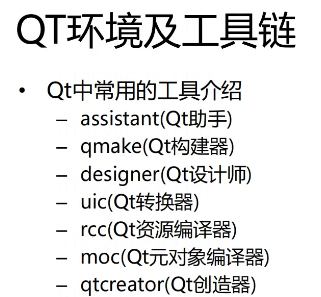

**qmake** 构建makefile脚本文件

**designer** 可视化UI设计 生成.ui 文件

**uic** 把.ui文件 转化为C++编译器可编译的文件 转换为.h 

**assistant** Qt帮助文档

- Properties 属性

- Public Functions 公有函数

- Public Slots 公有槽函数

- Reimplemented Public Functions 重载后的公有函数

rcc 图片等在qt中视为资源  编译作为程序的一部分

moc 不属于c++标准库中的语法 将qt中特有语法翻译为c++编译器能够认识的语法

qtcreator 集成以上所有部件 最终使用

### QApplication Class

构造函数 QApplication(int argc, char** argv) 

由于没有默认值 故而main函数的参数中需要带有两个参数

desktop application 只有当用户点击叉了以后才会关闭 故而不需要写入return 0

### 基于对象的Qt编程

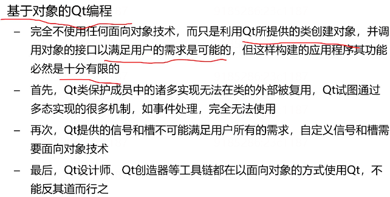

## 编译为可执行文件

```C++
#include <QApplication> //
#include <QLabel> //标签类
int main(int argc, char** argv)
{
  QApplication(argc, argv);
  QLabel label("Hello World\n");
  //槽函数也可以做普通成员函数的调用
  label.show(); //显示标签
  return app.exec(); //进入循环等待
}
```

编译步骤 编译为一个可执行程序

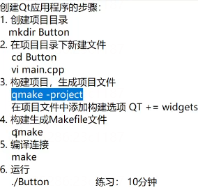


```C++
#include <QApplication>
#include <QLabel>
#include <QPushButton>

int main(int argc, char** argv)
{
  //创建Qt应用程序对象
  QApplication app(argc, argv);
  
  //创建标签控件
  QLabel label("I am Label");
  //显示标签
  label.show();
  
  //创建按钮控件
  QPushButton button("I am Button");
  
  //显示按钮
  button.show();
  //进入主事件循环并等待exit()调用
  return app.exe();
}
```

## Qt父窗口 

将多个部件放到一个窗口内

常用父窗口

- QWidget
- QMainWindow //Qwidget的子类
- QDialog //QWidget 子类

**inherited by** 被谁继承

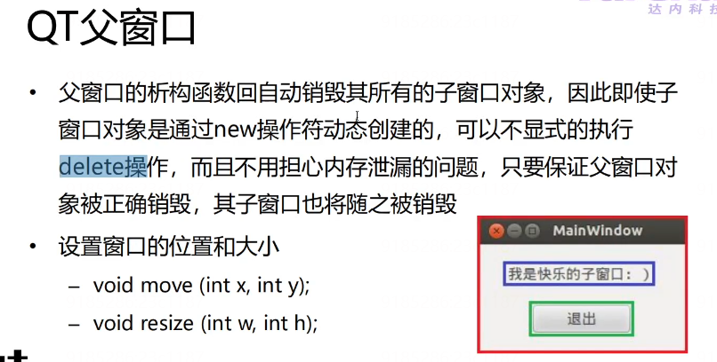

move基于父窗口的原点位置(x 向右增大 y向左增大)通常来说 左上角为原点

```C++
#include <QApplication>
#include <QLabel>
#include <QPushButton>
#include <QWidget>


int main(int argc, char** argv)
{
  //创建Qt应用程序对象
  QApplication app(argc, argv);
  
  QWidget parent;
  parent.move(500, 400);
  parent.resize(300, 200)； //父窗口的大小
  
  //创建标签控件
  QLabel label("I am Label", &parent);
  label.move(50, 40); //标签的位置
  label.resize(200, 40); //标签的大小
  //显示标签
//  label.show();
  
  //创建按钮控件
  QPushButton button("I am Button", &parent);
  button.move(90, 120);
  button.resize(120, 40);
  
  
  QPushBUtton* pBtn = new QPushButton("关闭", &parent);
  pBtn->move(170, 90);
  pBtn->resize(90, 30);
  
  //显示按钮
 // button.show();
  
  //由于show函数显示的是该控件及其子控件 则只需要显示父控件就回显示所有的子控件
  parent.show();
  //进入主事件循环并等待exit()调用
  return app.exe();
}
```

## 信号和槽

通信机制  实现对象之间的数据交互

当用户或系统触发了一个动作 导致某个控件的状态发生了改变  该控件就发送一个信号

槽函数对某种特定信号的处理 用槽和其他对象信号建立连接 绑定  当该信号发生时 触发和执行


### 定义

#### 信号的定义

```c++
class name:public QObject
{
	O_OBJECT//宏
	signals:
  	void signal_func(……); //信号函数
};
```

信号函数只需声明 不能写定义 底层使用信号的机制 QT做了封装

#### 槽函数

```c++
class name:public QObject{
  Q_OBJECT
  public slots:
  void slot_func(){;} //槽函数
};
//槽函数可以连接到某个信号 当信号被发射时 槽函数将被触发和执行
```

### 信号和槽的连接

QObect::connet(const QObect* sender, const char* signal, const QObect* receiver, const char* method);

- sender 信号发送对象指针
- signal 信号的函数

- receiver 信号接收对象指针
- method 接收信号后要执行的槽函数

```c++
#include <QApplication>
#include <QLabel>
#include <QPushButton>

int main(int argc, char** argv)
{
  //创建应用程序对象
  QApplication app(argc, argv);
  QLabel label("点击按钮关闭标签");
  label.show();
  
  QPushButton button("关闭");
  button.show();
  
  //信号和槽函数的连接
  QObject::connect(&button, SIGNAL(clicked()), &label, SLOT(close()));
  
  //进入主事件循环
  return app.exe();
}
```


信号和槽函数参数要一致 槽函数可以被直接调用

信号函数的参数可以多于槽函数 多于参数将被忽略

参数和槽的连接若参数不匹配 但不会编译错误 只会在产生信号时没有槽函数处理 代表连接失败

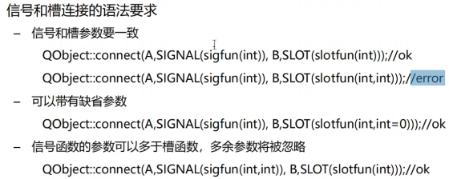

该机制类似于调用槽函数时 不直接调用 通过信号触发槽函数  **信号只有提供槽函数数据的功能** (迭代器调用算法)

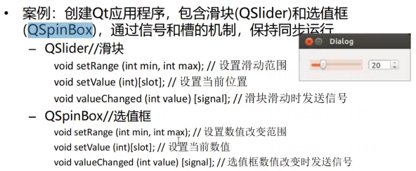

```C++
#include <QApplication>
#include <QDialog>
#include <QSlider> //滑块
#include <QSpainBox> //选值框

int main(int argc, char** argv)
{
  QApplication app(argc, argv);
  
  //创建父窗口
	QDiaglog parent;
  parent.move(500, 400);
  parent.resize(400, 100);
  
  //滑块
  QSlider slider(Qt::Horizontal, &parent);	//创建水平滑块
	slider.move(50, 35);
  slider.resize(180, 30);
  
  //选值框
  QSpinBox spinBox(&parent);
  spinbox.move(270, 35);
  spinBox.resize(80, 30);
  spinBox.serRange(0, 200); //设置选值框控件的取值范围
  
  
  //显示父窗口
  parent.show();
  
  //信号和槽函数的连接
  QObject::connect(&slider, SIGNAL(valueChanged(int)), &spinBox, SLOT(setValue(int)));
  QObject::connetc(&spinBox, SIGNAL(valueChanged(int)), &slider, SLOT(serValue(int)));
  
  //传入函数指针的connect
  QObject::connetc(&spinBox, &QSpinBox::valueChanged, &slider, &QSlider::setValue);
  //error
  //若当传入的函数为被重载过的函数 那么只通过函数名不能通过函数指针进行传入
  //编译时会报错
  return app.exec();
	
}
```

**Q_OBJECT**

Q_OBJECT 表明槽函数和信号通过moc翻译为c++语法  若定义了槽函数和信号函数而不添加这个宏  则在连接槽和信号时 由于槽函数未翻译 编译器找不到对应的函数  故而连接失败

### 案例

#### 案例:加法器

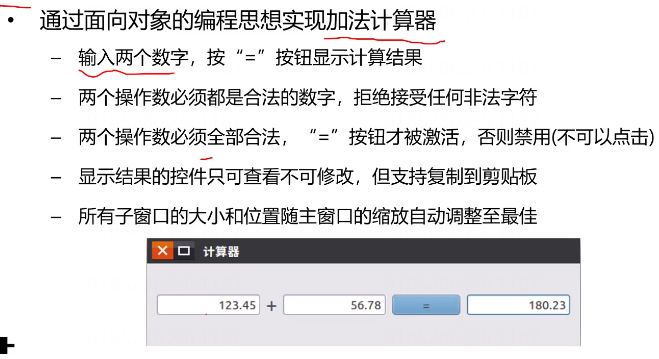


**CalculatorDialog.h**

```c++
#ifndef __CALCULATORDIALOG_H
#define __CALCULATORDIALOG_H

#include <QDialog>
#include <QLabel>
#include <QPushButton>
#include <QLineEdit> //单行输入框
#include <QHBoxLayout> //水平布局器
#include <QDoubleValidator> //double数字验证器


class CalculatorDialog:plblic QDialog{
	Q_OBJECT //moc 宏 将qt语法转化为c语法
public slots:
  	// 计算并显示结果
  void calc(void);

  void enabledButton(void);
  
  
public:
  	calculatorDialog(void);
private:
  QLineEdit* m_editX; //左操作数
  QLineEdit* m_editY; //右操作数
  QLineEdit* m_editZ; //结果
  QLabel* m_label;  //+
  QPushButton* m_button; //=

};


#endif //__CALCULATORDIAGLOG_H
```


**calculator.cpp**

```c++
#include "calculatorDiaglog.h"
//构造函数

CalculatorDialog::CalculatorDialog(void)
{
	//窗口初始化
  this->setWindowTitle("计算器");
  
  //左操作数 this 当前控件的父窗口指针 谁调用构造函数 谁就是父窗口
  m_editX = new QLineEdit(this);
  //设置文本对齐 水平右对齐
  m_editX->setAlignment(Qt::AlignRight);
  //设置数字验证器 只能输入数字
  m_editX->setValudator(new QDoubleValidator(this));
  
  //右操作数
  m_editY = new QLineEdit(this);
  m_editY->setAlignment(Qt::AlignRight);
  m_editY->setValudator(new QDoubleValidator(this));
  
  //结果
  m_editZ = new QLineEdit(this);
  m_editZ->setAlignment(Qt::AlignRight);
  m_editZ->setReadOnly(true);
  
  // +
  m_label = new QLabel("+", this);
  
  //=
  m_button = new QPushButton("=", this);
  m_button->setEnable(false); //设置为禁用
  
  //创建布局器 布局器即将所有的控件放到一个盒子中 盒子水平对齐  当对整体移动时 只需要移动盒子即可
  QHBoxLayout* layout = new QHBoxLayout(this);
  layout_addWidget(m_editX);
  layout_addWidget(m_label);
  layout_addWidget(m_button);
  layout_addWidget(m_editZ);
  //添加顺序为在水平布局器中的先后顺序
  
  //设置窗口的布局器 窗口也是一个盒子
  this->setLayout(layout);
  
  //信号和槽函数的连接
  connect(m_editX, SIGNAL(textChanged(QString)), this, SLOT(enabledButton())));
  connect(m_editY, SIGNAL(textChanged(QString)), this, SLOT(enabledButton())));
  connect(m_button, SIGNAL(clicked()), this, SLOT(calc()));
  
}

void CalculatorDialog::enabledButton(void)
{
  bool bXok, bYok;
  //QLineEdit::text(); 获取QLineEdit的文本
  //QString::toDouble(bool* ok) 将QString 转化为double
 if(m_editX->text().toDouble(&bXok) && m_editY->text().toDouble(&bYok))
 {
   m_button->setEnabled(bXOk && bYOk);
 }
}

void CalculatorDialog::calc(void)
{
  double res = m_editX->text().toDouble() + m_editY->text().toDouble();
  //Qstring::number 将double数字 转换为QString 字符串
  QString str = QString::number(res, 'g', 2);
  //将结果显示在文本框中
  m_editZ->setText(str);
	  
}
```


**main.cpp**

```c++
#include <QApplication>'
#include "CalculatorDialog.h"

int main(int argc, char** argv)
{
	//创建应用程序对象
  QApplication app(argc, argv);
  CalculatorDialog calc;
  calc.show();
  return app.exec();
}
```


编译为可执行文件

- qmake -project 生成.pro文件 依据当前目录生成
- vi Calculator.pro
  - 在开始添加 QT += widgets

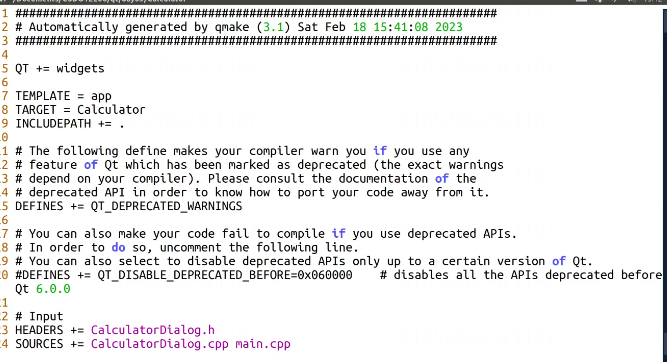

- qmake 构建脚本文件
  - 生成.o moc_CalculatorDialog.cpp Q_OBEJCT 启动moc 将.h 转换为.cpp 槽函数和信号写在头文件中
  - 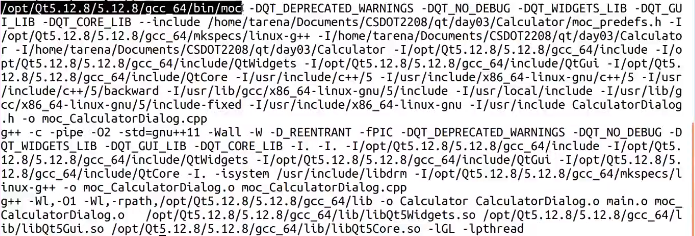

#### 案例:获取系统时间

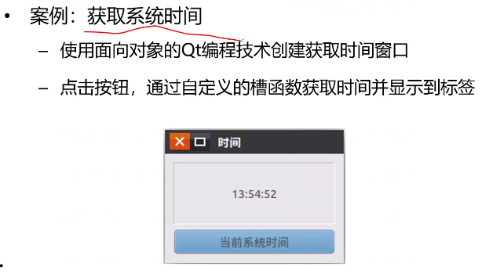


```c++
#ifndef __TIMEDIALOG_H
#define __TIMEDIALOG_H

#include <QDialog>
#include <QLabel>
#include <QPushButton>
#include <QVBoxLayout>
#include <QVBoxLayout>
#include <QTime>
#include <QDebug>

class TimeDialog:public QDialog
{
  Q_OBJECT
 public:
 	//构造函数
  TimeDialog(void);
  
 public slots:
  //获取系统时间的槽函数
  void getTime(void);
 signals:
  void mySignal(const QString&); // 自定义信号 只能声明 不能定义
 private:
  QLabel* m_label; //显示时间的标签
  QPushButton* m_button;  //获取时间的按钮
  
};

#endif //__TIMEDIALOG_H

```


```C++
#include "TimeDialog.h"

//构造函数
TimeDialog::TimeDialog(void)
{
  //窗口的初始化
  this->setWindowTitle("获取系统时间");
  
  //label
  m_label = new QLabel(this);
  //设置边框效果
  m_label->setFrameStyle(QFrame::Panel | QFrame::Sunken);
  //设置水平垂直居中
  m_label->setAlignment(Qt::AlignHCenter | Qt::AlignVCenter);
  
  //设置字体大小
  QFont font;
  fon.setPointSize(20);
  m_label->setFont(font);
  
  //m_button
  m_button = new QPushButton("获取系统时间", this);
  m_button->setFont(font);
  
  QVBoxLayout* layout = new QVBoxLayout(this);
  layout->addWidget(m_label);
  layout->addWidget(m_button);
  this->setLayout(layout);
  
  //信号和槽的连接
  connect(m_buttn, SIGNAL(clicked()), this, SLOT(gettime()));
  
  connect(m_button, SIGNAL(mySignal(QString)), m_label, SLOT(setText(QString)));
}

void TimeDialo::getTime(void)
{
  QTime time = QTime::currrentTime ();
  QString str = time.toString("hh:mm:ss");
  m_label->setText(str)；
  //发射信号
  emit mySignal(str);
}
```


**main.cpp**

```c++
#include <QApplication>
#include "TimeDialog.h"

int main(int argc, char** argv)
{
  QApplication app(argc, argv);
  TimeDialog time;
  time.show();
  
  return app.exec();
}
```

自定义信号常用于不同窗口的数据传递


## QT designer

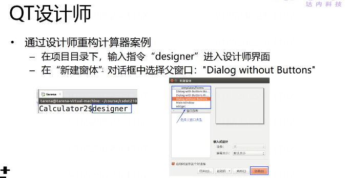

可视化编程

生成一个xml文件 类似一个html文件

使用uic转换器生成.h文件

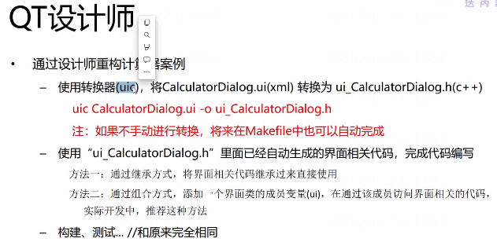


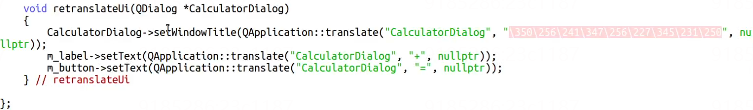

未避免出现中文乱码  在qt的.ui中转换为了编码


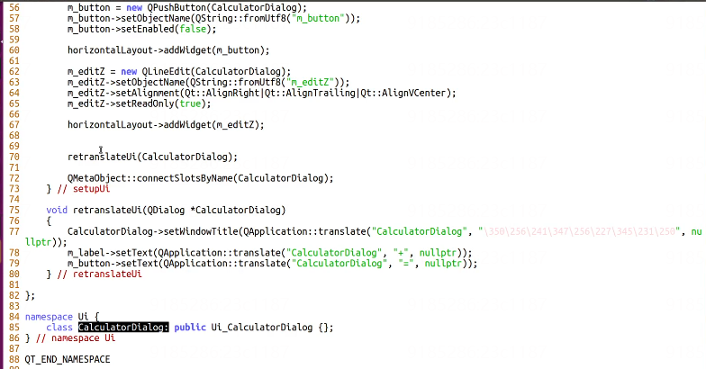

UI下的calculateDialog 继承自上面写好的类 

而上面的类为designer自动生成的  当修改ui界面时 上面的类会被频繁的重新编译

而功能部分不变 故而可以将其进行封装  设计时使用子类进行拓展 原有的界面类不变  防止重复编译

**使用继承方式重构后的.h**

```c++
#ifndef __CALCULATORDIALOG_H
#define __CALCULATORDIALOG_H

#include <QDoubleValidator>
#include "ui_CalculatorDialog.h"

//继承方式
class CalculatorDalog:public QDialog, public Ui::CalculatorDialog
{ //继承多个类的写法
  Q_OBJECT //moc
  public:
  	CalculatorDialog(void);
  public slots:
  	void enabledButton(void);
  	void calcRes(void);
}

#endif //__CALCULATORDIALOG_H
```


```c++
#include "CalculatorDialog.h"

CalculatorDialog::CalculatorDialog(void)
{
  //界面初始化
  setupUi(this);
  //m_editX 等几根指针在头文件中删除  但在构建ui文件中有定义 故而可以继续使用
  m_editX->setValidator(new QDoubleValudator(this));
  m_editY->setValidator(new QDoubleValudator(this));


  connect(m_editX, SIGNAL(textChanged(QString)), this, SLOT(enabledButton())));
  connect(m_editY, SIGNAL(textChanged(QString)), this, SLOT(enabledButton())));
  connect(m_button, SIGNAL(clicked()), this, SLOT(calc()));

}

void CalculatorDialog::enabledButton(void)
{
  bool bXok, bYok;
  //QLineEdit::text(); 获取QLineEdit的文本
  //QString::toDouble(bool* ok) 将QString 转化为double
  if(m_editX->text().toDouble(&bXok) && m_editY->text().toDouble(&bYok))
  {
    m_button->setEnabled(bXOk && bYOk);
  }
}

void CalculatorDialog::calc(void)
{
  double res = m_editX->text().toDouble() + m_editY->text().toDouble();
  //Qstring::number 将double数字 转换为QString 字符串
  QString str = QString::number(res, 'g', 2);
  //将结果显示在文本框中
  m_editZ->setText(str);

}
```


### **使用复合方式生成.h

```c++
#ifndef __CALCULATORDIALOG_H
#define __CALCULATORDIALOG_H

#include <QDoubleValidator>
#include "ui_CalculatorDialog.h"

//继承方式
class CalculatorDalog:public QDialog
{ //继承多个类的写法
  Q_OBJECT //moc
  public:
  	CalculatorDialog(void);
  	~CalculatorDialog(void); //销毁ui指针
  
  public slots:
  	void enabledButton(void);
  	void calcRes(void);
  private:
  	Ui::CalculatorDialog* ui; //通过ui访问界面类的成员
};

#endif //__CALCULATORDIALOG_H
```


**注意写法!!!**

```C++
#include "CalculatorDialog.h"

CalculatorDialog::CalculatorDialog(void)
  :ui(new Ui::CalculatorDialog) //构造哈数
{
  //界面初始化
  setupUi(this);
  //m_editX 等几根指针在头文件中删除  但在构建ui文件中有定义 故而可以继续使用
  ui->m_editX->setValidator(new QDoubleValudator(this));
  ui->m_editY->setValidator(new QDoubleValudator(this));


  connect(ui->m_editX, SIGNAL(textChanged(QString)), this, SLOT(enabledButton())));
  connect(ui->m_editY, SIGNAL(textChanged(QString)), this, SLOT(enabledButton())));
  connect(ui->m_button, SIGNAL(clicked()), this, SLOT(calc()));

}

CalculatorDialog::~CalculatorDialog(void)
{
	delete ui; //释放Ui 动态分配内存 
}


void CalculatorDialog::enabledButton(void)
{
  bool bXok, bYok;
  //QLineEdit::text(); 获取QLineEdit的文本
  //QString::toDouble(bool* ok) 将QString 转化为double
  if(ui->m_editX->text().toDouble(&bXok) && ui->m_editY->text().toDouble(&bYok))
  {
    ui->m_button->setEnabled(bXOk && bYOk);
  }
}

void CalculatorDialog::calc(void)
{
  double res = ui->m_editX->text().toDouble() + ui->m_editY->text().toDouble();
  //Qstring::number 将double数字 转换为QString 字符串
  QString str = QString::number(res, 'g', 2);
  //将结果显示在文本框中
  ui->m_editZ->setText(str);

}
```

## 槽函数的命名

**on\_控件名\_信号名（参数列表） 这样不用讲信号和槽进行连接**

### 案例

#### 登陆对话框

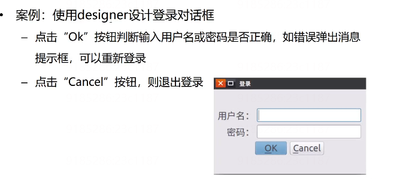

**LoginDialog.h**

```c++
#ifndef __LOGINDIALOG_H
#define __LOGINDIALOG_H

#include "ui_loginDialog.h"
#include <QMessageBOx>
#include <QDebug> //打印信息

//使用组合方式
class LoginDialog:public QDialog
{
  Q_OBJECT //moc
  public :
  	LoginDialog(void);//构造函数
		~LoginDialog(void);
  public slots:
  	//处理ok按钮的点击 accepted 信号
  	void onAccepted(void);
  //处理取消按钮的点击 reject 信号
  void onRejected(void);
  private:
  	Ui::LoginDialog* ui;
};


#endif // __LOGINDIALOG_H
```

**LoginDialog.cpp**

```c++
#include "LoginDialog.h"

//构造函数
LoginDialogL::LoginDialog(void)
  :ui(new LoginDialog)
{
	//界面初始化函数
  ui->setupUi(this);
  //信号与槽的连接
    connect(ui->buttonBox, SIGNAL(accpted(), this, SLOT(onAccepted())));
		connect(ui->buttonBox, SIGNAL(rejected(), this SLOT(onRejected())));
  }

//析构
LoginDialog::~LoginDialog(void)
{
  delete Ui;
}

//点击ok按钮 
void LoginDialog::onAccepted(void)
{
  if(ui->editUserName->text() == "tarena" && ui->editPassword()  == "123456")
  {
    qDebug() << "登陆成功";
    this->close(); //关闭登陆窗口
	}
  else
  {
    QMessageBox::critical(this, "登陆", "用户名或密码错误,请重新输入", QMessageBox::Ok | …… );
	}
}

//点击cancel按钮
void LoginDialog::onRejected(void)
{
  QMessageBox::StandardButton temp = QMessageBox::question(this, "登录", "确定要退出登录吗？", QMessageBox::Yes | QMessageBox::No, QMessageBox::No );
  if(temp == QMessageBox::Yes) this->close();
  
}
```


```c++
#include <QApplication>
#include <LoginDialog.h>

int main(int argc, char** argv)
{
  QApplication app(argc, argv);
  LoginDialog login;
  login.show();
  
  return app.exec();
}
```

## QT创造器

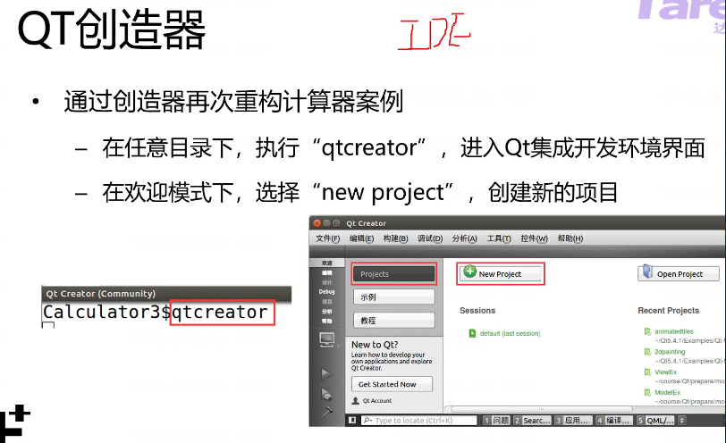

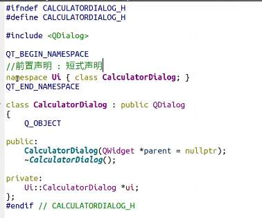

> 在qtcreator中.ui文件未转换为.h 但想使用一颗指针来使用.ui里面的控件 
>
> 此时可以使用该方法  前置声明 先声明这样一个类先用  后面编译过后该类就回在头文件中产生  防止编译器在编写代码时报错 影响开发

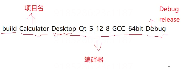

### Qt事件

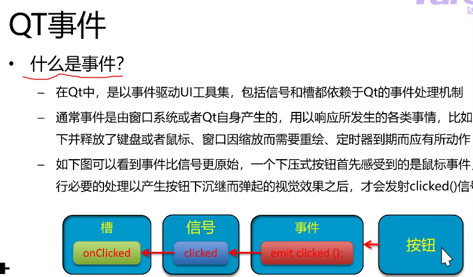

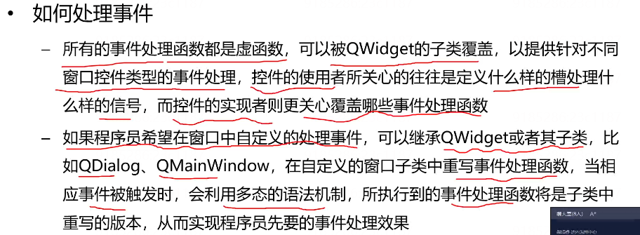


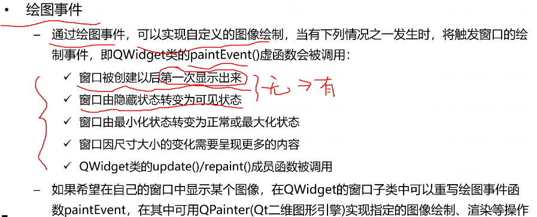


#### 案例:基于资源的图片浏览器

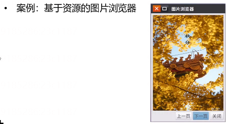

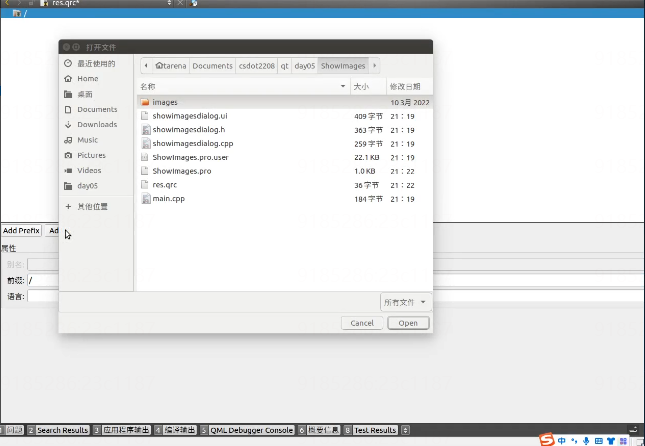

添加前缀prefix后添加文件

前缀即在逻辑上的前面的路径 

showImageDialog.h

```c++
#ifndef SHOWIMAGEDIALOG_H
#define SHOWIMAGESDIALOG_H

#include <QDialog>
#include <QPainter>
#include <QImage>

QT_BEGIN_NAMESPACE
  namespace Ui { class ShowImagesDialog;}
QT_END_NAMESPACE

  class ShowImagesDialog : public QDialog
  {
    Q_OBJECT

      public:
    ShowImagesDialog(QWidget *parent = nullptr)
      ~ShowImagesDialog();
    protected:
    //绘图事件处理函数
		void paintEvent(QPaintEvent *event);
    private:
    Ui::ShowImagesDialog *ui;
    int m_index; //图片的索引
  };

#endif //SHOWIMAGESDOALOG_H
```

.cpp

```c++
#include "showimagesdialog.h"
#include "ui->showimagesdialog.h"

ShowImagesDialog::ShowImagesDialog(QWidget *parent)
  :QDialog(parent), ui(new Ui::ShowImagesDialog)
  {
    ui->setupUi(this);
    
    m_index = 0;
  }
ShowImagesDialog::~ShowImagesDialog()
{
  delete ui;
}

void ShowImagesDialog::paintEvent(QPaintEvent *event)
{
  Q_UNUSED(event) //宏 代表该参数不使用
  //创建画家类对象
  QPainter painter(this);
  
  //获取绘图区域
  QRect rect = ui->frame->frameRect();
  //坐标系的平移
  rect.translate(ui->frame->pos());
  
  //构建一张图片
  QImage image(":/images/" + QString::number(m_index) +".jpg"); //:冒号代表该资源来自资源文件
  
  //使用painter
  painter.drawImage(rect, image);
}

//上一页
void ShowImagesDialog::on_btnPrev_clicked()
{
  if(--m_index < 0) m_index = 7;
  this->update(); // 触发绘图事件的产生 产生信号 调用绘图事件处理函数
}

//下一页
void ShowImagesDialog::on_btnNext_clicked()
{
  if(++m_index > 7) m_index = 1;
  this->update();
}

void ShowImagesDialog::on_btnClose_clicked()
{
  this->close;
}
```


## OpenCV图像处理

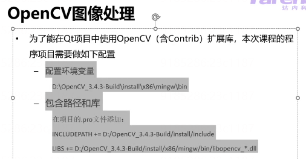

单独的技术  用cpp编写

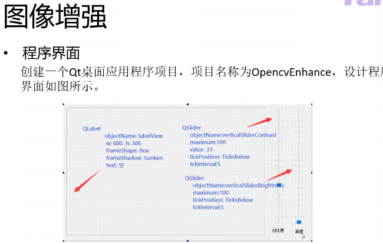

**MinGW** 编译器

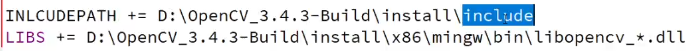

在包含头文件时可以从该INCLUDEPATH下去寻找 而不用去写绝对路径

LIBS 动态库


Widget.h

.hpp 文件 即.h和.cpp写在一起  函数的定义和声明

```c++
#ifndef WIDGET_H
#define WIDGET_H

#include <QWidget>
#include <QImage>
#include <opencv2/imgproc.hpp>
using namespace cv;

QT_BEGIN_NAMESPACE
  namespace Ui
{
  class Widget;
}

QT_END_NAMESPACE

  class Widget:public QWidget
  {
    Q_OBJECT
      public:
    Widget(QWidget* parent = nullptr);
    ~Widget();
    //界面初始化
   	void initWidget();
    //处理图片
    void imgProc(float contrast, int brightness);
    //显示图片
    void imgShow();
    
    private:
    Ui::wideget* ui;

    Mat myImg; //opencv保存图片数据
    QImage myQImg; //QT保存图片数据
  };

#endif //WIDGET_H


```


```c++
#include "Widget.h"
#include "ui_widget.h"

Widget::Widget(QWidget* parent)
  :QWidget(parent), ui(new UI::Widget)
  {
    ui->setupUi(this);
    setWindowsFlag(Qt::MSWindowsFixedSizeDialogHint);//设置窗口大小不可改变
    initWidget();
  }

Widget::-Widget()
{
  delete ui;
}

//界面初始化

void Widget::initWidget()
{
  QString imgPath = "img path";
  Mat imgDate = imread(imgpath.toLatin1().date() ); //读取图片数据
  cvtColor(imgData, imgData, COLOR_BGR2RGB); 
  myImg = imgData;
  myQImg = QImage(imgData.data, imgData.cols, imgData.rows, QImage::Format_RGB888);
	
  imgShow();
}

void Widget::imgShow()
{
  ui->labelView->setPixmap(QPixmap::fromImage(myQImg.scaled(ui->labelView->size(), Qt::KeepAspectRatio)))
}

void Widget::imgProc(float contrast, int brightness)
{
  Mat imgSrc = myImg;
  Mat imgDest = Mat::zeros(imgSrc.size(), imgSrc.type())//初始生成一个空的零像素
	imgSrc.convertTo(imgDest, -1, contrast, brightness);
  myQImg = QImage(imgDest.data, imgDest.cols, imgDest.row, QImage::Format_RGB888);
  imgShow();
}


//对比度滑块 槽函数
void Widget::on_verticalSliderCOntrast_valueChanged(int value)
{
	imgProc(value/33.3, ui->verticalSliderBrightness->value());
}

//亮度滑块
void Widget::on_verticalSliderBrightness_valueChanged(int value)
{
  imgproc(ui->verticalSliderContrast->value()/33/3, value);
}


```


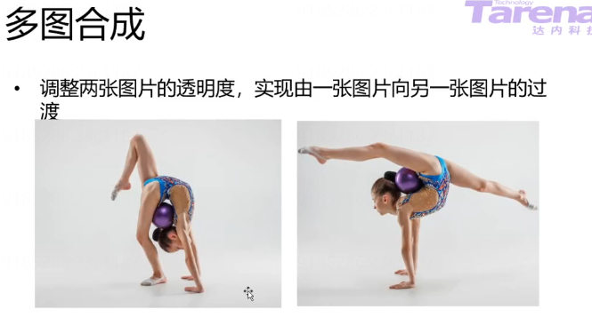

两张图片重叠 移动滑块两张图片的透明度逐渐变化


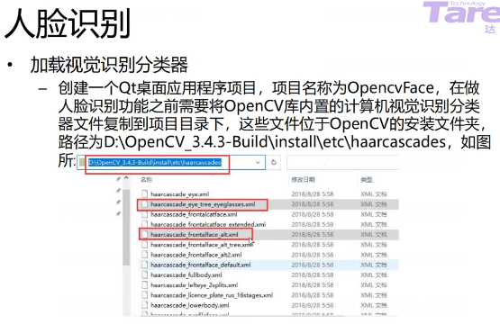


**wideget.h**

```c++
#ifndef WIDGET_H
#define WIDGET_H

#include <QWidget>
#include <opencv2/opencv.hpp>
#include <vector>

using namespace cv;
using namespace std;

QT_BEGIN_NAMESPACE
  namespace Ui {class Widget:}
QT_END_NAMESPACE

  class Widget:public QWidget
  {
    Q_OBJECT
      public :
    widget(QWidget* parent = nullptr);
    ~Widget();
		void initWidget();
    void imgProc();
    void imgShow();
    private；
      Ui::Widget* ui;
			Mat myImg;
    QImage myQImg;
    	
  };

#endif //WIDGET_H
```


**widget.cpp**

```c++
#include "widget.h"
#include "ui_widget.h"

Widget::Widget(QWidget *parent)
  :QWidget(parent), ui(new Ui::widget)
  {
    ui->setupUi(this);
    ui->setWindosFlag(Qt::MSWindowsFixedSizeDialogHint);
    initWidget();
  }

Widget::~Widget()
{
  delete ui;
}

//界面初始化
void Widget::initWidget()
{
  QString imgPath = "../OpenCVFace"； //图片路径
  Mat imgData = imread(imgPath.toLatin1().data());
  cvtColor(imgData, imgData, COLOR_BGR2RGB);
  myImg = imgData;
  myQImg = QImage(imgData.data, imgData.cols, imgData.rows, QImage::Format_RGB888);
	imgShow();
}

//图片的显示
void Widget::imgShow()
{
  ui->labelView->setPixmap(Qpixap::fromImage(myQImg.scaled(ui->labelView->size(), Qt::KeepAspectRation)));
  
}

//图片处理 人脸识别
void Widget::imgProc()
{
  CascadeClassifier face_detector; //定义人脸识别分类器
  CascadeClassifier eye_detector; //定义人眼识别分类器
  string faceDetectorPath = "../open... .xml";
  face_detector.load(faceDetectorPath); //加载人脸识别分类器
  string eyeDetectorPath = "../ ..... .xml"; // 加载人眼识别分类器
  eye_detector.load(eyeDetectorPath);
  
  vector<Rect> faces; //保存识别出来的人脸信息
  Mat imgSrc = myImg;
  Mat imgGray; //对图片进行灰度处理
  cvtColor(imgSrc, imgGray, CV_RGB2GRAY); //将彩色图片转换为灰度图片
  equalizeHist(imgGray, imgGray); //直方图均衡化 图片增强
  
  //多尺寸识别
  face_detector.detectMultiScale(
    imgGray, //检测图片
    faces, //保存检测结果的容器
    1.1, //每次检测时的缩放比例
    3， //至少检测次数 确认目标
    0,
    size(30, 30) //检测的最小尺寸
                                ); //多尺寸缩放识别
  
  for (unsigned int i = 0; i < faces.size(); i++) //for int i : faces
  {
    Point faceCenter(faces[i].x + faces[i].width*0.5, faces[i].y+ face[i].height*0.5);
    ellipse(imgSrc, faceCenter, Size(faces[i].windth*0.5, 
                                     faces[i].height*0.5)
           0,0,360,
           Scalar(255,0,255),
            4,8,0
     );
    
    Mat faceROI = imgGray(faces[i]); //检测出的人脸
    vector<Rect> eyes; //人眼信息
    eye_datector.detectMultScale(faceROI, eyes, 1.1, 3, 0, size(30, 30));
  	for(unsigned int  j = 0; j < eyes.size(); j++)
    {
      Point eyeCenter(faces[i].x + eyes[j].x + eyes[j].width*0.5,
                      faces[i].x + eyes[j].y + eyes[j].height*0.5
                     );
      int r = cvRound((eyes[j].width + eyes[j].height)*0.25);
      circle(imgSrc, eyeCenter, r, Scalar(255, 0, 0), 4, 8, 0);
      
      
    }
  }
  Mat imgDest = imgSrc;
  myQImg = QImage(imgDest.data, imgDest.cols, imgDest.rows, QImage::Format_RGB888);


}

void Widget::on_btnDetect_clicked()
{
  imgProc();
}

```

## 远程视频监控系统

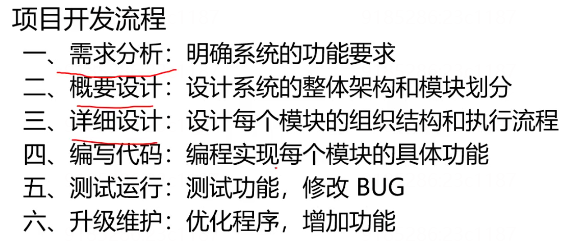

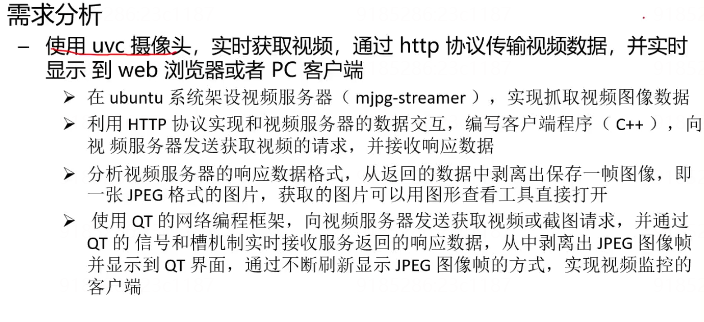

uvc usb接口的摄像头 笔记本自带的摄像头也遵循该协议

从网络传输的视频即为一帧图片 当放映一秒钟24帧以上时 人眼感觉为连续党的视频


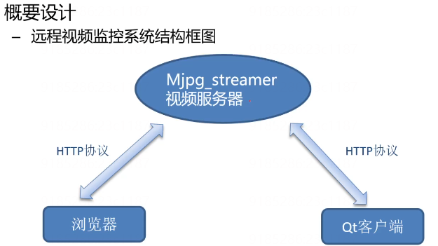

**Mjpg_streamer 框架图**


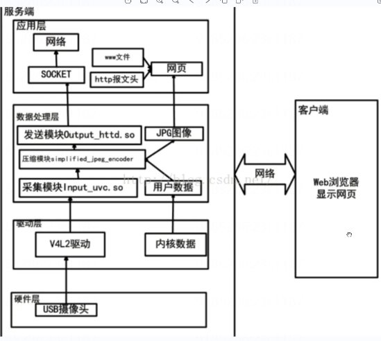

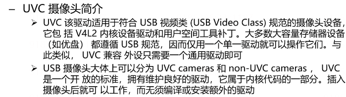

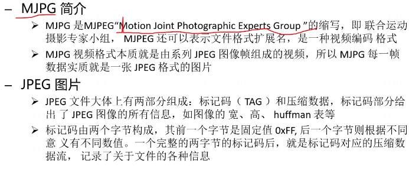

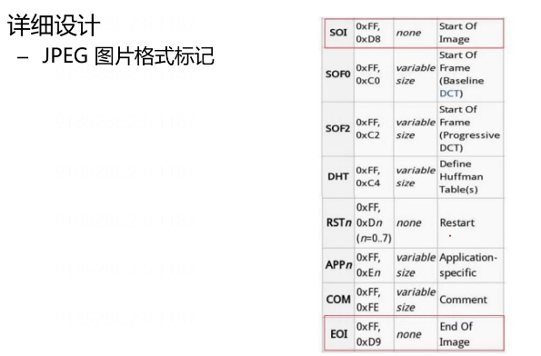

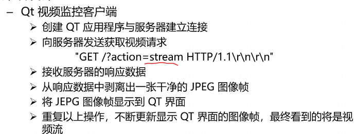

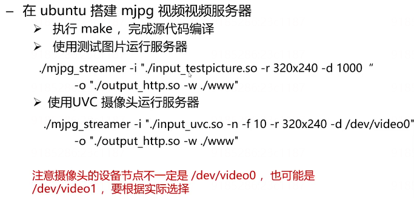

dev文件内装入的是设备的名称


实现结果

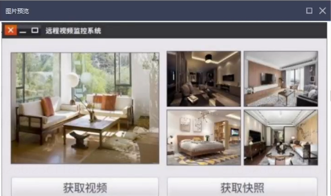


qt中多线程 有两种方式

>继承QThread 定义线程类
>
>movetothread 将工作对象移动到线程


**widget.h**

```C++
#ifndef WIDGET_H
#define WIDGET_H

#include <QWidget>
#include <QNetworkAccessManager>
#include <QNetworkRequest>
#include <QNetworkReply>
#include <QUrl>
#include <QThread>
#include <QLabel>
#include "facedetection.h"


QT_BEGIN_NAMESPACE
  namespace Ui {class Widget;}
QT_END_NAMESPACE

  class Widget:public QWidget
  {
    Q_OBJECT
      public:
    Widget(QWidget* parent = nullptr);
    ~Widget();

    signals:
    //自定义信号
    void imageAcquired(QImage); //拿到一个图片时 自定义信号

    private:
    void onMjpgReayread(); //自定义槽函数 接收到视频流数据时信号处理

    private:
    Ui::Widget *ui;

    QNetworkAccessManage* manager;
    QNetworkReques request; //根据url生成 url包

    QNetworkReply *mjpgReply; //获取视频流响应数据包
    QByteArray mjpgBuffer; //接收数据的缓冲区

    QImage mjpgImg; //保存从视频流中截取的图片帧

		QThread* thread;
    FaceDetectopm* detectWork; //人脸检测工作对象
		
    QVector<QLabel*> labelJpegs; //保存显示的快照
    int m_index; //索引
  };

#endif //WIDGET_H
```

**Widget.cpp**

```c++
#include "widget.h"
#include "ui_widget.h"

Widget::Widget(QWidget *parent)
  :QWiget(parent), ui(new Ui::Widget)
  {
    ui->setupUi(this);
    setWindowFlag(Qt::MsWindowsFixedSizeDialogHint);

    labelJpegs.append(ui->labelJpeg1);
    labelJpegs.append(ui->labelJpeg2);
    labelJpegs.append(ui->labelJpeg3);
    labelJpegs.append(ui->labelJpeg4);
    
    
    manager = new QNetworkaccessManager(this);
    thread = new QThread(this);
    detectWork = new FaceDetection; 
    //将一个进程调用到一个线程执行的时候 
    //不能指定父对象
    detectWork->moveToThread(thread);
    connect(this, SIGNAL(imageAcqueired(QIage)), detectWork, SLOT(onFaceDetection(QImage)));
    
    thread->start();
    
  }

Widget::~Widget()
{
  deteket manage;
  manage = nullptr;
  thread->terminate();
  thread->wait();
	detele ui;
}

void Widget::on_btnGetMJpg_clicked()
{
  // 准备请求包
  
}


```

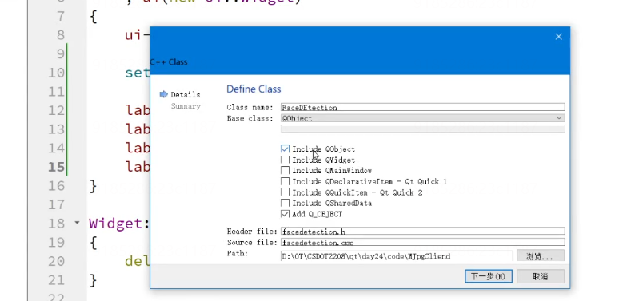


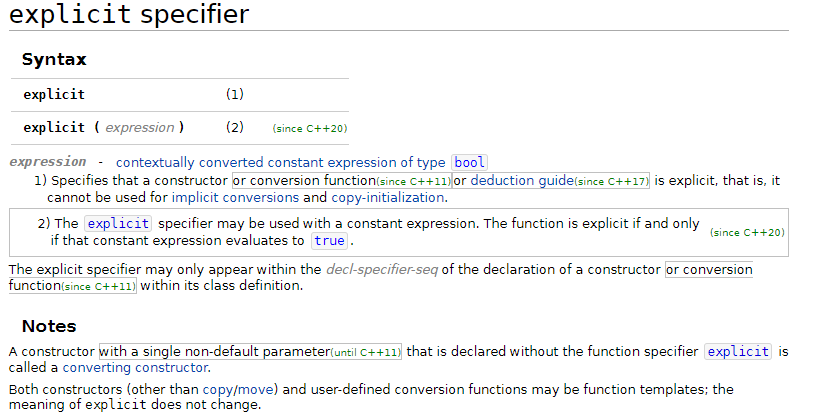


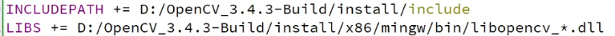

**facedetection.h**

```c++
#ifndef FACEDETECTION_H
#define FACEDETECTION_H

#include <QObejct>

class FaceDEtection : public QObject
{
  Q_OBEJCT
    public:
  explicit FaceDEtection(QObject* paren = nullptr);
  signals:
  public slots:
		void onFaceDetection(QImage img); //人脸识别
};
```

**facedetection.cpp**

```c++
#include "facedetection.h"
#include <opencv2/opencv.hpp>
#include <iostream>
#include <QImage>
#include <QDebug>
using namespace cv;
using namespace std;


void FaceDetection::onFaceDetection(QImage img)
{
	//将图像转换为RGB24 24bit 彩色
  QIamge image = img.converToFormat(QImage::Format_RGB888);
  
  //将QImage格式转换为Mat格式
  
  Mat matImg = Mat(imgage.height(), image.width(), CV_8UC,
                  image.bits(),
                  image.bytesPerLine()); //可以将mat类型的图片想象成一个二维矩阵  点阵图  每一个像素点保存对应的颜色数据
	//进行灰度处理 将图片进行灰度处理
  Mat imageGray;
  cvtColor(matImg, imgGray, CV_RGB2GRAY);
  
  //加载分类器
  CascadeClassifier faceDetector;
  
  string detectPath = "分类器路径";
  faceDetector.load(detectPath);
  vector<Rect> faces;
  equalizeHist(imgGray, imgGray);
  
  //多尺寸检测人脸
  faceDetector.detectMultiScale(imgGray, faces, 1.1, 3, 0, Size(30, 30));
  
  if(!faces.empty())
  {
    QString str = "检测到有" + QString::number(faces.size()) +"人进入监控区域";
    qDebug() << str;
  	
  
}
```

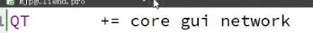
