# 分布式流媒体

## 服务器

### 单机服务器

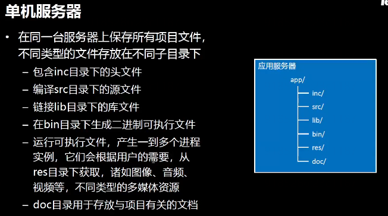

缺点 

服务器压力大 存储空间  用户多了后 不堪重负

Centos ubuntu 等等

改进 

存储模块 放置于别的存储集群 类似NAS的东西

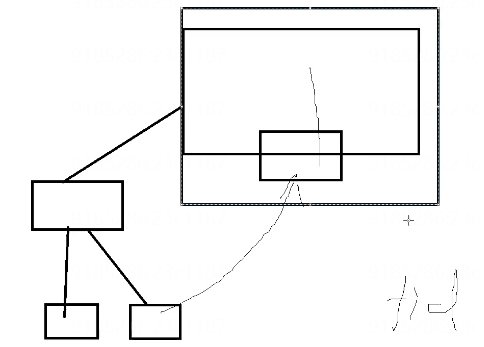

### 独立服务器

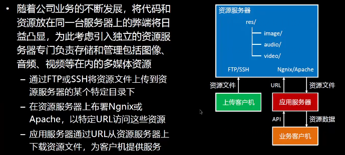

应用服务器 处理与存储无关的功能

上传客户机  对资源服务器进行管理


交互性越高  时间片越短  I/O速度越快 所需时间片越长


### 分布式存储

分布式 将每个模块独立出去 不单独放置于一台机器

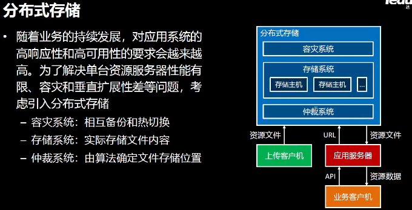

仲裁系统 选着某一存储主机

保证负载均衡

容灾系统 管理多级备份  热切换 主机与备份机实时同步状态 当主机损坏 则交给备份机


可以不用停机维护


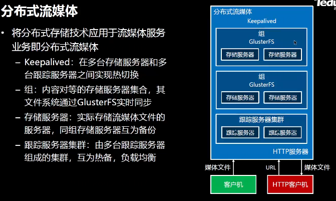

跟踪服务器 实时跟踪存储服务器集群的状态

每个组间的服务器互为镜像  可以根据业务需求 将各个组放置到不同的地区


## 系统总体架构

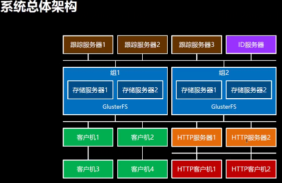

ID服务器 产生ID 保证一个集群中的各个进程ID号等等 唯一

### 跟踪服务器


被动接受 存储服务器信息 存储服务器 服务注册

存储服务器 周期发送心跳包  跟踪服务器 周期检查心跳包


### 存储服务器和ID服务器

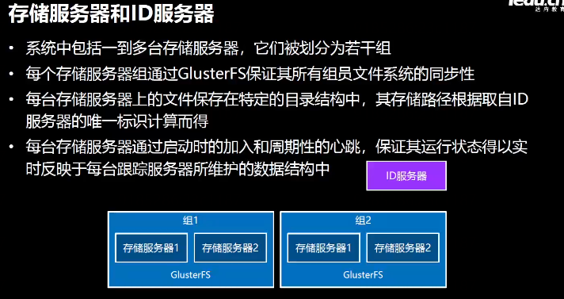


### 客户端

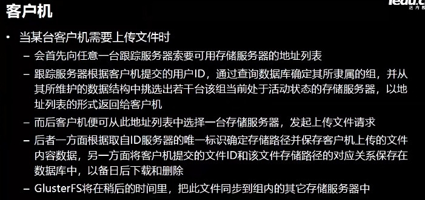


每个业务可能由一个服务器集群完成 当客户端请求某一业务处理时 需要知道对应服务器的信息

那么集群多了以后 客户机所需要维护的信息就回增多 成本增加 所以 可以类似索引一样的处理 将所有的服务器集群的信息 所能够完成的业务交给某一个专用的服务器来完成

客户机只需要与该服务器进行交互 只需要维护一个服务器的信息即可  由该服务器将所需要处理的业务分发出去


### HTTP服务器和客户机


## 报文规约  

定义一个报文 TCP是流式结构

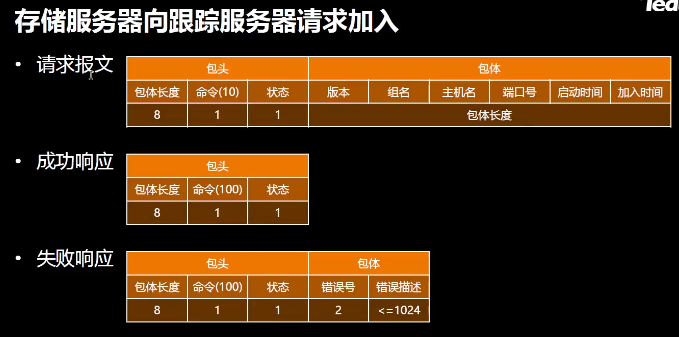

根据固定长度的报头 来知晓该包的结构

报文格式

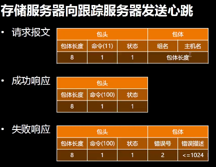

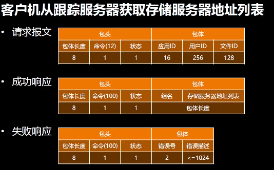

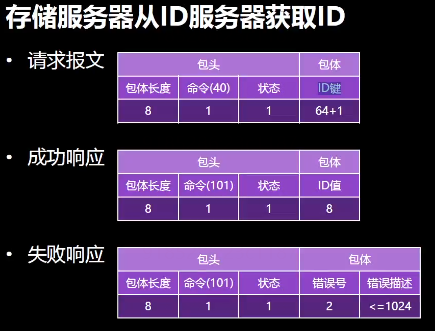

ID键 区分ID的种类 键值对


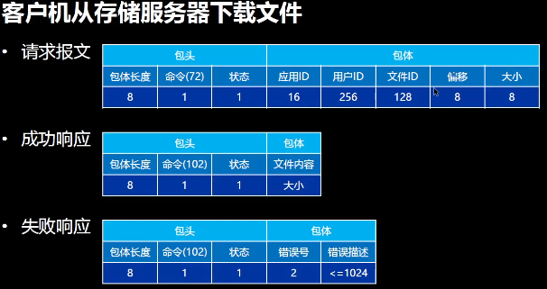

命令 表明响应发送源

## 库表结构

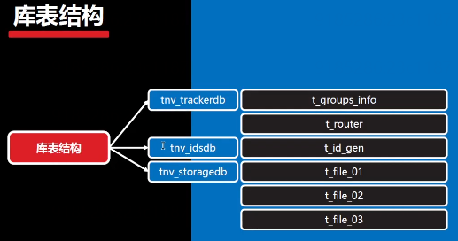


合法组名的集合

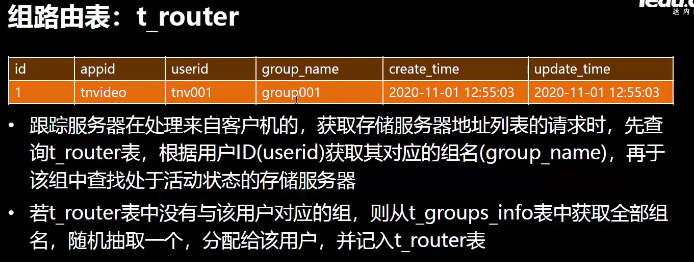

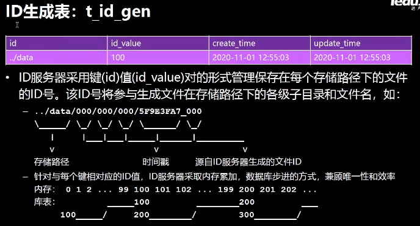

重启机器后 从数据库中的数据初始化  舍弃一段数值 保证ID唯一性

id用存储位置做键  每一个键对应一块硬盘 或者一个区 每个硬盘随机做键  用512进制来做值的部分 分成四层 每一层可以放512个文件 共有512^4个文件数


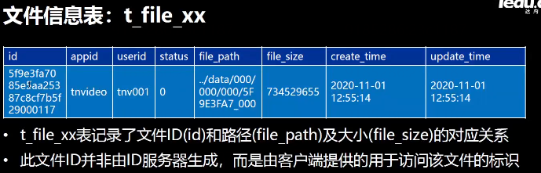

status 预留于做软删除  当删除某一文件时 将其改为1 逻辑删除 不允许用户访问 若用户想要恢复则转换为0即可


## 开发环境

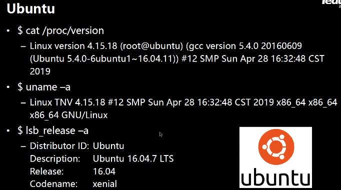

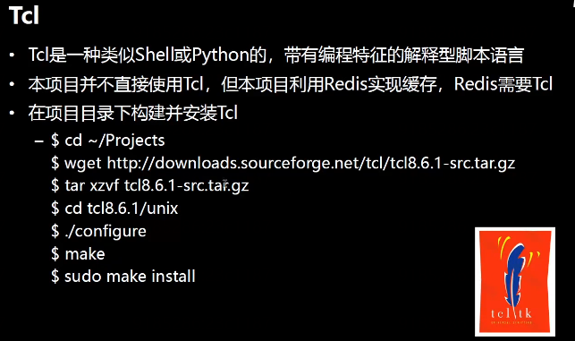


redis 内存级别的数据库

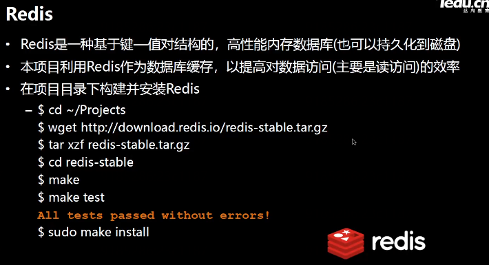

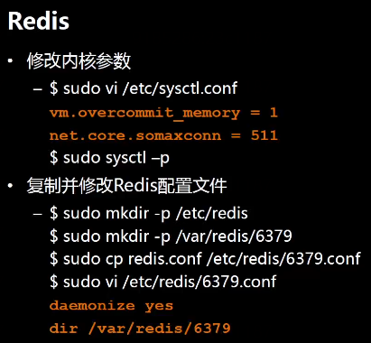

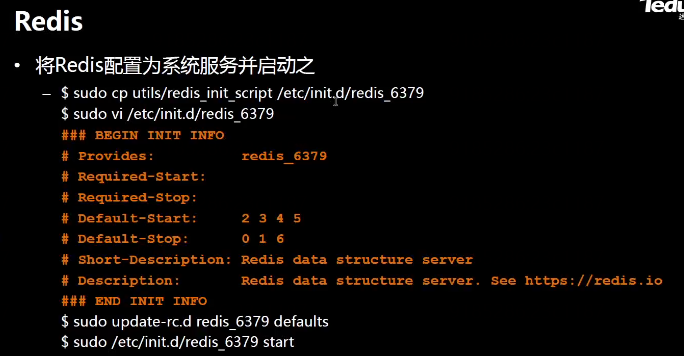


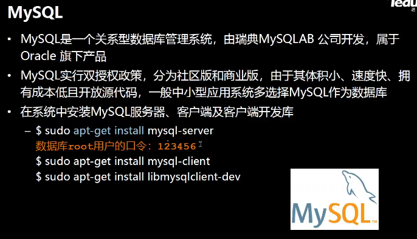

网络框架

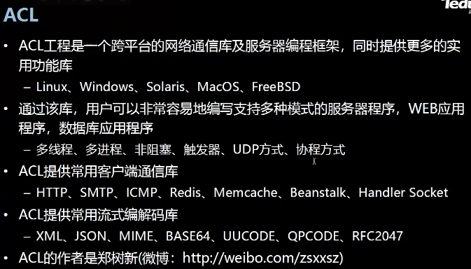

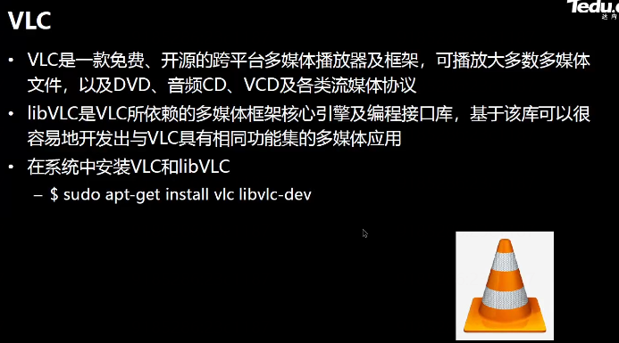


项目结构

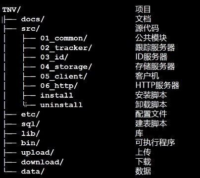


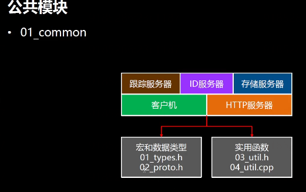

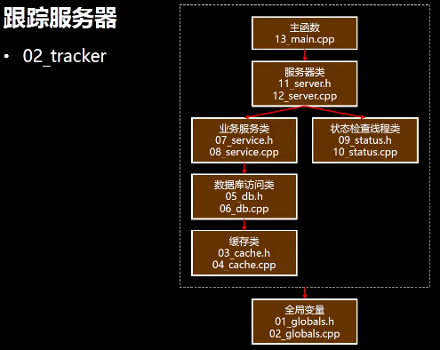


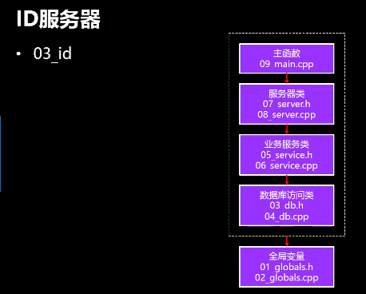

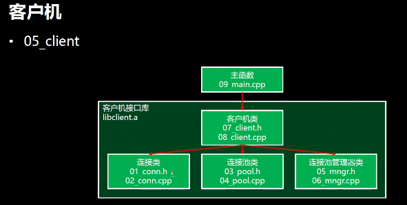


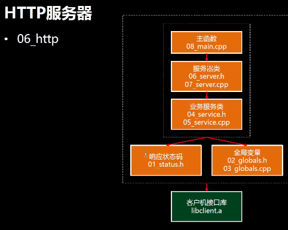

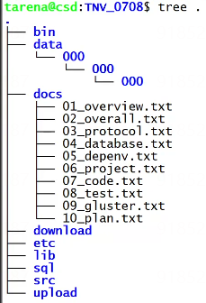

## 代码编写

### 公共模块（宏定义 数据类型）


**types.h**

```c++
//公共模块
//定义所有模块 用到的宏 数据类型

#pragma once //头文件卫士 防止被多重定义

#include <netinet/in.h> //网络编程

//函数返回值 宏
#define OK            0 //成功
#define ERROR        -1 //本地错误 内存分配错误……
#define SOCKET_ERROR -2 //网络通信错误 
#define STATUS_ERROR -3 //服务器状态异常

//缓存 宏 对数据库的优化 前缀 类似名字空间
#define TRACKER_REDIS_PREFIX  "tracker" //跟踪服务器Redis前缀
#define STORAGE_REDIS_PREFIX  "storage" //存储服务器Redis前缀
//
//存储服务器状态 
//
typedef enum storage_status
{
  STORAGE_STATUS_OFFLINE,//离线 
  STORAGE_STATUS_ONLINE,//在线 存储服务器刚启动时 发送给跟踪服务器
  STORAGE_STATUS_ACTIVE//活动 收到心跳包的时候 
} storage_status_t; //定义枚举类型
//
//存储服务器加入 信息
//
#define STORAGE_VERSION_MAX   6   //版本号最大字符数
#define STORAGE_GROUPNAME_MAX 16  //每个存储服务器的组名的最大字符数
#define STORAGE_HOSTNAME_MAX  128 //主机名最大字符数
#define STORAGE_ADDR_MAX      16  //IP地址最大字符数

typedef struct storage_join //存储服务器加入到跟踪服务器中
{
  char      sj_version[STORAGE_VERSION_MAX + 1];     //版本号字段
  char      sj_groupname[STORAGE_GROUPNAME_MAX + 1]; //组名
  char      sj_hostname[STORAGE_HOSTNAME_MAX+1];     //主机名
  in_port_t sj_port;                                 //存储服务器端口号
  time_t    sj_stime;                                //启动时间
  time_t    sj_jtime;                                //加入时间
} storage_join_t;                                    //存储服务器加入

typedef struct storage_info
{

  char                sj_version[STORAGE_VERSION_MAX + 1];     //版本号字段
  char                sj_hostname[STORAGE_HOSTNAME_MAX+1];     //主机名
  in_port_t           sj_port;                                 //存储服务器端口号
  char                sj_addr[STORAGE_ADDR_MAX+1];             //端口号
  time_t              sj_stime;                                //启动时间
  time_t              sj_jtime;                                //加入时间
  time_t              sj_btime;                                //发送心跳时间
  storage_status_t    si_status;                               //状态
} storage_info_t;                                              //存储服务器信息
//
//ID键值对
//
#define ID_KEY_MAX 64 //键最大字符数

typedef struct id_pair
{
  char id_key[ID_KEY_MAX+1]; //键
  long id_value;             //值
  int id_offset;             //偏移量
} id_pair_t;                 //ID键值对
//
//存储服务器读写磁盘文件缓冲区
//
#define STORAGE_RCVWR_SIZE (512 * 1024) //接收写入缓冲区字节数大小
#define STORAGE_RDSND_SIZE (512 * 1024) //读取发送缓冲区字节数大小
```

> g++ -c types.h 编译头文件  得到一个.gch文件

**proto.h**

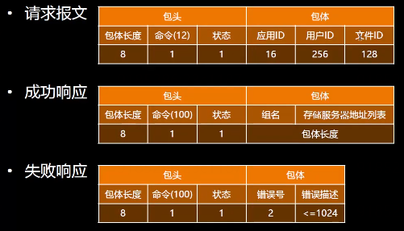

```c++
//公共模块
//定义报文规约有关的宏和数据类型
//
#pragma once

#include "types.h"
//
//请求报文
// |包体长度|命令|状态|   |包体|
// |    8  | 1  |  1 |   |包体长度|
//
#define BODYLEN_SIZE 8 //包体长度字节数
#define COMMAND_SIZE 1 //命令字节数
#define STATUS_SIZE  1 //状态字节数
#define HEADLEN (BODYLEN_SIZE + COMMAND_SIZE + STATUS_SIZE)
//
//错误报文
// |包体长度|命令|状态|错误号|错误描述|
// |8      | 1  | 1 | 2    | <=1024|
//
#define ERROR_NUMB_SIZE 2    //错误号字节数
#define ERROR_DESC_SIZE 1024 //错误描述最大字节数 含空字符
//
// | 包体长度|命令|状态|应用ID|用户ID|文件ID|
// | 8      | 1  | 1 | 16   | 256  | 128  |
//
#define APPID_SIZE  16  //应用ID最大字符串 含结束符
#define USERID_SIZE 256 //用户ID最大字节数 含结束符
#define FILEID_SIZE 128 //文件ID最大字符数 含空字符
//
//存储服务器加入包和心跳包
//
typedef struct storage_join_body
{
  char sjb_version[STORAGE_VERSION_MAX+1];     //版本
  char sjb_groupname[STORAGE_GROUPNAME_MAX+1]; //组名
  char sjb_hostname[STORAGE_HOSTNAME_MAX+1];   //主机名
  char sjb_port[sizeof(in_port_t)];            //端口号 不直接使用in_port_t 防止内存对齐 插入空字节
  char sjb_stime[sizeof(time_t)];              //启动时间
  char sjb_jtime[sizeof(time_t)];              //加入时间
} storage_join_body_t;                         //存储服务器加入包体
//
//心跳包
//
typedef struct storage_beat_body
{
  char sbb_groupname[STORAGE_GROUPNAME_MAX+1]; //组名
  char sbb_hostname[STORAGE_HOSTNAME_MAX+1];   //主机名
} storage_beat_body_t;                         //存储服务器心跳包包体
//
//追踪服务器命令
//
#define CMD_TRACKER_JOIN   10 //存储服务器向跟踪服务器发送加入包
#define CMD_TRACKER_BEAT   11 //心跳包
#define CMD_TRACKER_SADDRS 12 //客户机从跟踪服务器获取存储服务器地址
#define CMD_TRACKER_GROUPS 13 //获取组列表
//
//心跳服务器
//
#define CMD_ID_GET 40 //存储服务器从ID服务器获取ID
//
//存储服务器
//
#define CMD_STORAGE_UPLOAD 70   //客户向存储服务器上传
#define CMD_STORAGE_FILESIZE 71 //获得服务器上文件大小
#define CMD_STORAGE_DOWNLOAD 72 //下载文件
#define CMD_STORAGE_DELETE 73   //删除服务器上的文件
//
//服务器应答命令 反应响应发送源
//
#define CMD_TRACKER_REPLY 100 //跟踪服务器应答
#define CMD_ID_REPLY      101 //ID服务器
#define CMD_STORAGE_REPLY 102 //存储服务器应答

```

> gcc -c proto.h 

**util.h**

```c++
//公共模块
//声明实用函数
//
#pragma once

#include <string>
#include <vector>

//long long 主机序转网络序
void llton(long long ll, char* n);
//long long 网络序转主机序
long long ntoll(char const* n);

// long 主机序转网络序
void lton(long l, char* n);
//long 网络序转主机序
long longntol(char const* n);

// long 主机序转网络序
void lton(short s, char* n);
//long 网络序转主机序
short longntol(char const* n);

//字符串合法性验证 只允许英文字符和数字
int valid(char const* str);

//以;为分割符 将长串拆分为多个子串
int split(char const* str, std::vector<std:string>& substrs);

```

> g++ -c util.h

**util.cpp**

```c++
//公共模块
//定义几个实用函数

#include <string.h>
#include "types.h"
#include "util.h"


//long long 主机序转网络序
void llton(long long ll, char* n)
{
  for (size_t i = 0; i < sizeof(ll); ++i)
  {
    n[i] = ll >> (sizeof(ll) -i -1) * 8;
  }
}
//long long 网络序转主机序
long long ntoll(char const* n)
{ 
  long long ll;
  for (size_t i = 0; i < sizeof(ll); ++i)
  {
    ll =(long long)(unsigned char)n[i] << (sizeof(ll) -i -1) * 8;
  }
  return ll;
}

// long 主机序转网络序
void lton(long l, char* n)
{
  for (size_t i = 0; i < sizeof(ll); ++i)
  {
    n[i] = l >> (sizeof(l) -i -1) * 8;
  }
}
//long 网络序转主机序
long ntol(char const* n)
{
  long l = 0;
  for (size_t i = 0; i < sizeof(l); ++i)
  {
    l =(long long)(unsigned char)n[i] << (sizeof(l) -i -1) * 8;
  }
  return l;
}

// long 主机序转网络序
void ston(short s, char* n)
{
  for (size_t i = 0; i < sizeof(s); ++i)
  {
    n[i] = s >> (sizeof(s) -i -1) * 8;
  }
}
// 网络序转主机序
short ntos(char const* n)
{
    long long s;
  for (size_t i = 0; i < sizeof(s); ++i)
  {
    s =(short)(unsigned char)n[i] << (sizeof(ll) -i -1) * 8;
  }
  return s;
}

//字符串合法性验证 只允许英文字符和数字
int valid(char const* str)
{
  return 0;
}

//以;为分割符 将长串拆分为多个子串
int split(char const* str, std::vector<std:string>& substrs)
{
  return 0;
}


```

> 