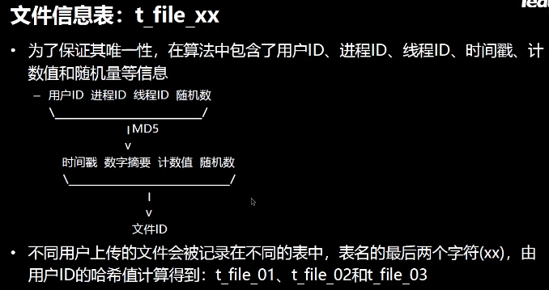

# 分布式流媒体

## 服务器

### 单机服务器

缺点 

服务器压力大 存储空间  用户多了后 不堪重负

Centos ubuntu 等等

改进 

存储模块 放置于别的存储集群 类似NAS的东西

### 独立服务器

应用服务器 处理与存储无关的功能

上传客户机  对资源服务器进行管理

交互性越高  时间片越短  I/O速度越快 所需时间片越长

### 分布式存储

分布式 将每个模块独立出去 不单独放置于一台机器

仲裁系统 选着某一存储主机

保证负载均衡

容灾系统 管理多级备份  热切换 主机与备份机实时同步状态 当主机损坏 则交给备份机

可以不用停机维护

跟踪服务器 实时跟踪存储服务器集群的状态

每个组间的服务器互为镜像  可以根据业务需求 将各个组放置到不同的地区

## 系统总体架构

ID服务器 产生ID 保证一个集群中的各个进程ID号等等 唯一

### 跟踪服务器

被动接受 存储服务器信息 存储服务器 服务注册

存储服务器 周期发送心跳包  跟踪服务器 周期检查心跳包

### 存储服务器和ID服务器

### 客户端

每个业务可能由一个服务器集群完成 当客户端请求某一业务处理时 需要知道对应服务器的信息

那么集群多了以后 客户机所需要维护的信息就回增多 成本增加 所以 可以类似索引一样的处理 将所有的服务器集群的信息 所能够完成的业务交给某一个专用的服务器来完成

客户机只需要与该服务器进行交互 只需要维护一个服务器的信息即可  由该服务器将所需要处理的业务分发出去

### HTTP服务器和客户机

## 报文规约  

定义一个报文 TCP是流式结构

根据固定长度的报头 来知晓该包的结构

报文格式

ID键 区分ID的种类 键值对

命令 表明响应发送源

## 库表结构

合法组名的集合

重启机器后 从数据库中的数据初始化  舍弃一段数值 保证ID唯一性

id用存储位置做键  每一个键对应一块硬盘 或者一个区 每个硬盘随机做键  用512进制来做值的部分 分成四层 每一层可以放512个文件 共有512^4个文件数

status 预留于做软删除  当删除某一文件时 将其改为1 逻辑删除 不允许用户访问 若用户想要恢复则转换为0即可

## 开发环境

网络框架

项目结构

